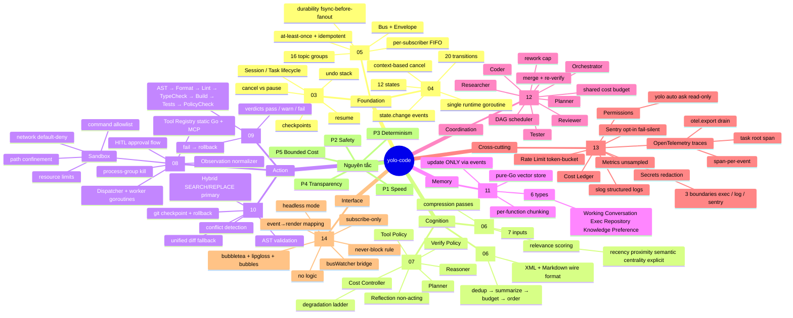
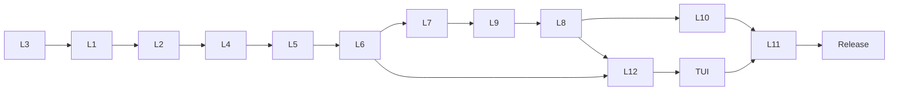

# 00 — Mindmap

> Bản đồ tư duy toàn cảnh kiến trúc **yolo-code** — agent viết code đa agent
> trên terminal bằng Go. Mỗi nhánh là một layer (L1–L12) hoặc một mặt cắt
> ngang (TUI / Nguyên tắc / Docs). Số trong ngoặc trỏ tới file tài liệu tương
> ứng.

## Chú thích

| Ký hiệu | Ý nghĩa |
|---|---|
| `root((yolo-code))` | Toàn bộ hệ thống |
| `Foundation` | Xương sống: bus, session, FSM — mọi thứ dựa vào đây |
| `Cognition` | Lớp "suy nghĩ": context, prompt, planner/reflection/reasoner |
| `Action` | Lớp "hành động": chạy tool, vá file, kiểm chứng |
| `Memory` | Trí nhớ dài hạn, chỉ cập nhật qua events |
| `Coordination` | Đa agent cho task phức tạp |
| `Cross-cutting` | Quan sát + an toàn + chi phí, bọc toàn agent, không đụng logic |
| `Interface` | TUI subscribe-only (và headless dùng chung contract) |
| `Nguyên tắc` | P1–P5, thứ tự ưu tiên khi xung đột |

## Thứ tự phụ thuộc (dependency)

> Quy tắc: mỗi layer chỉ phụ thuộc layer thấp hơn + Event Bus, **không bao giờ** phụ thuộc TUI.

## Index file

| # | File | Layer |
|---|---|---|
| 00 | `00-Mindmap.md` | Bản đồ tổng |
| 01 | `01-Project_Vision.md` | Tầm nhìn + S1–S10 |
| 02 | `02-System_Architecture.md` | Tổng quan 12 lớp |
| 03 | `03-Session_Manager.md` | L1 Session |
| 04 | `04-Runtime_State_Machine.md` | L2 Runtime FSM |
| 05 | `05-Event_Bus.md` | L3 Event Bus |
| 06 | `06-Context_Engine.md` | L4 + L5 |
| 07 | `07-Cognitive_Core.md` | L6 Cognitive Core |
| 08 | `08-Execution_Engine.md` | L7 Execution |
| 09 | `09-Verification_Engine.md` | L8 Verification |
| 10 | `10-Patch_Engine.md` | L9 Patch |
| 11 | `11-Memory_System.md` | L10 Memory |
| 12 | `12-Coordination_Layer.md` | L11 Multi-Agent |
| 13 | `13-Infrastructure.md` | L12 Infra |
| 14 | `14-TUI_Architecture.md` | TUI |
| 15 | `15-Implementation_Roadmap.md` | 11 sprint + CI |

*End of File 00 — Mindmap.*
