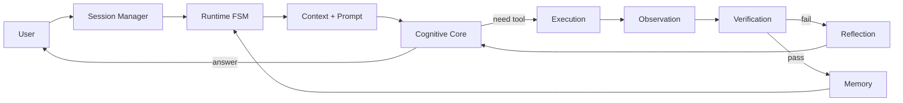
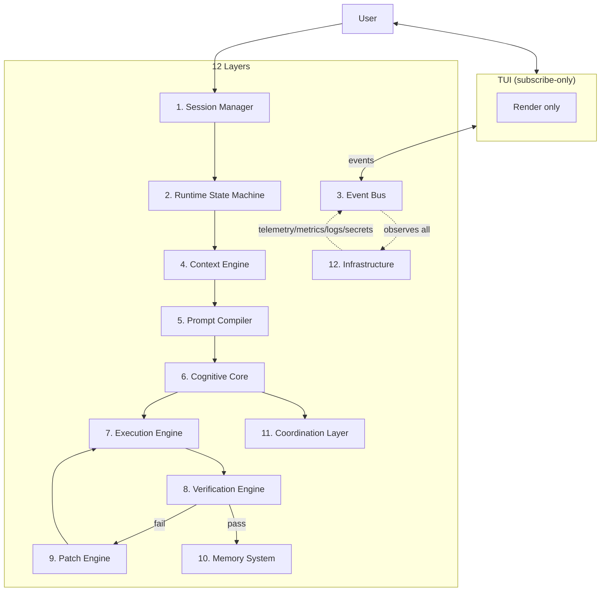

# 01 — Project Vision

> **Goal of this document:** sell the idea, fix the scope, and justify the
> foundational technical choices for a lightweight, terminal-native, multi-agent
> AI coding agent written in Go — organized as a **12-layer system**.

---

## Table of Contents

1. [Problem Statement](#11-problem-statement)
2. [Solution](#12-solution)
3. [Target Audience](#13-target-audience)
4. [Core Principles](#14-core-principles)
5. [High-level Architecture (12 Layers)](#15-high-level-architecture-12-layers)
6. [Tech Stack Selection](#16-tech-stack-selection)
7. [Scope & Non-Goals](#17-scope--non-goals)
8. [Success Criteria](#18-success-criteria)

---

## 1.1 Problem Statement

Modern AI-assisted development is dominated by heavy graphical IDEs and
cloud-bound editor extensions. They impose recurring costs that conflict with
the daily reality of a large class of developers.

### 1.1.1 The weight problem

Mainstream AI IDEs (Cursor, Windsurf, GitHub Copilot in VS Code, JetBrains AI
Assistant) ship on top of Electron or a full JVM-based IDE. The practical
consequences on a developer machine are:

| Symptom | Typical cost | Who suffers |
|---|---|---|
| RAM footprint | 1.5 – 4 GB resident per window | Laptop users, shared dev boxes |
| Cold start | 5 – 30 s before the assistant is usable | Anyone reopening a session |
| CPU spikes during indexing | One core saturated for minutes | Large monorepos |
| GPU / WebGL rendering | Battery drain, fan noise | Mobile workstations |
| Network dependency | Editor unusable when offline or behind strict proxies | Air-gapped / on-call engineers |

For a developer who lives in the terminal, opening a 2 GB IDE just to ask an
LLM "what does this function do" is an absurd round-trip.

### 1.1.2 The control & transparency problem

AI IDEs bundle the model call, the file edit, and the UI confirmation into one
opaque pipeline. When something goes wrong — a wrong refactor, a hallucinated
import, a tool that ran a destructive command in the wrong directory — the user
has no first-class surface to inspect *what was decided*, *what was sent to the
model*, and *why an action was taken*. The logs, if any, are buried in a debug
panel that itself requires the heavy IDE to view.

### 1.1.3 The environment problem

A large fraction of real engineering work happens where a GUI IDE cannot
follow: SSH sessions into production, bastion hosts, Docker containers,
Kubernetes pods, CI runners, embedded and edge devices. In all of these the
only universally available, latency-free interface is a terminal. An AI
assistant that cannot live there cannot help there.

### 1.1.4 The determinism problem

LLM-based edits are probabilistic. In current IDEs the same request can produce
a flawless patch on one run and a destructive one on the next. Users compensate
with `git stash` reflexes and manual review of every diff, which defeats the
productivity promise. There is no enforced loop of *verify before apply,
rollback if broken* — and no notion that a failing attempt should drive a
structured *reflection* that improves the next attempt rather than a blind retry.

### 1.1.5 The vendor lock-in problem

Most AI IDEs are tightly coupled to one model provider and one billing
relationship. Switching models means changing the whole editing surface, because
the tool-calling format, streaming protocol, and context handling are baked into
the IDE.

---

## 1.2 Solution

We propose **a terminal-native, multi-agent AI coding agent**: a single
self-contained binary that brings an LLM-driven coding assistant into any shell,
with the rigor of an IDE and the footprint of a Unix tool.

The thesis is fourfold:

1. **The terminal is the right UI surface for code agents.** Code is text,
   diffs are text, tool output is text. A well-designed TUI renders chat,
   diffs, status, and token budgets within the 80×24 viewport every SSH session
   guarantees — and the TUI *only subscribes to events*; it contains no logic.

2. **A verify-then-apply loop with reflection is the right execution model.**
   Every mutation goes through *plan → patch → verify → rollback-or-commit*.
   A failed verification feeds a *reflection* step that diagnoses the root cause
   and replans, rather than blindly retrying. Determinism is engineered into the
   loop, not hoped for from the model.

3. **A single static binary is the right delivery model.** One `scp` or one
   `brew install` puts the same agent on a laptop, a server, a container, and a
   CI runner — no runtime, no Electron, no plugin marketplace, no GUI
   dependency.

4. **A layered, event-driven architecture is the right shape.** Twelve layers,
   each a Go package, communicate exclusively through an event bus that is the
   system's backbone. Every action is an observable, loggable, replayable event
   — which is what makes the agent transparent, deterministic, and able to host
   multiple specialized agents (planner, coder, reviewer, tester, researcher)
   without shared state.

### 1.2.1 What "agent" means here

A *perceive → think → act → observe → verify → reflect* loop, where *think* is an
LLM call, *act* is an externally-observable tool call, *observe* is the parsed
result, *verify* is an automated check, and *reflect* is a non-acting reasoning
step on failure. The user is always in the loop for any state-changing action.



---

## 1.3 Target Audience

### 1.3.1 Primary: the terminal-native developer
Developers whose default surface is `vim`/`neovim`/`helix`/`tmux`/a bare shell.
They want an LLM in the loop for explanation, scaffolding, refactor, and review
— next to their existing workflow, not on top of a replacement editor.

### 1.3.2 Secondary: the sysadmin / SRE
Operators who debug on production hosts over SSH. They need an assistant that
reads logs, proposes commands, explains a stack trace, and drafts a fix — within
the same session, without copying secrets into a browser on another machine.
Sandbox and human-in-the-loop guarantees (§1.4, File 08) are mandatory here.

### 1.3.3 Tertiary: the server / headless environment
CI runners, build agents, ephemeral containers. The same binary a human steers
interactively can be driven non-interactively to run scripted agentic tasks —
"open this repo, reproduce the failing test, propose a fix, open a PR". One
artifact serves both modes because the agent core is decoupled from the TUI.

### 1.3.4 Who this is *not* for
Developers who genuinely want a full graphical IDE with mouse-driven panes;
non-technical users (the surface assumes shell literacy); users who want the
model to silently auto-edit files (every state-changing action is confirmable
by design).

---

## 1.4 Core Principles

Five principles govern every design decision in the series. When two conflict,
the earlier one wins.

- **P1 — Speed.** Cold start < 200 ms to first paint, streaming rendered as it
  arrives, no blocking round-trips to a UI thread.
- **P2 — Safety.** No state-changing action without a verifiable rollback or
  explicit approval. Every file mutation is snapshot-protected and verified
  before commit.
- **P3 — Determinism.** The same inputs and model produce a traceable event
  sequence. Non-determinism from the model is contained by verify-then-apply and
  reflection; non-determinism from the system is eliminated by single-writer
  event ordering per session.
- **P4 — Transparency.** The user can always answer *what is it doing now, what
  did it send to the model, what is it about to do* — via the event bus, where
  every event is a first-class, loggable, renderable object.
- **P5 — Bounded Cost.** Every loop, tool call, token, dollar, and second is
  tracked; runaway loops are auto-degraded (reflection disabled, then verify-only,
  then autosubmit) before they bankrupt the user.

> **Priority order:** **Speed → Safety → Determinism → Transparency → Bounded
> Cost.** A faster-but-less-safe shortcut is rejected. A more-transparent but
> slower logging path is acceptable only if it does not threaten P1.

---

## 1.5 High-level Architecture (12 Layers)

The system is a twelve-layer pipeline. The dependency rule is invariant: **a
layer may depend on layers below it and on the event bus, never on a layer
above, and never on the TUI.** The TUI is a consumer of the bus, not a
dependency.



### 1.5.1 The end-to-end request flow

```
User
 │
 ▼
Session Manager
 │
 ▼
Runtime State Machine
 │
 ▼
Context Engine
 │
 ▼
Prompt Compiler
 │
 ▼
Cognitive Core (Planner)
 │
 ├──► Tool Selection ──► Execution Engine ──► Observation ──► Verification
 │                                                          │
 │                                                          ├─ pass ──► Memory
 │                                                          └─ fail ──► Reflection ──► Patch Engine ──► (re-verify)
 │
 └──► Direct Response ──► User
                                                              │
                                                              ▼
                                              Event Bus + Telemetry ──► UI
```

### 1.5.2 Layer → package map (preview)

| # | Layer | Go package | One-line responsibility |
|---|---|---|---|
| 1 | Session Manager | `internal/session` | Conversation, task, history, undo, checkpoint, resume, cancel |
| 2 | Runtime State Machine | `internal/runtime` | FSM: INIT→…→DONE + PAUSED/CANCELLED/ERROR/WAIT_USER |
| 3 | Event Bus | `internal/event` | Backbone: typed pub/sub, event log, all subsystems subscribe |
| 4 | Context Engine | `internal/context` | Rank/relevance/compress inputs → Context Package |
| 5 | Prompt Compiler | `internal/prompt` | Dedup/summarize/budget/order → final prompt |
| 6 | Cognitive Core | `internal/cognitive` | Planner, Reflection, Reasoner, Tool/Verification Policies |
| 7 | Execution Engine | `internal/exec` | Tool Registry (static+MCP), Sandbox, Observation Normalizer |
| 8 | Verification Engine | `internal/verify` | AST→Formatter→Lint→TypeCheck→Build→Tests→PolicyCheck |
| 9 | Patch Engine | `internal/patch` | Hybrid diff/search-replace, conflict detect, checkpoint, rollback |
| 10 | Memory System | `internal/memory` | Working / Conversation / Execution / Repository / Knowledge / Preference |
| 11 | Coordination Layer | `internal/coord` | Multi-agent: Scheduler, Task Queue, Coder/Reviewer/Tester/Researcher, Merge |
| 12 | Infrastructure | `internal/infra` | Telemetry, tracing, metrics, logs, secrets, permissions, rate limit, cost |
| – | TUI | `internal/tui` | Subscribe-only render of events; no logic |

File 02 owns the full expansion of this table.

---

## 1.6 Tech Stack Selection

The implementation language is the most consequential decision: it constrains
concurrency model, TUI library, distribution, and the available LLM /
tree-sitter / vector-DB / observability bindings. We select **Go**.

### 1.6.1 Candidates and evaluation axes

| Axis | Rust | Go | Python |
|---|---|---|---|
| Runtime speed (raw) | ★★★★★ | ★★★★ | ★★ |
| Memory footprint | ★★★★★ | ★★★★ | ★★ |
| Startup time | ★★★★★ | ★★★★★ | ★★ |
| Concurrency fit for event bus | ★★★ (async hard) | ★★★★★ (goroutine/channel) | ★★★ (asyncio) |
| Cancellation primitives | manual | `context.Context` idiomatic | manual / asyncio |
| TUI ecosystem | `ratatui` (excellent) | `bubbletea`+`lipgloss` (excellent) | `textual` (heavy) |
| LLM SDK availability | sparse | solid + easy hand-rolled HTTP/SSE | richest |
| Tree-sitter bindings | official, best | community, adequate | adequate |
| Observability (OTel) | good | **excellent** (official SDK) | good |
| Cross-compile to static binary | painful (cross toolchains) | **trivial** (`GOOS/GOARCH`) | impossible |
| Single-file distribution | yes | yes | no |
| Compile / iterate speed | slow (borrow checker) | **fast** | instant (no compile) |
| Contributor onboarding | high cost | low | low |

### 1.6.2 Why not Python
Best LLM ecosystem and fastest prototyping, but no single static binary
(shipping means a runtime + venv + pinned deps), heavy TUI options, slow startup
— failing the distribution and footprint axes that define this project.

### 1.6.3 Why not Rust
Best raw performance and `ratatui` is strong, but the borrow checker fights the
event-bus architecture (multi-owner event data, async streaming, TUI observer
demand constant `Arc/Mutex` ceremony), cross-compilation is painful, compile
times hurt iteration, and contributor onboarding is steep. The performance
margin is irrelevant: the bottleneck is network latency to the model, not CPU.

### 1.6.4 Why Go — the deciding reasons
1. **Goroutines and channels map 1:1 onto an event bus.** A topic is fan-out
   over channels; a subscriber is a goroutine selecting on its channel;
   backpressure is a bounded channel. No async runtime to choose.
2. **`context.Context` is idiomatic cancellation** — the Ctrl+C → stop stream →
   kill children → return-to-IDLE flow is a first-class language pattern.
3. **`bubbletea` + `lipgloss` + `bubbles`** give a mature Elm-architecture TUI
   with first-class streaming support.
4. **Trivial cross-compilation.** `GOOS=linux GOARCH=arm64 go build` from a
   Windows laptop yields a static ARM binary.
5. **Single static binary by default.** `scp` and run.
6. **Sufficient ecosystem for every layer** — `go-openai`/hand-rolled SSE,
   tree-sitter bindings, `modernc.org/sqlite` (pure Go, no CGO),
   `go-git/go-git`, the **official OpenTelemetry Go SDK**, and Sentry's Go SDK.
7. **Fast compile + wide contributor pool.**

### 1.6.5 Decision
> **Implementation language: Go 1.22+.** Every code example in Files 02–15 is
> expressed in Go.

### 1.6.6 Full library stack (frozen per layer in later files)

| Concern | Library |
|---|---|
| TUI | `charmbracelet/bubbletea`, `lipgloss`, `bubbles` |
| Event bus | channel-based broker + `context.Context` |
| Concurrency | goroutines, channels, `select`, worker pools |
| LLM client | provider-agnostic interface; `go-openai` + raw SSE via `net/http` |
| Tool extension | built-in static tools + **MCP (Model Context Protocol) client** for runtime tools |
| Tree-sitter (AST) | `smacker/go-tree-sitter` |
| SQLite (session/memory) | `modernc.org/sqlite` (pure Go, no CGO) |
| Vector DB (RAG) | pure-Go in-memory + SQLite persistence (File 11) |
| Git snapshot | `go-git/go-git` |
| Config | `koanf` + YAML |
| Logging | `log/slog` |
| **Telemetry/tracing/metrics** | **OpenTelemetry Go SDK** |
| **Error reporting** | **Sentry Go SDK** (opt-in) |
| Release | `goreleaser` + GitHub Actions |

### 1.6.7 Acknowledged trade-offs
Verbose error handling (mitigated by a small `internal/xerrors` helper and a
consistent `if err != nil` style); generics used sparingly; GC pauses
invisible at human timescales and far smaller than one LLM round-trip.

---

## 1.7 Scope & Non-Goals

### In scope
- Interactive TUI agent: chat, diff view, status bar, token meter, cost meter.
- Session/task management with checkpoints, undo, resume, cancel.
- 12-layer architecture; full agent loop with verify + reflection.
- Tool set: shell, filesystem, git, grep/glob, plus Docker/Browser/LSP/MCP/
  Python/HTTP/SQL via static registration and MCP.
- Patch engine (hybrid search-replace + unified diff) with AST validation,
  verification, git-backed rollback, conflict detection.
- Memory: six types, updated only via events.
- Multi-agent orchestration (planner / coder / reviewer / tester / researcher).
- Cost controller with auto-degradation.
- Infrastructure: OpenTelemetry traces/metrics, structured logs, secrets
  redaction, permissions, rate limiting.
- Provider-agnostic LLM client with streaming.
- Single static binary for Windows, macOS, Linux, amd64 and arm64.

### Non-goals (this version)
- A graphical / web UI.
- Building or training a custom model.
- Replacing an editor (we coexist with vim/neovim/helix).
- A plugin marketplace (tools are static Go code or MCP servers).
- Autonomous, unsupervised operation (human always in the loop for
  state-changing actions; non-interactive mode is gated behind explicit config).
- Multi-user / collaborative sessions.

---

## 1.8 Success Criteria

The project is "done" for this version when all hold, each mapped to a principle:

| # | Criterion | Target | Principle |
|---|---|---|---|
| S1 | Cold start to first paint | < 200 ms on a 2020-era laptop | P1 |
| S2 | Token streaming visible latency | < 50 ms chunk→screen | P1 |
| S3 | Destructive action without confirmation | impossible by construction | P2 |
| S4 | Any applied patch rollback-able | 100% via snapshot before apply | P2 |
| S5 | Identical input + model → identical event trace | byte-identical (modulo model nondeterminism) | P3 |
| S6 | Live "what is it doing now" | < 1 keypress, always available | P4 |
| S7 | Single binary on 4 OS/arch pairs | Win/macOS/Linux × amd64/arm64, no runtime deps | delivery |
| S8 | Add a tool without touching the TUI | implement one interface + register (or one MCP config) | architecture |
| S9 | Add an LLM provider without touching the runtime | implement one interface | architecture |
| S10 | Runaway loop auto-degraded | reflection disabled after N cycles; hard cost cap enforced | P5 |

S1–S6 are the product. S7–S9 the engineering posture. S10 is the cost-safety
guarantee introduced by the cost controller. Every later file refines criteria
into concrete mechanisms.

---

## 1.9 Next steps

This file fixes the problem, the five principles, the 12-layer architecture,
and Go. The next document, **`02-System_Architecture.md`**, expands the
twelve-layer model into a full architectural specification: per-layer
responsibilities, the package map, the end-to-end data flow, the event bus
topology, and the goroutine/channel threading model.

---

*End of File 01 — Project Vision.*
