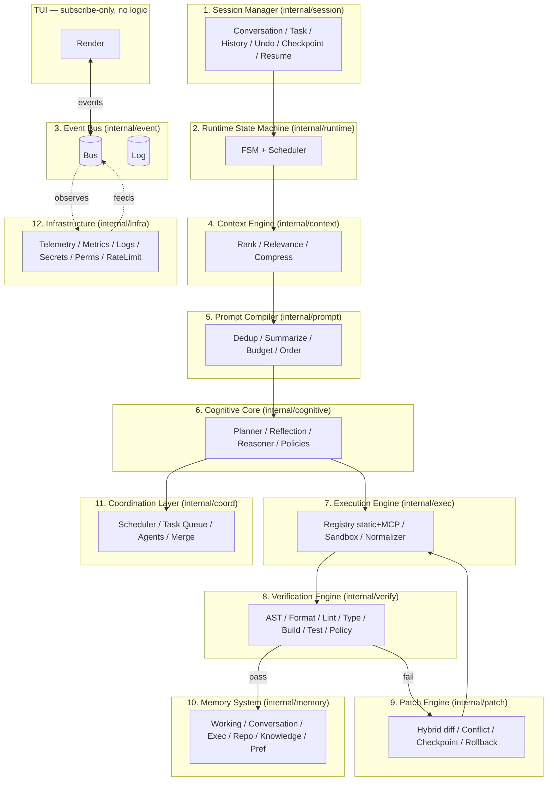
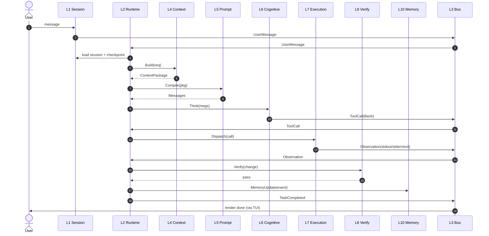
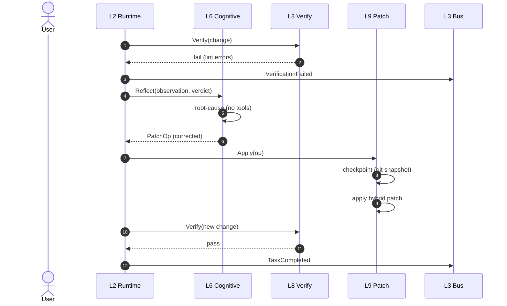
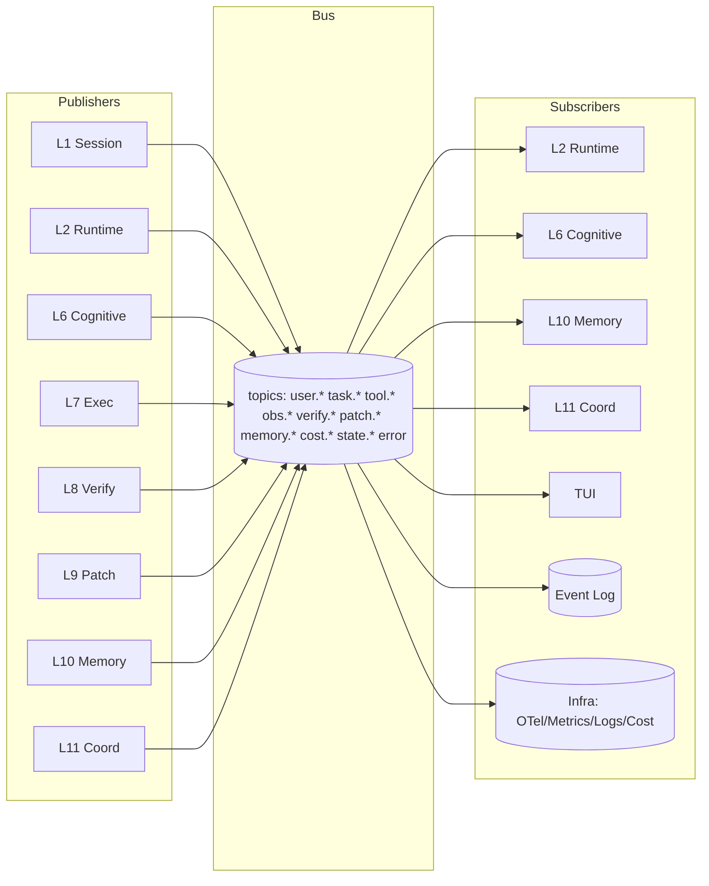

# 02 — System Architecture

> **Goal of this document:** specify the twelve-layer architecture in full —
> per-layer responsibilities and Go packages, the end-to-end data flow, the
> event bus topology, and the goroutine/channel threading model that keeps the
> TUI non-blocking.

This file is the structural backbone of the series. Files 03–15 each take one
layer and elaborate it; none re-derives the layering or the bus, which are
fixed here.

---

## Table of Contents

1. [The 12-Layer Model](#21-the-12-layer-model)
2. [Data Flow](#22-data-flow)
3. [Event Bus Topology](#23-event-bus-topology)
4. [Thread & Async Model](#24-thread--async-model)
5. [Architecture decisions, summarized](#25-architecture-decisions-summarized)

---

## 2.1 The 12-Layer Model

The system is a strict, twelve-layer pipeline. The dependency rule is
invariant: **a layer may depend on layers below it and on the event bus, never
on a layer above, and never on the TUI.** The TUI is a consumer of the bus, not
a dependency of any layer.



The vertical arrows are **direct in-process calls** confined to a single
turn's goroutine; the bus arrows are **event subscriptions** observable by the
TUI, the log, and Infrastructure. The distinction matters: events are the
cross-layer communication that observers can see; direct calls are intra-turn
execution that does not need observation.

### 2.1.1 Layer responsibilities at a glance

| # | Layer | Owns | Does NOT do | Primary principle |
|---|---|---|---|---|
| 1 | Session Manager | Session/task lifecycle, history, undo, checkpoints, resume, cancel | Drive the FSM or call the LLM | P3 |
| 2 | Runtime State Machine | FSM transitions, scheduler, cancellation, turn orchestration | Call the LLM or tools directly | P3, P2 |
| 3 | Event Bus | Typed pub/sub, event log, ordering | Any business logic | P3, P4 |
| 4 | Context Engine | Rank/relevance/compress of context inputs → Context Package | Format the final prompt (that's L5) | P1 |
| 5 | Prompt Compiler | Dedup/summarize/budget/order → final prompt | Decide tool use | P3 |
| 6 | Cognitive Core | Planner, Reflection, Reasoner, Tool/Verification/Cost policies | Execute side effects | P3, P5 |
| 7 | Execution Engine | Tool registry (static+MCP), sandbox, observation normalizer | Decide what to do | P2 |
| 8 | Verification Engine | AST/format/lint/type/build/test/policy checks | Apply patches (that's L9) | P2 |
| 9 | Patch Engine | Hybrid diff application, conflict detect, checkpoint, rollback | Run semantic verification (that's L8) | P2 |
| 10 | Memory System | Six memory types; updated only via events | Know about the LLM | P3 |
| 11 | Coordination Layer | Multi-agent scheduler, task queue, agent roles, merge | Be an agent itself (it orchestrates) | P3 |
| 12 | Infrastructure | Telemetry, metrics, logs, secrets, permissions, rate limit, cost | Drive agent logic | P4, P5 |
| – | TUI | Render events; capture input | Any logic (subscribe-only) | P1, P4 |

### 2.1.2 The contracts (preview — each expanded in its own file)

Each layer below is a Go package with a frozen public surface. The full
contracts live in Files 03–15; here is the one-line shape so the data flow in
§2.2 is readable.

```go
// L1
session.Manager.Start(ctx, goal) (SessionID, error)   // owns tasks, checkpoints, undo

// L2
runtime.Core.Run(ctx) error                           // the FSM goroutine

// L3
event.Bus.Subscribe(topics...) <-chan Envelope
event.Bus.Publish(ctx, e) error

// L4
context.Engine.Build(ctx, req) (ContextPackage, error) // ranked, compressed

// L5
prompt.Compiler.Compile(pkg ContextPackage) ([]Message, error)

// L6
cognitive.Core.Think(ctx, msgs) (Turn, error)        // plan / reflect / reason

// L7
exec.Engine.Dispatch(ctx, call) (Observation, error)

// L8
verify.Engine.Verify(ctx, change) (Verdict, error)

// L9
patch.Engine.Apply(ctx, op) (Result, error)          // hybrid; checkpoint+rollback

// L10
memory.Store.*                                      // 6 sub-stores; event-driven writes

// L11
coord.Orchestrator.Run(ctx, plan) error

// L12
infra.Telemetry / infra.Metrics / infra.Secrets / infra.RateLimiter / infra.Cost

// TUI
tui.Run(ctx, core) error
```

### 2.1.3 Layer → package → library map (frozen)

| # | Layer | Go package | Key external libraries |
|---|---|---|---|
| 1 | Session Manager | `internal/session` | `modernc.org/sqlite`, `go-git/go-git` (checkpoints) |
| 2 | Runtime State Machine | `internal/runtime` | stdlib `context`, `sync` |
| 3 | Event Bus | `internal/event` | stdlib `chan`, `sync`; OpenTelemetry (span per event) |
| 4 | Context Engine | `internal/context` | tree-sitter (graph), `tiktoken-go` |
| 5 | Prompt Compiler | `internal/prompt` | `tiktoken-go` |
| 6 | Cognitive Core | `internal/cognitive` | `go-openai` / raw SSE; `internal/cost` |
| 7 | Execution Engine | `internal/exec` | `gojsonschema`; **MCP client** |
| 8 | Verification Engine | `internal/verify` | tree-sitter, `go vet`/`golangci-lint`/`tsc`… |
| 9 | Patch Engine | `internal/patch` | `go-git/go-git`, `go-diff` |
| 10 | Memory System | `internal/memory` | `modernc.org/sqlite`, vector store, embedder |
| 11 | Coordination Layer | `internal/coord` | reuses `internal/runtime` per agent |
| 12 | Infrastructure | `internal/infra` | **OpenTelemetry Go SDK**, **Sentry Go SDK** |
| – | TUI | `internal/tui` | `bubbletea`, `lipgloss`, `bubbles` |

---

## 2.2 Data Flow

### 2.2.1 The single request path (textual)

1. **L1** opens (or resumes) a session, allocates a Task, attaches a checkpoint.
2. **L1** publishes `UserMessage`; **L2** receives it, transitions the FSM to
   `LOAD_SESSION` → `LOAD_CONTEXT`.
3. **L2** asks **L4** to build context; **L4** gathers conversation, open files,
   git diff, repository graph, diagnostics, user preference, project memory,
   then **ranks** by relevance, **scores**, **compresses** → a `ContextPackage`.
4. **L2** transitions `LOAD_CONTEXT → PLAN`; hands the package to **L5**,
   which **deduplicates**, **summarizes**, applies the **token budget**,
   **orders** the parts → the final prompt.
5. **L2** transitions `PLAN → EXECUTE`; the prompt goes to **L6** (Cognitive
   Core). The Planner decides: direct answer, or tool use.
   - **(a) Direct response:** **L6** streams tokens; **L2** → `DONE`; reply to
     user.
   - **(b) Tool selection:** **L6** emits a tool call; **L2** → `WAIT_TOOL`;
     **L7** dispatches under the sandbox, normalizes the output into an
     `Observation`, publishes it.
6. **L2** transitions `WAIT_TOOL → VERIFY`; **L8** runs the verification
   pipeline (AST → format → lint → type → build → tests → policy).
   - **(a) Pass:** **L2** → `DONE` (or back to `PLAN` for another loop iter);
     **L10** updates memory via events.
   - **(b) Fail:** **L2** → `PATCH`; **L9** applies the corrective patch
     (checkpoint first), then re-verifies. If the model decides a re-think is
     needed, **L6**'s Reflection step diagnoses root cause and replans (no
     tools called during reflection).
7. Every step publishes events on **L3**; **L12** records telemetry/metrics/logs
   and the cost controller accrues counts. **TUI** renders from those events.

### 2.2.2 Sequence diagram: a turn that succeeds after one verify pass



### 2.2.3 Sequence diagram: a turn that fails verify and reflects



### 2.2.4 Event ordering and causality

- Each event carries a monotonic `Seq` (bus-assigned) and a `CausalID` linking
  it to the task that caused it.
- A subscriber's channel is **single-consumer**; the bus writes in publish
  order, so the subscriber observes events in causal order *for its topics*.
- Cross-topic ordering is not globally guaranteed, which is fine: the TUI renders
  idempotently from absolute state and never infers causality from arrival order.
- Infrastructure subscribes to the root topic to record a full OpenTelemetry
  trace per task (one span per event), giving an end-to-end causal view that the
  TUI does not need.

---

## 2.3 Event Bus Topology

The event bus (fully specified in File 05) is the system's **backbone**. Every
layer publishes and/or subscribes; nothing reaches across layers except via
events (plus the confined intra-turn direct calls in §2.1).



### 2.3.1 Delivery semantics

| Property | Guarantee | Mechanism |
|---|---|---|
| Ordering | per-subscriber FIFO | single channel per subscriber, single bus goroutine writes |
| Delivery | at-least-once in-session | channel send; full channel → publisher blocks (backpressure) |
| Persistence | append-only log on disk | event fsynced before in-memory fan-out (durability before visibility) |
| Replay | deterministic for non-LLM events | log replay re-publishes; LLM nondeterminism is the only entropy |
| Duplication | possible across restart | subscribers must be idempotent on `Env.Seq` |

### 2.3.2 The subscribers that make the system observable

Three subscribers are always present, beyond the layers that react to events:

- **Event Log** — the append-only source of truth (P3, P4). `tail -f` is a debug
  session; a recorded log is a bug report and a test fixture.
- **Infrastructure** — turns every event into an OpenTelemetry span/metric and a
  structured log line. This is how "what did the agent do?" becomes answerable
  in your existing observability stack, not a bespoke panel.
- **TUI** — renders. The TUI holds no state machine of its own; it projects
  event state to the screen (File 14).

The full `Bus` type, topic registry, and event catalog live in File 05.

---

## 2.4 Thread & Async Model

The system runs many goroutines but only **one runtime goroutine** drives a
task. This is the key to determinism: a single-threaded decision maker,
many-threaded workers.

### 2.4.1 Goroutine inventory

| Goroutine | Layer | Lifetime | Role | Blocks TUI? |
|---|---|---|---|---|
| `tui.program` | TUI | session | bubbletea loop; reads stdin, renders | (is the TUI) |
| `bus.dispatch` | L3 | session | bookkeeping, slow-subscriber detection | no |
| `log.writer` | L3 | session | fsyncs the event log off the hot path | no |
| `runtime.loop` | L2 | session | the FSM; the only state-machine driver | no |
| `cognitive.stream.*` | L6 | one LLM call | reads SSE, publishes token events | no |
| `exec.tool.*` | L7 | one tool call | runs the sandboxed tool | no |
| `verify.step.*` | L8 | one verify step | runs lint/build/test | no |
| `patch.apply` | L9 | one patch | applies, snapshots | no |
| `memory.index` | L10 | background | reindexes changed files into vectors | no |
| `otel.export` | L12 | session | batches spans/metrics to OTel collector | no |
| `cost.watch` | L12 | session | accrues counts; enforces caps/degradation | no |

### 2.4.2 Why the TUI never blocks
bubbletea's Elm architecture gives this for free if we obey one rule: **never do
work in `Update`; always dispatch it as a `tea.Cmd` returning a `tea.Msg`.** The
TUI's only bridge to the bus is a long-lived `busWatcher` command that pumps
envelopes into `tea.Msg`s (specified in File 14). Because `Update` never blocks
and the watcher is off-thread, the TUI stays responsive mid-stream.

### 2.4.3 Cancellation
Cancellation flows **down** through `context.Context`; status flows **up**
through events. They never share a channel. Each task gets its own cancellable
context; canceling it stops the SSE read (HTTP body closed), kills any spawned
process group, rolls back any in-flight unverified patch, and returns the FSM to
a terminal state. Detailed in File 04 §4.6.

### 2.4.4 Race-safety rules (enforced by `go test -race` in CI)
1. The runtime goroutine owns the FSM; no other goroutine mutates it.
2. Each memory sub-store owns its backing storage; writes happen only via event
   handlers on a single goroutine.
3. The bus never calls back into a publisher (`Publish` only writes channels +
   log; never invokes subscriber code).
4. No `select` with a `default` that swallows a channel read, except the
   explicit non-blocking poll in the runtime loop.

---

## 2.5 Architecture decisions, summarized

| Decision | Chosen | Rejected | Why |
|---|---|---|---|
| Layers | 12 | 7 (earlier draft) | Session/Verify/Reflection/Infra deserve first-class status |
| Cross-layer comms | Event bus | Direct calls | P3/P4: replayable, observable, decoupled TUI |
| Delivery | At-least-once + idempotent subs | Exactly-once | Unnecessary on one machine; expensive |
| Ordering | Per-subscriber FIFO | Global linearizability | Avoids a global lock; TUI renders from absolute state |
| Persistence | fsync log before fan-out | Fan-out then log | P3: durability before visibility |
| Threading | One runtime goroutine, many workers | Actor-per-layer shared state | Single decision maker → determinism |
| TUI | Subscribe-only, no logic | TUI with its own FSM | Single source of truth (the bus) |
| Verification | Separate layer (L8) | Inside patch engine | Verifies *any* change, not just patches |
| Reflection | Non-acting reasoning step | Blind retry | Diagnose root cause before re-attempt |
| Cost | Bounded with auto-degradation | Unlimited | P5: runaway loops can't bankrupt the user |
| Observability | OpenTelemetry + Sentry | Bespoke panel | Fits existing stacks; no extra IDE to view |
| Tool extension | Static Go + MCP | Hardcoded only | Deterministic defaults + runtime flexibility |
| Patch format | Hybrid (search-replace primary + diff fallback) | Unified diff only | Avoids line-number hallucination while accepting diffs |
| L7 on the bus | Yes (publishes observations) | No | Observations are first-class for verify/reflect/memory |
| Backpressure | Bounded channels, block publisher | Drop events | P3: never lose an event; stall loudly |

---

## 2.6 What the next files inherit

This file fixed:
- the **twelve layers** and their one-way dependency rule;
- the **layer → package → library map** used by every code example hereafter;
- the **event bus topology** and delivery semantics (full contract in File 05);
- the **single runtime goroutine** model and the **context-down/events-up**
  cancellation pattern (full FSM in File 04).

The next file, **`03-Session_Manager.md`**, specifies Layer 1 — the session,
task, history, undo, checkpoint, resume, and cancel primitives that frame every
task the agent runs.

---

*End of File 02 — System Architecture.*
