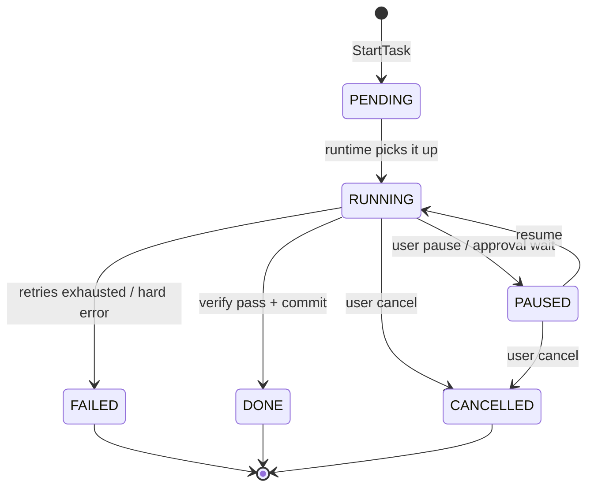

# 03 — Session Manager

> **Goal of this document:** design Layer 1 — the lifecycle framing for
> everything the agent does. A task does not start at the LLM; it starts at a
> **session** that owns the conversation, the task, the history, the undo
> stack, the checkpoints, the resume point, and the cancel handle.

This file owns **Layer 1 (`internal/session`)**. It is the entry point the
runtime (File 04) calls before any thinking happens, and it is the layer that
makes "close the app, come back tomorrow, keep going" a real guarantee.

---

## Table of Contents

1. [Why a Session Manager (not a Planner)](#31-why-a-session-manager-not-a-planner)
2. [Sessions and Tasks](#32-sessions-and-tasks)
3. [History & Undo](#33-history--undo)
4. [Checkpoints](#34-checkpoints)
5. [Resume](#35-resume)
6. [Cancel](#36-cancel)
7. [The Manager, consolidated](#37-the-manager-consolidated)

---

## 3.1 Why a Session Manager (not a Planner)

A common mistake is to start the agent loop at the Planner. The agent actually
starts at a **session**: the user is resuming a half-finished task, or starting
one. Before the model thinks, the system must know *which conversation this
is*, *what task is in progress*, *what the last safe state was*, and *how to
undo the last step*.

The Session Manager owns that framing. The Planner (File 07) runs *inside* a
task that the Session Manager has already opened.

Concretely, the Session Manager manages:

| Concern | Owned by Session Manager | Example |
|---|---|---|
| Conversation | the message list for this session | "refactor auth, step 3 of 5" |
| Task | the unit of work, with status and retry count | `Task #14 status=RUNNING checkpoint=patch_03 retry=2` |
| History | the undo-able sequence of applied changes | `[patch_01, patch_02, patch_03]` |
| Undo | revert the last applied change | roll back `patch_03` to its snapshot |
| Checkpoint | a named, restorable point in the task | `checkpoint=patch_03` |
| Resume | reopen a closed session and continue | "open session 9a3f…" |
| Cancel | stop the active task and return to a safe state | Ctrl+C |

---

## 3.2 Sessions and Tasks

### 3.2.1 The model

```go
package session

type ID string
type TaskID string

type Session struct {
    ID        ID
    ProjectID string
    Title     string            // auto-derived from first user message
    CreatedAt time.Time
    UpdatedAt time.Time
    Model     string            // which model this session used
    Tasks     []TaskID          // ordered; one session may run many tasks
}

type Task struct {
    ID          TaskID
    SessionID   ID
    Goal        string          // the user's request for this task
    Status      TaskStatus      // PENDING | RUNNING | PAUSED | DONE | FAILED | CANCELLED
    Checkpoint  string          // name of the last safe checkpoint, e.g. "patch_03"
    Retry       int             // number of reflection-driven retries so far
    RetryMax    int             // cap (default from Cost Controller, File 07)
    StartedAt   time.Time
    EndedAt     *time.Time
    Tokens      TokenUse        // running tally for cost controller
    History     []HistoryEntry  // undo-able changes, see §3.3
}
```

### 3.2.2 Task status lifecycle



The example from the brief maps directly:

```
Task #14
  status   = RUNNING
  checkpoint = patch_03
  retry    = 2
```

means the task is mid-execution, the last safe rollback point is the snapshot
taken before `patch_03` was applied, and the reflection loop has retried twice
(the Cost Controller will disable reflection at the configured cap, File 07
§7.5).

### 3.2.3 Opening a task

```go
func (m *Manager) StartTask(ctx context.Context, sid ID, goal string) (TaskID, error) {
    tid := newTaskID()
    t := Task{
        ID:        tid,
        SessionID: sid,
        Goal:      goal,
        Status:    StatusPending,
        RetryMax:  m.costCtrl.ReflectionCap(),
        StartedAt: time.Now().UTC(),
    }
    m.mu.Lock()
    m.tasks[tid] = t
    m.sessions[sid].Tasks = append(m.sessions[sid].Tasks, tid)
    m.mu.Unlock()
    m.bus.Publish(ctx, TaskStartedEvent{Task: tid, Session: sid, Goal: goal})
    return tid, nil
}
```

`StartTask` does **not** call the model. It allocates the framing and emits the
event; the runtime (File 04) is what later transitions the task to `RUNNING`
and drives the loop.

---

## 3.3 History & Undo

### 3.3.1 History entries

Every applied change is recorded as a `HistoryEntry` so it can be undone. An
entry is the link between "the model did something" and "the user can undo
it".

```go
type HistoryEntry struct {
    Seq        int             // monotonic per task
    Kind       EntryKind       // patch | bash | file-write | checkpoint
    Snapshot   SnapshotRef    // git snapshot id (File 10) or shadow copy
    Summary    string          // 1-line, for the undo menu
    Paths      []string        // affected files
    Reversible bool            // false only for truly irreversible ops (denied by default)
    At         time.Time
}
```

### 3.3.2 The undo stack

History is a stack per task. `Undo` pops the most recent reversible entry and
restores its snapshot:

```go
func (m *Manager) Undo(ctx context.Context, tid TaskID) error {
    t := m.task(tid)
    if len(t.History) == 0 {
        return ErrNothingToUndo
    }
    last := t.History[len(t.History)-1]
    if !last.Reversible {
        return ErrNotReversible
    }
    if err := m.git.Rollback(ctx, last.Snapshot); err != nil {
        return err
    }
    t.History = t.History[:len(t.History)-1]
    // Walk back the checkpoint to the previous entry if present.
    if len(t.History) > 0 {
        t.Checkpoint = t.History[len(t.History)-1].Summary
    } else {
        t.Checkpoint = ""
    }
    m.bus.Publish(ctx, UndoneEvent{Task: tid, Entry: last})
    return nil
}
```

Undo is **user-driven** (a keybinding, File 14) and **system-driven** (the
Patch Engine's verification loop rolls back via the same snapshot primitive,
File 10). They share one mechanism, so "the model reverted its own bad patch"
and "the user hit undo" are the same operation seen from two callers.

### 3.3.3 Multi-step undo

`Undo` is repeatable: each press pops one more entry. There is no redo by
default (redo requires re-applying a forward diff, which the model can do via a
new patch on request); redo is a deliberate non-feature to keep the history
model single-direction and simple.

---

## 3.4 Checkpoints

### 3.4.1 What a checkpoint is

A checkpoint is a **named, restorable safe state** within a task. It is taken
*before* any state-changing action, so the task can always return to it. The
Patch Engine (File 10) creates a checkpoint before every apply; the Session
Manager names it and tracks it on the task.

```
Task #14
  checkpoints: [init, patch_01, patch_02, patch_03]
  current:      patch_03        ← last safe state
```

### 3.4.2 Checkpoint creation

```go
func (m *Manager) Checkpoint(ctx context.Context, tid TaskID, name string, paths []string) (SnapshotRef, error) {
    snap, err := m.git.Snapshot(ctx, paths)
    if err != nil { return "", err }
    t := m.task(tid)
    t.History = append(t.History, HistoryEntry{
        Seq: len(t.History), Kind: KindCheckpoint,
        Snapshot: snap, Summary: name, Paths: paths, Reversible: true, At: time.Now().UTC(),
    })
    t.Checkpoint = name
    m.bus.Publish(ctx, CheckpointEvent{Task: tid, Name: name, Snapshot: snap})
    return snap, nil
}
```

### 3.4.3 Restoring a checkpoint

Restoring jumps the task back to a named checkpoint, discarding later history:

```go
func (m *Manager) Restore(ctx context.Context, tid TaskID, name string) error {
    t := m.task(tid)
    idx := -1
    for i, h := range t.History {
        if h.Summary == name { idx = i; break }
    }
    if idx < 0 { return ErrUnknownCheckpoint }
    target := t.History[idx]
    if err := m.git.Rollback(ctx, target.Snapshot); err != nil { return err }
    t.History = t.History[:idx+1]   // discard everything after the checkpoint
    t.Checkpoint = name
    m.bus.Publish(ctx, RestoredEvent{Task: tid, Name: name})
    return nil
}
```

This is what the UI's "jump to checkpoint" affordance calls, and what the
runtime uses if reflection concludes the task went wrong several steps ago.

---

## 3.5 Resume

### 3.5.1 Closing and reopening

Sessions persist to SQLite (File 11 owns the schema; the Session Manager uses
the store). Closing the app writes the current task state, history, and last
checkpoint. Reopening lists sessions for the project; selecting one calls
`Resume`:

```go
func (m *Manager) Resume(ctx context.Context, sid ID) (*Session, *Task, error) {
    s, err := m.store.LoadSession(ctx, sid)
    if err != nil { return nil, nil, err }
    var t *Task
    if len(s.Tasks) > 0 {
        last := s.Tasks[len(s.Tasks)-1]
        loaded, _ := m.store.LoadTask(ctx, last)
        if loaded.Status == StatusRunning {
            // A task interrupted by a crash/quit resumes as PAUSED, not RUNNING.
            loaded.Status = StatusPaused
        }
        t = &loaded
    }
    m.bus.Publish(ctx, SessionResumedEvent{Session: sid})
    return s, t, nil
}
```

### 3.5.2 The interrupted-task rule

A task that was `RUNNING` when the process died is restored as `PAUSED`, never
auto-resumed. The user explicitly resumes it. This is a safety property (P2):
an agent that was mid-patch when the laptop died does not silently continue
mutating files on the next launch.

### 3.5.3 Checkpoint integrity on resume

On resume, the manager verifies the last checkpoint's snapshot still matches
the working tree (a quick `git diff` against the snapshot tree). If the user
edited files between sessions, the checkpoint is marked "stale" and the task
advises the user before continuing — it does not blindly apply on top of
diverged content.

---

## 3.6 Cancel

### 3.6.1 What cancel does

`Cancel` stops the active task and returns to a safe state. It is the user-facing
side of the runtime's cancellation (File 04 §4.6), but the Session Manager owns
the *task-level* semantics:

1. Cancel the task's context (cascades to LLM stream + tool processes).
2. Roll back any in-flight, unverified patch (using the last checkpoint).
3. Set the task status to `CANCELLED`.
4. Emit `TaskCancelledEvent` with the partial work summary.

```go
func (m *Manager) Cancel(ctx context.Context, tid TaskID, reason string) error {
    t := m.task(tid)
    if cancel, ok := m.cancels[tid]; ok {
        cancel()                       // cascade to L4/L5/L8/L9 work
    }
    if t.Checkpoint != "" {
        _ = m.Restore(ctx, tid, t.Checkpoint)   // safe state
    }
    t.Status = StatusCancelled
    now := time.Now().UTC()
    t.EndedAt = &now
    m.bus.Publish(ctx, TaskCancelledEvent{Task: tid, Reason: reason, RestoredTo: t.Checkpoint})
    return nil
}
```

### 3.6.2 Cancel vs. pause

- **Pause** (`RUNNING → PAUSED`): the task stops at the next safe boundary
  (after a verify pass, before the next loop iteration). It can be resumed
  in-place. Used for HITL approval waits and explicit user pause.
- **Cancel** (`* → CANCELLED`): the task stops and rolls back to the last
  checkpoint. Resuming a cancelled task starts a fresh task with the same goal
  rather than continuing the old one.

The distinction matters: pause is reversible continuation; cancel is a
controlled abort to a known-safe state.

---

## 3.7 The Manager, consolidated

```go
package session

type Manager struct {
    store    Store                // SQLite-backed (schema in File 11)
    git      *sysio.Git
    bus      *event.Bus
    costCtrl CostView             // read-only view of the cost controller (File 07)

    mu       sync.Mutex
    sessions map[ID]*Session
    tasks    map[TaskID]*Task
    cancels  map[TaskID]context.CancelFunc
}

type Deps struct {
    Store    Store
    Git      *sysio.Git
    Bus      *event.Bus
    CostCtrl CostView
}

func New(d Deps) *Manager {
    return &Manager{
        store: d.Store, git: d.Git, bus: d.Bus, costCtrl: d.CostCtrl,
        sessions: make(map[ID]*Session), tasks: make(map[TaskID]*Task),
        cancels:  make(map[TaskID]context.CancelFunc),
    }
}

// Lifecycle
func (m *Manager) OpenSession(ctx context.Context, projectID, title string) (ID, error)
func (m *Manager) Resume(ctx context.Context, sid ID) (*Session, *Task, error)
func (m *Manager) Close(ctx context.Context, sid ID) error

// Tasks
func (m *Manager) StartTask(ctx context.Context, sid ID, goal string) (TaskID, error)
func (m *Manager) Pause(ctx context.Context, tid TaskID) error
func (m *Manager) Cancel(ctx context.Context, tid TaskID, reason string) error

// History / checkpoints
func (m *Manager) Checkpoint(ctx context.Context, tid TaskID, name string, paths []string) (SnapshotRef, error)
func (m *Manager) Restore(ctx context.Context, tid TaskID, name string) error
func (m *Manager) Undo(ctx context.Context, tid TaskID) error
func (m *Manager) History(tid TaskID) []HistoryEntry

// Wiring used by the runtime (File 04)
func (m *Manager) AttachCancel(tid TaskID, cancel context.CancelFunc)
func (m *Manager) RecordEntry(tid TaskID, e HistoryEntry)
```

### 3.7.1 Events published

| Topic | When |
|---|---|
| `session.opened` / `session.resumed` / `session.closed` | session lifecycle |
| `task.started` / `task.paused` / `task.cancelled` / `task.completed` / `task.failed` | task lifecycle |
| `task.checkpoint` / `task.restored` / `task.undone` | history ops |

These are the first events in any task's trace and are what the TUI renders as
the task header / status line.

---

## 3.8 What this file fixes, and what it hands off

**Fixed here:**
- the session/task model with the full status lifecycle (PENDING → RUNNING →
  PAUSED → DONE/FAILED/CANCELLED);
- the per-task undo stack and the single shared rollback mechanism used by both
  user undo and the engine's verify loop;
- named checkpoints with restore and stale-detection on resume;
- the interrupted-task-resumes-as-PAUSED safety rule;
- the cancel vs. pause distinction (controlled abort to safe state vs.
  reversible continuation).

**Handed off:**
- The `git.Snapshot`/`git.Rollback` primitive → **File 10 (Patch Engine)**.
- The task's `RetryMax` is sourced from the Cost Controller → **File 07**.
- The runtime drives the task through the FSM and calls these primitives →
  **File 04**.
- Persistence schema (sessions, tasks, history tables) → **File 11 (Memory)**.

---

*End of File 03 — Session Manager.*
