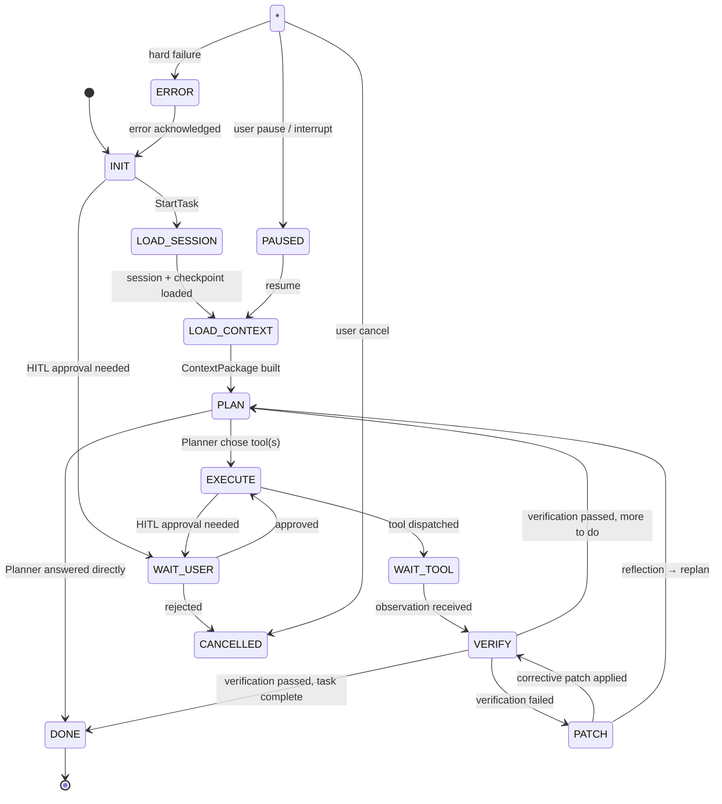
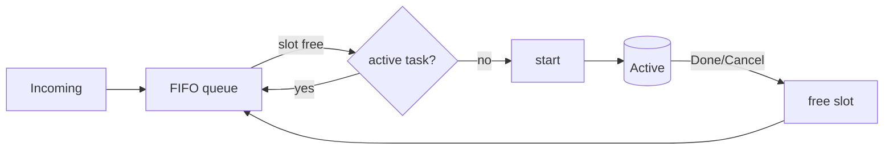
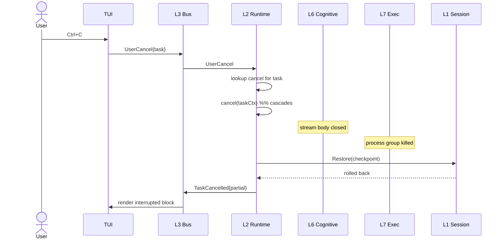

# 04 — Runtime State Machine

> **Goal of this document:** design Layer 2 — the finite state machine that
> decides where the agent is at every instant, the transition table that
> governs movement, the scheduler that orders tasks, and the cancellation path
> that stops an in-flight LLM stream safely.

This file owns **Layer 2 (`internal/runtime`)**. It consumes the session/task
framing from File 03, drives the context→prompt→cognitive→exec→verify→patch
pipeline from Files 06–10, and inherits the context-down/events-up cancellation
pattern from File 02 §2.4.3.

---

## Table of Contents

1. [State Machine Diagram](#41-state-machine-diagram)
2. [State Transitions](#42-state-transitions)
3. [The Drive Loop](#43-the-drive-loop)
4. [Scheduler & Queue](#44-scheduler--queue)
5. [Cancellation & Interruption](#45-cancellation--interruption)
6. [The Core, consolidated](#46-the-core-consolidated)

---

## 4.1 State Machine Diagram

The runtime is a finite state machine. The brief specifies the canonical path
plus four side states. Exactly one operational state is active per task at any
instant; the bus publishes a `StateChangeEvent` on every transition so the TUI
and Infrastructure always know where the task is.



### 4.1.1 The states, defined

| State | Meaning | Exit conditions |
|---|---|---|
| `INIT` | A task has been requested; not yet loading. | `StartTask` → `LOAD_SESSION` |
| `LOAD_SESSION` | Loading the session, task, and last checkpoint. | loaded → `LOAD_CONTEXT` |
| `LOAD_CONTEXT` | Building the Context Package (File 06). | built → `PLAN` |
| `PLAN` | Cognitive Core deciding: direct answer or tool use (File 07). | answer → `DONE`; tool → `EXECUTE` |
| `EXECUTE` | A tool is being dispatched under the sandbox (File 08). | dispatched → `WAIT_TOOL` |
| `WAIT_TOOL` | Tool running; awaiting observation. | observation → `VERIFY` |
| `VERIFY` | Verification pipeline running (File 09). | pass → `PLAN`/`DONE`; fail → `PATCH` |
| `PATCH` | Corrective patch being applied (File 10). | applied → `VERIFY`; reflect → `PLAN` |
| `DONE` | Task complete; final answer delivered. | terminal |
| `PAUSED` | Task halted at a safe boundary; resumable. | resume → `LOAD_CONTEXT` |
| `CANCELLED` | Task aborted and rolled back to last checkpoint. | terminal |
| `ERROR` | A fatal (task-ending) failure; user must acknowledge. | ack → `INIT` |
| `WAIT_USER` | Blocked on human-in-the-loop approval. | approve → `EXECUTE`; reject → `CANCELLED` |

### 4.1.2 Why these states (vs. the older IDLE/THINKING/ACTING/OBSERVING)

The older four-state model collapsed loading, planning, verifying, and patching
into "thinking" and "acting". The expanded machine makes each a first-class
state because each has distinct *cancellation*, *timeout*, and *observability*
semantics: a Ctrl+C during `VERIFY` must roll back an unverified patch, while
during `WAIT_USER` it must not (the user is in charge). One "ACTING" state could
not express that.

---

## 4.2 State Transitions

The complete transition table. **Guard** = conditions that must hold; **Action**
= side effects performed atomically with the transition, before the
`StateChangeEvent` is published.

| # | From | Event/Signal | Guard | To | Action |
|---|---|---|---|---|---|
| T1 | `INIT` | `StartTask` | task allocated | `LOAD_SESSION` | publish `task.started` |
| T2 | `LOAD_SESSION` | session+checkpoint loaded | resume rule (File 03 §3.5.2) | `LOAD_CONTEXT` | attach cancel ctx |
| T3 | `LOAD_CONTEXT` | `ContextPackage` ready | within budget | `PLAN` | publish `context.built` |
| T4 | `PLAN` | Planner: answer | `final == true` | `DONE` | publish `task.completed` |
| T5 | `PLAN` | Planner: tool call | ≥1 call | `EXECUTE` | publish `tool.call` |
| T6 | `EXECUTE` | dispatched + needs approval | risk ≥ medium | `WAIT_USER` | publish `approval.request` |
| T7 | `EXECUTE` | dispatched, no approval needed | risk low | `WAIT_TOOL` | run tool |
| T8 | `WAIT_USER` | `UserApprove` | approval matches | `EXECUTE` | resume tool |
| T9 | `WAIT_USER` | `UserReject` | approval matches | `CANCELLED` | publish `task.cancelled` |
| T10 | `WAIT_TOOL` | `Observation` received | tool returned | `VERIFY` | publish `observation.received` |
| T11 | `VERIFY` | verdict: pass | more to do | `PLAN` | append result; loop |
| T12 | `VERIFY` | verdict: pass | task complete | `DONE` | publish `task.completed`; memory update |
| T13 | `VERIFY` | verdict: fail | reflection says patch | `PATCH` | publish `verification.failed` |
| T14 | `VERIFY` | verdict: fail | reflection says replan | `PLAN` | append reflection note |
| T15 | `PATCH` | patch applied | — | `VERIFY` | re-verify the new change |
| T16 | `*` | `UserPause` | at safe boundary | `PAUSED` | publish `task.paused` |
| T17 | `PAUSED` | `UserResume` | checkpoint intact | `LOAD_CONTEXT` | rebuild context |
| T18 | `*` | `UserCancel` | task matches | `CANCELLED` | cancel ctx; rollback to checkpoint |
| T19 | `*` | hard error | non-recoverable | `ERROR` | publish `error` |
| T20 | `ERROR` | `UserAckError` | — | `INIT` | publish `state→init` |

### 4.2.1 Transition invariants

Three invariants are checked at every transition; a violation aborts (a
determinism bug, never recoverable):

- **I1 — single-writer.** Only the runtime goroutine mutates `task.state`.
  Other layers communicate via events.
- **I2 — monotonic task.** `TaskID` strictly increases; a transition for an
  older task is a stale event, dropped + logged.
- **I3 — safe-boundary pause.** `PAUSED` is only entered at `DONE`, after a
  `VERIFY` pass, or before `EXECUTE` — never mid-tool or mid-verify. Pausing
  mid-verify would leave an unverified patch on disk.

### 4.2.2 The transition handler

```go
package runtime

func (c *Core) transition(t TaskID, from, to State, why string, act func()) {
    h, ok := c.tasks[t]
    if !ok { c.log.Warn("stale transition", "task", t); return }
    if h.state != from {
        c.log.Error("invariant violation", "task", t, "expected", from, "actual", h.state)
        panic("FSM invariant I1/I2")
    }
    h.state = to
    act()
    c.bus.Publish(h.ctx, StateChangeEvent{Task: t, From: from, To: to, Why: why})
}
```

---

## 4.3 The Drive Loop

The runtime goroutine runs one task at a time (MVP) and walks the FSM. Each
phase delegates to the layer that owns it; the runtime only orchestrates.

```go
func (c *Core) drive(ctx context.Context, tid TaskID) {
    h := c.tasks[tid]
    for {
        select {
        case <-h.ctx.Done():
            c.handleCancel(tid)
            return
        default:
        }
        switch h.state {

        case INIT:
            c.transition(tid, INIT, LoadSession, "start", func() {
                c.bus.Publish(ctx, TaskStartedEvent{Task: tid})
            })

        case LoadSession:
            s, t, err := c.session.Resume(ctx, h.sessionID)
            if err != nil { c.toError(tid, err); return }
            h.task = t
            c.session.AttachCancel(tid, h.cancel)
            c.transition(tid, LoadSession, LoadContext, "session_loaded", nil)

        case LoadContext:
            pkg, err := c.context.Build(ctx, ContextRequest{Task: h.task, Session: h.session})
            if err != nil { c.toError(tid, err); return }
            h.pkg = pkg
            c.transition(tid, LoadContext, Plan, "context_built", func() {
                c.bus.Publish(ctx, ContextBuiltEvent{Task: tid})
            })

        case Plan:
            msgs := c.prompt.Compile(h.pkg)
            turn, err := c.cognitive.Think(ctx, msgs)
            if err != nil { c.toError(tid, err); return }
            if turn.Final {
                c.transition(tid, Plan, Done, "direct_answer", func() {
                    c.bus.Publish(ctx, AssistantMessageEvent{Task: tid, Text: turn.Text, Final: true})
                    c.memory.Update(ctx, MemoryUpdate{Task: tid})
                    c.bus.Publish(ctx, TaskCompletedEvent{Task: tid})
                })
                return
            }
            h.pendingCalls = turn.ToolCalls
            c.transition(tid, Plan, Execute, "tool_call", func() {
                for _, call := range turn.ToolCalls {
                    c.bus.Publish(ctx, ToolCallEvent{Task: tid, Tool: call.Tool, Args: call.Args})
                }
            })

        case Execute:
            call := h.pendingCalls[0]
            h.pendingCalls = h.pendingCalls[1:]
            if c.exec.NeedsApproval(call) {
                c.transition(tid, Execute, WaitUser, "approval_needed", func() {
                    c.bus.Publish(ctx, ApprovalRequestEvent{Task: tid, Tool: call.Tool})
                })
                h.pendingApproval = call
                continue
            }
            obs, err := c.exec.Dispatch(ctx, call)
            if err != nil { c.toError(tid, err); return }
            h.lastObs = obs
            c.transition(tid, Execute, Verify, "tool_done", func() {
                c.bus.Publish(ctx, ObservationEvent{Task: tid, Tool: call.Tool, Obs: obs})
            })

        case WaitUser:
            // blocked on approval channel; resolved by handleApproval (§4.5.3)
            select {
            case dec := <-h.approvalCh:
                if !dec.approved {
                    c.transition(tid, WaitUser, Cancelled, "rejected", func() {
                        c.bus.Publish(ctx, TaskCancelledEvent{Task: tid, Reason: "rejected"})
                    })
                    return
                }
                c.transition(tid, WaitUser, Execute, "approved", nil)
            case <-h.ctx.Done():
                c.handleCancel(tid); return
            }

        case WaitTool:
            // tool already dispatched in Execute; this state awaits observation
            // (in MVP, Dispatch blocks, so WaitTool is a brief pass-through)
            c.transition(tid, WaitTool, Verify, "observation", nil)

        case Verify:
            verdict, err := c.verify.Verify(ctx, h.lastObs, h.task)
            if err != nil { c.toError(tid, err); return }
            if verdict.Pass {
                if c.cognitive.HasMore(h.task) {
                    c.transition(tid, Verify, Plan, "verify_pass_more", nil)
                } else {
                    c.transition(tid, Verify, Done, "verify_pass_done", func() {
                        c.memory.Update(ctx, MemoryUpdate{Task: tid})
                        c.bus.Publish(ctx, TaskCompletedEvent{Task: tid})
                    })
                    return
                }
                continue
            }
            // fail → reflect, then patch or replan
            decision := c.cognitive.Reflect(ctx, h.task, verdict, h.lastObs)
            if decision.Replan {
                c.transition(tid, Verify, Plan, "replan", func() {
                    c.bus.Publish(ctx, ReflectionEvent{Task: tid, Note: decision.Note})
                })
                continue
            }
            h.pendingPatch = decision.Patch
            c.transition(tid, Verify, Patch, "patch_needed", func() {
                c.bus.Publish(ctx, VerificationFailedEvent{Task: tid, Reason: verdict.Reason})
            })

        case Patch:
            res, err := c.patch.Apply(ctx, h.pendingPatch)
            if err != nil { c.toError(tid, err); return }
            if !res.Accepted {
                c.cognitive.NotePatchRejected(h.task, res.Reason)
                c.transition(tid, Patch, Plan, "patch_rejected_replan", nil)
                continue
            }
            h.lastObs = Observation{FromPatch: res}
            c.transition(tid, Patch, Verify, "patch_applied", func() {
                c.bus.Publish(ctx, PatchAppliedEvent{Task: tid, Snapshot: res.Snapshot})
            })

        case Done:
            c.session.CompleteTask(ctx, tid)
            return
        }
    }
}
```

This is the heart of the system: a single goroutine walking the FSM, each state
delegating to the layer that owns the work, every transition observable on the
bus.

---

## 4.4 Scheduler & Queue

### 4.4.1 Policy (MVP)
At most one active task at a time (single-user interactive mode). A
`UserMessage` received while a task is active is **queued**, not rejected, so
the user can type ahead. Multi-agent mode (File 12) lifts this to N active
tasks under the Coordination Layer.



| Concern | Decision |
|---|---|
| Concurrency | 1 (MVP), N (Coordination Layer) |
| Discipline | FIFO by arrival |
| Overflow | soft cap 32; beyond, reject with banner |
| Cancellation | acts on active task; queued items removable by index |
| Priority | none in MVP; user > agents in multi-agent (File 12) |

### 4.4.2 The queue

```go
type Scheduler struct {
    q      []pendingTask
    active *taskHandle
    cap    int
}

func (s *Scheduler) Enqueue(p pendingTask) error {
    if len(s.q) >= s.cap { return ErrQueueFull }
    s.q = append(s.q, p); return nil
}
func (s *Scheduler) Next() (pendingTask, bool) {
    if len(s.q) == 0 { return pendingTask{}, false }
    p := s.q[0]; s.q = s.q[1:]; return p, true
}
func (s *Scheduler) DropAt(i int) bool {
    if i < 0 || i >= len(s.q) { return false }
    s.q = append(s.q[:i], s.q[i+1:]...); return true
}
```

The MVP code is written so swapping `active *taskHandle` for
`active map[TaskID]*taskHandle` is the only structural change for multi-agent.

---

## 4.5 Cancellation & Interruption

### 4.5.1 Requirements
On Ctrl+C the system must:
1. stop the LLM stream within one network round-trip (close the HTTP body);
2. kill any running child process group;
3. roll back any in-flight unverified patch (using the last checkpoint);
4. preserve partial output as a labeled "interrupted" block;
5. transition the FSM to `CANCELLED` exactly once;
6. never lose an event (cancel itself is published + logged).

### 4.5.2 The cancel flow



### 4.5.3 Implementation

```go
func (c *Core) handleCancel(tid TaskID) {
    h := c.tasks[tid]
    h.cancel()                                   // cascade to L6/L7/L8/L9
    if h.task.Checkpoint != "" {
        _ = c.session.Restore(h.ctx, tid, h.task.Checkpoint)  // safe state
    }
    h.task.Status = session.StatusCancelled
    c.bus.Publish(h.ctx, TaskCancelledEvent{Task: tid, Partial: h.partial.String()})
    c.finishTask(tid)
}

func (c *Core) handleApproval(tid TaskID, approved bool) {
    h := c.tasks[tid]
    select { // non-blocking; the drive loop's WaitUser reads it
    case h.approvalCh <- approvalDecision{approved: approved}:
    default:
    }
}
```

### 4.5.4 Child-process kill (portable)
Every child is spawned with a process group (`setpgid` on Unix,
`CREATE_NEW_PROCESS_GROUP` on Windows). Cancellation sends a signal to the
negative pgid on Unix or `GenerateConsoleCtrlEvent` on Windows, then
`Process.Kill`. The runtime only cancels the context; `internal/sysio`
translates that into the correct group-kill (detailed in File 08).

### 4.5.5 Patch rollback on cancel
A patch applied to disk but not yet verified is in a dangerous window. The Patch
Engine (File 10) takes a checkpoint *before* applying; cancellation during the
verify window restores that checkpoint via the Session Manager's `Restore`
(§3.4.3 / §3.6.1). The user never sees a half-edited file survive an interrupt.

---

## 4.6 The Core, consolidated

```go
package runtime

type Core struct {
    rootCtx   context.Context
    bus       *event.Bus
    session   *session.Manager
    context   *context.Engine
    prompt    *prompt.Compiler
    cognitive *cognitive.Core
    exec      *exec.Engine
    verify    *verify.Engine
    patch     *patch.Engine
    memory    *memory.Store
    sched     Scheduler
    tasks     map[TaskID]*taskHandle
    log       *slog.Logger
}

type taskHandle struct {
    id            TaskID
    sessionID     session.ID
    ctx           context.Context
    cancel        context.CancelFunc
    state         State
    task          *session.Task
    pkg           context.ContextPackage
    pendingCalls  []ToolCall
    pendingPatch  patch.Op
    pendingApproval ToolCall
    lastObs       Observation
    approvalCh    chan approvalDecision
    partial       strings.Builder
}

func New(d Deps) *Core { /* wire layers */ }
func (c *Core) Run(ctx context.Context) error            // the loop: drain user bus + turnResults + pump
func (c *Core) Submit(ctx context.Context, m UserMessage) TaskID
func (c *Core) Cancel(tid TaskID) error
func (c *Core) Approve(tid TaskID, approved bool)
```

The `Run` loop (sketched in File 02 §2.4) subscribes to user events, feeds the
scheduler, and pumps `drive` for the active task; `drive` (§4.3) is the FSM
walker.

---

## 4.7 What this file fixes, and what it hands off

**Fixed here:**
- the 12-state FSM and 20-entry transition table with invariants;
- the single-goroutine drive loop that delegates each state to its layer;
- the FIFO scheduler with the single-active-task MVP policy and a clear path to
  N-active under the Coordination Layer;
- the cancellation flow that stops the stream, kills process groups portably,
  rolls back to the last checkpoint, preserves partial output, and transitions
  to `CANCELLED` exactly once.

**Handed off:**
- Session/checkpoint/undo primitives → **File 03**.
- Context Package + compiled prompt → **Files 06**.
- Planner + Reflection (the `Think`/`Reflect` calls) → **File 07**.
- Dispatch + sandbox + HITL → **File 08**.
- Verify pipeline → **File 09**.
- Patch apply + checkpoint → **File 10**.

---

*End of File 04 — Runtime State Machine.*
