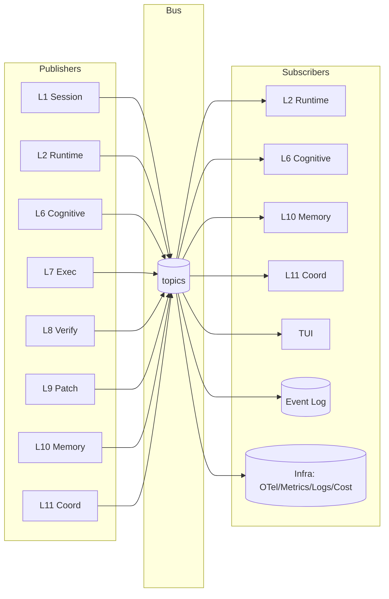

# 05 — Event Bus

> **Goal of this document:** design Layer 3 — the system's backbone. Every
> layer and every subsystem (memory, UI, logger, telemetry, metrics, cost)
> subscribes to the bus; nothing reaches across layers except via events. This
> file fixes the `Bus` type, the topic registry, the full event catalog, and
> the observer subscribers that make the system transparent.

This file owns **Layer 3 (`internal/event`)**. It is referenced by every other
file; its contract is frozen here.

---

## Table of Contents

1. [Why a Bus, Not Direct Calls](#51-why-a-bus-not-direct-calls)
2. [Topics, Subscribers, Delivery Semantics](#52-topics-subscribers-delivery-semantics)
3. [The `Bus` Type (Go)](#53-the-bus-type-go)
4. [Event Types Catalog](#54-event-types-catalog)
5. [Observer Subscribers (Log, Infra, TUI)](#55-observer-subscribers-log-infra-tui)
6. [Backpressure & Bounded Channels](#56-backpressure--bounded-channels)

---

## 5.1 Why a Bus, Not Direct Calls

A direct-call architecture (runtime calls cognitive, cognitive calls exec) is
simpler to draw and slightly faster. We reject it for three reasons mapping to
the principles:

- **P4 Transparency.** A direct call is invisible; only caller and callee know.
  An event is a first-class object with payload, timestamp, and sequence number,
  written to an append-only log the TUI, a headless runner, and Infrastructure
  can all replay. "What did the agent just do?" becomes `tail` on the log.
- **P3 Determinism.** A replay of the log reproduces the task. Direct calls
  cannot be replayed because they are not recorded.
- **Decoupling.** The TUI is one subscriber. A future headless runner, a metrics
  exporter, a test harness recording golden transcripts, and Infrastructure's
  OpenTelemetry tracer all subscribe without touching the agent core. Direct
  calls would force every such consumer to be wired in at compile time.

The cost is one channel hop per cross-layer message (sub-microsecond) and the
discipline of not reaching across layers except inside a single turn's
intra-turn calls (File 02 §2.4).

---

## 5.2 Topics, Subscribers, Delivery Semantics



Topics use a dotted hierarchy (`tool.*`, `verify.*`). A subscriber can subscribe
to a leaf (`tool.result`) or a wildcard prefix (`tool.>`). The event log and
Infrastructure subscribe to the root (`>`) and are the only subscribers
guaranteed to see every event.

| Property | Guarantee | Mechanism |
|---|---|---|
| Ordering | per-subscriber FIFO | single channel per subscriber, single bus goroutine writes |
| Delivery | at-least-once in-session | channel send; full channel → publisher blocks (backpressure) |
| Persistence | append-only log on disk | event `MarshalJSON` + fsync before in-memory fan-out |
| Replay | deterministic for non-LLM events | log replay re-publishes; LLM nondeterminism is the only entropy |
| Duplication | possible across restart | subscribers must be idempotent on `Env.Seq` |

---

## 5.3 The `Bus` Type (Go)

A deliberately small implementation. The bus owns one goroutine and one channel
per subscriber. Everything is typed via the `Event` interface.

```go
package event

import (
    "context"
    "encoding/json"
    "sync"
    "sync/atomic"
    "time"
)

type Topic string

type Event interface {
    Type() Topic
    CausalID() TaskID
}

type Envelope struct {
    Seq uint64      // bus-assigned, monotonic per session
    At  time.Time
    Evt Event
}

type Bus struct {
    mu        sync.Mutex
    next      atomic.Uint64
    subs      []subscription
    log       *Log
    closed    atomic.Bool
    closeOnce sync.Once
    closeCh   chan struct{}
}

type subscription struct {
    topics []Topic
    ch     chan Envelope
}

func New() *Bus {
    b := &Bus{log: NewLog(), closeCh: make(chan struct{})}
    go b.dispatch()
    return b
}

func (b *Bus) Subscribe(topics ...Topic) <-chan Envelope {
    ch := make(chan Envelope, 64)
    b.mu.Lock()
    b.subs = append(b.subs, subscription{topics: topics, ch: ch})
    b.mu.Unlock()
    return ch
}

func (b *Bus) Publish(ctx context.Context, e Event) error {
    if b.closed.Load() { return ErrBusClosed }
    seq := b.next.Add(1)
    env := Envelope{Seq: seq, At: time.Now().UTC(), Evt: e}

    // 1. Durability before fan-out (P3).
    if err := b.log.Append(env); err != nil { return err }

    // 2. Fan-out to matching subscribers.
    b.mu.Lock()
    subs := append([]subscription(nil), b.subs...)
    b.mu.Unlock()
    for _, s := range subs {
        if !matches(s.topics, e.Type()) { continue }
        select {
        case s.ch <- env:
        case <-ctx.Done():
            return ctx.Err()
        }
    }
    return nil
}

func (b *Bus) Close() error {
    b.closeOnce.Do(func() {
        b.closed.Store(true)
        close(b.closeCh)
        b.mu.Lock()
        for _, s := range b.subs { close(s.ch) }
        b.subs = nil
        b.mu.Unlock()
    })
    return nil
}

func matches(topics []Topic, t Topic) bool {
    for _, w := range topics {
        if w == t { return true }
        if strings.HasSuffix(string(w), ".>") && strings.HasPrefix(string(t), strings.TrimSuffix(string(w), ">")) {
            return true
        }
    }
    return false
}
```

### 5.3.1 The event log

```go
type Log struct {
    mu   sync.Mutex
    f    *os.File
    enc  *json.Encoder
}

func (l *Log) Append(env Envelope) error {
    l.mu.Lock(); defer l.mu.Unlock()
    if err := l.enc.Encode(env); err != nil { return err }
    return l.f.Sync()   // fsync; batchable in File 15 §10.5
}
```

The log is the single source of truth for P4. A debug session is
`tail -f yolo.log | jq .Evt`; a bug report is the log file; a test fixture is a
recorded log.

---

## 5.4 Event Types Catalog

Every event the bus can carry, grouped by publisher. Each entry gives the
topic, the Go struct, and an example JSON payload. This is the authoritative
list referenced by the event log and by test fixtures (File 15 §15.4).

### 5.4.1 Session & task (L1) — see File 03

```go
type TaskStartedEvent   struct{ Task, Session, Goal string }                       // task.started
type TaskCompletedEvent struct{ Task string }                                        // task.completed
type TaskCancelledEvent struct{ Task, Reason, Partial string }                      // task.cancelled
type TaskPausedEvent    struct{ Task string }                                        // task.paused
type CheckpointEvent    struct{ Task, Name string; Snapshot SnapshotRef }           // task.checkpoint
type RestoredEvent      struct{ Task, Name string }                                  // task.restored
type UndoneEvent        struct{ Task string; Entry HistoryEntry }                   // task.undone
```

### 5.4.2 Runtime FSM (L2) — see File 04

```go
type StateChangeEvent    struct{ Task TaskID; From, To, Why string }                // state.change
type ContextBuiltEvent  struct{ Task TaskID }                                        // context.built
type ApprovalRequestEvent struct{ Task TaskID; Tool, Summary, Preview string; Risk Risk } // approval.request
type ObservationEvent    struct{ Task TaskID; Tool string; Obs Observation }        // observation.received
type VerificationFailedEvent struct{ Task TaskID; Reason string }                    // verification.failed
type ReflectionEvent     struct{ Task TaskID; Note string }                          // reflection.note
type PatchAppliedEvent   struct{ Task TaskID; Snapshot SnapshotRef }                  // patch.applied
```

### 5.4.3 Cognitive (L6) — see File 07

```go
type TokenEvent         struct{ Task TaskID; Delta string }                          // llm.token
type ThinkingEvent      struct{ Task TaskID; Delta string }                          // llm.thinking
type AssistantMessageEvent struct{ Task TaskID; Text string; Final bool }          // assistant.message
type ToolCallEvent      struct{ Task TaskID; Tool string; Args json.RawMessage; Reason string } // tool.call
```

### 5.4.4 Execution (L7) — see File 08

```go
type ToolResultEvent    struct{ Task TaskID; Tool string; Obs Observation }          // tool.result
```

### 5.4.5 Memory (L10) — see File 11

```go
type MemoryUpdateEvent  struct{ Task TaskID; Store string; Items int }              // memory.update
```

### 5.4.6 User (published by TUI, subscribed by L2)

```go
type UserSubmitEvent  struct{ Text string; Attachments []AttachmentRef }             // user.submit
type UserCancelEvent  struct{ Task TaskID }                                         // user.cancel
type UserApproveEvent struct{ Task, ApprovalID string }                            // user.approve
type UserRejectEvent  struct{ Task, ApprovalID, Reason string }                     // user.reject
type UserPauseEvent   struct{ Task TaskID }                                         // user.pause
type UserResumeEvent  struct{ Task TaskID }                                         // user.resume
type UserQuitEvent    struct{}                                                       // user.quit
```

### 5.4.7 Coordination (L11) — see File 12

```go
type TaskAssignEvent  struct{ PlanID, TodoID, Agent, Brief string; Context []string } // coord.task.assign
type PlanReadyEvent   struct{ PlanID string; Plan Plan }                              // coord.plan.ready
type CodeReadyEvent   struct{ PlanID, TodoID, Diff, SelfReport string }               // coord.code.ready
type ReviewVerdictEvent struct{ PlanID, TodoID string; Approved bool; Comments []string } // coord.review.verdict
type TestReportEvent  struct{ PlanID, TodoID string; Passed bool; Output string }     // coord.test.report
```

### 5.4.8 Error (any layer)

```go
type ErrorEvent struct{ Task TaskID; Layer, Code, Msg string; Retry bool }           // error
// JSON: {"task":"t_01","layer":"cognitive","code":"provider_timeout","msg":"…","retry":true}
```

### 5.4.9 Topic registry (consolidated)

| Topic | Publisher | Subscribers | Rendered by TUI? |
|---|---|---|---|
| `task.*` | L1 | L2, TUI, Infra | yes (header) |
| `state.change` | L2 | TUI, Infra | yes (status) |
| `context.built` | L2 | TUI, Infra | yes (briefly) |
| `llm.token` / `llm.thinking` | L6 | TUI, Infra | yes (typing) |
| `assistant.message` | L6 | L2, TUI, Infra | yes |
| `tool.call` | L6 | L2, TUI, Infra | yes |
| `observation.received` | L2 | TUI, Infra | yes |
| `tool.result` | L7 | L2, L10, TUI, Infra | yes |
| `approval.request` | L2 | TUI, Infra | yes (Y/N) |
| `verification.failed` | L2 | TUI, Infra | yes |
| `reflection.note` | L6 | TUI, Infra | yes |
| `patch.applied` | L9 | L1, TUI, Infra | yes (diff) |
| `memory.update` | L10 | TUI, Infra | yes (status) |
| `coord.*` | L11 | L11, TUI, Infra | yes (board) |
| `error` | any | TUI, Infra | yes (banner) |
| `user.*` | TUI | L2 | (input echo) |

### 5.4.10 Versioning
Every struct carries `"v": 1` in its JSON (omitted above for brevity). A bump
is a breaking change requiring a log-reader migration. Within `v1`, additive
optional fields are allowed; removing/renaming a field is not.

---

## 5.5 Observer Subscribers (Log, Infra, TUI)

Three subscribers are always present, beyond the layers that *react* to events:

### 5.5.1 The Event Log (transparency sink)
Append-only, root subscriber. Described in §5.3.1. This is P4 made concrete.

### 5.5.2 Infrastructure (observability sink)
Subscribes to `>` (root) and turns every event into:
- an **OpenTelemetry span** (one per event, nested under the task's root span),
  exported by a background `otel.export` goroutine (File 13);
- a **metric** counter (events-per-topic, tokens, tool calls, loop iterations);
- a **structured log line** via `log/slog` with the event's fields.

Infrastructure never modifies agent state; it only projects events into
external observability systems. This is why "what is the agent doing?" is
answerable in your existing Grafana/Jaeger/Sentry stack, not a bespoke panel.

### 5.5.3 The TUI (render sink)
Subscribes to the rendering topics (see registry) and projects event state to
the screen. The TUI holds **no state machine of its own** — it renders what the
bus says. Cancellation, pause, state changes, tool calls, approvals, diffs, and
errors are all derived from events, never from the TUI inspecting the runtime
(File 14).

---

## 5.6 Backpressure & Bounded Channels

Every subscriber channel is bounded (default buffer 64). When a subscriber
falls behind, `Publish` blocks on `s.ch <- env` until the subscriber drains or
the publisher's context is canceled. This is deliberate:

- A slow TUI must not drop events (P3); backpressure is the correct response.
- A slow TUI can stall the agent, but rendering an event is microseconds; the
  bound of 64 absorbs bursts. Sustained slowness indicates a bug, and stalling
  surfaces it loudly rather than silently dropping events.

The one exception is the **event log**: it writes synchronously on a dedicated
goroutine with its own ring buffer so disk latency does not stall fan-out. If
the ring fills, the bus blocks *before* fan-out (durability before visibility).

### 5.6.1 Idempotency rule
Because delivery is at-least-once across restart, subscribers must be idempotent
on `Env.Seq`. The runtime keeps a `seen` set per task and drops duplicates; the
TUI renders from absolute state, not deltas, so a replayed token is a no-op.

---

## 5.7 What this file fixes, and what it hands off

**Fixed here:**
- the rationale and the delivery semantics (at-least-once + idempotent subs +
  per-subscriber FIFO + durability-before-visibility);
- the `Bus` type, the `Event`/`Envelope` contract, the topic registry, and the
  complete event catalog (16 topic groups);
- the three observer subscribers (log, Infrastructure, TUI) and the rule that
  the TUI holds no state machine of its own;
- backpressure and the idempotency rule.

**Handed off:**
- The OpenTelemetry/metrics/logs projection of events → **File 13**.
- The TUI's event→render mapping → **File 14**.
- Every layer's published events are enumerated in its own file; the bus
  contract here is what they all implement.

---

*End of File 05 — Event Bus.*
