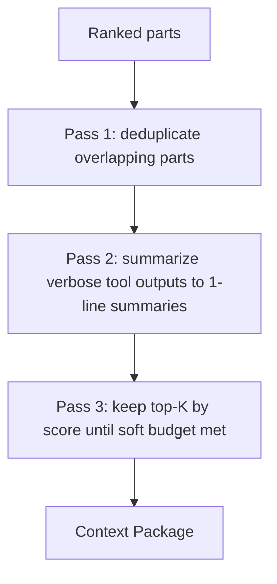
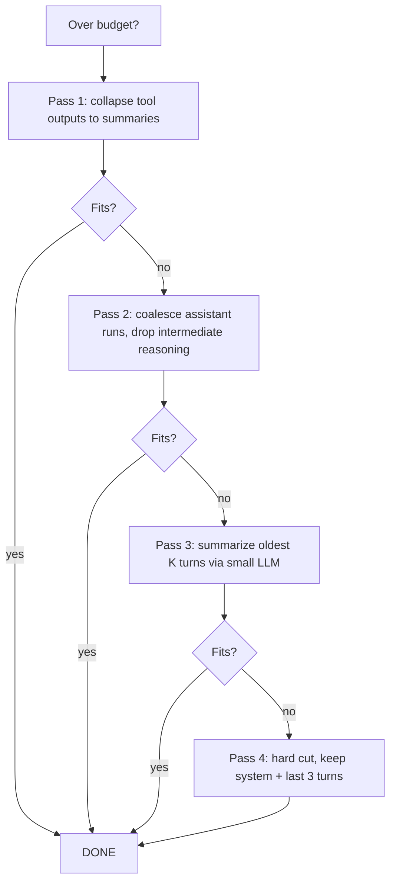

# 06 — Context Engine

> **Goal of this document:** design Layers 4 and 5 — the **Context Engine** that
> gathers, ranks, scores, and compresses context inputs into a Context Package,
> and the **Prompt Compiler** that deduplicates, summarizes, budgets, and orders
> that package into the final prompt. This is the module that decides what the
> model sees.

The brief calls this "the hardest module." It owns **Layers 4–5
(`internal/context`, `internal/prompt`)**, consuming memory (File 11) and
feeding the Cognitive Core (File 07).

---

## Table of Contents

1. [Context Engine — Inputs](#61-context-engine--inputs)
2. [Context Ranking & Relevance Score](#62-context-ranking--relevance-score)
3. [Compression](#63-compression)
4. [The Context Package](#64-the-context-package)
5. [Prompt Compiler — Pipeline](#65-prompt-compiler--pipeline)
6. [Token Budget & Ordering](#66-token-budget--ordering)
7. [Sliding Window & Trimming](#67-sliding-window--trimming)
8. [The two engines, consolidated](#68-the-two-engines-consolidated)

---

## 6.1 Context Engine — Inputs

The Context Engine gathers everything that *could* be relevant to the current
task, then filters it down. The inputs are:

| Input | Source | Why |
|---|---|---|
| Conversation | session/task history (File 03) | continuity |
| Open files | tracked reads/edits (File 08) | what the user/model is looking at |
| Git diff | `git diff` of the working tree | uncommitted changes the model must respect |
| Repository graph | tree-sitter symbol graph (File 11) | call sites, definitions, dependents |
| Diagnostics | LSP/compile errors (File 09) | known-broken state to avoid |
| User preference | preference memory (File 11) | style, tooling, do/don't |
| Project memory | `AGENTS.md` + project store (File 11) | conventions, structure |

```go
package context

type Engine struct {
    memory   *memory.Store
    git      *sysio.Git
    graph    *GraphStore
    diags    DiagnosticSource
    counter  Counter
    bus      *event.Bus
}

type ContextRequest struct {
    Task    *session.Task
    Session *session.Session
}

func (e *Engine) Build(ctx context.Context, req ContextRequest) (ContextPackage, error) {
    parts := e.gather(ctx, req)        // §6.1
    ranked := e.rank(parts, req)       // §6.2
    pkg := e.compress(ranked)          // §6.3 + §6.4
    return pkg, nil
}
```

---

## 6.2 Context Ranking & Relevance Score

### 6.2.1 Why rank
Not everything gathered is useful. A 50-file repo graph and a 200-line git diff
cannot both fit; and even if they could, noise hurts the model. Ranking assigns
each part a **relevance score** so the compressor knows what to keep.

### 6.2.2 The score
Each `Part` gets a score in `[0,1]` from a weighted blend:

```go
type Scored struct {
    Part  Part
    Score float64
}

func (e *Engine) rank(parts []Part, req ContextRequest) []Scored {
    out := make([]Scored, len(parts))
    for i, p := range parts {
        s := 0.0
        s += 0.30 * recency(p, req)         // recently touched?
        s += 0.25 * proximity(p, req)        // near the task's files?
        s += 0.20 * semantic(p, req)          // RAG cosine to the goal
        s += 0.15 * centrality(p, req)       // in the repo graph's hot path?
        s += 0.10 * explicit(p, req)         // user @-referenced?
        out[i] = Scored{Part: p, Score: s}
    }
    sort.SliceDesc(out, func(i, j int) bool { return out[i].Score > out[j].Score })
    return out
}
```

| Signal | Weight | Source |
|---|---|---|
| Recency | 0.30 | timestamps from session/read tracking |
| Proximity | 0.25 | directory/symbol distance to the task's files |
| Semantic | 0.20 | vector cosine (RAG) between the goal and the chunk |
| Centrality | 0.15 | PageRank-style weight in the repo symbol graph |
| Explicit | 0.10 | `@file`/`#issue` references in the user message |

### 6.2.3 Repository graph centrality
The repository graph (built by tree-sitter, File 11) lets us ask "is this
symbol on the hot path?" — a function called by many callers scores higher than
a leaf helper. A simple PageRank over the call/import graph produces a
centrality weight per symbol; that weight feeds the ranker. This is what makes
"the auth middleware" surface before "a one-off helper" even if both match the
query semantically.

---

## 6.3 Compression

Compression reduces ranked parts to fit a soft budget *before* the Prompt
Compiler applies the hard token budget. It has three passes:



| Pass | Action | Cost |
|---|---|---|
| 1 | Merge parts covering the same file/symbol; keep the most complete | cheap |
| 2 | Replace raw tool stdout/stderr with the 1-line summary (File 08 §8.5) | cheap |
| 3 | Greedily keep highest-scored parts until the soft byte budget is hit; drop the rest | cheap |

Compression does **not** call an LLM. Summaries used here are the pre-computed
ones from the execution engine; LLM-driven summarization is reserved for the
trimmer (§6.7 pass 3), which only fires when the hard budget is exceeded.

---

## 6.4 The Context Package

The output of the Context Engine is a `ContextPackage` — a structured,
ranked, compressed bundle handed to the Prompt Compiler:

```go
type ContextPackage struct {
    System      []Part   // role, rules, tool schemas
    Project     []Part   // AGENTS.md, structure
    Conversation []Part  // ranked history
    Files       []Part   // open + retrieved files, ranked
    Graph       []Part   // relevant symbols/edges
    Diagnostics []Part   // current errors
    Preferences []Part   // user prefs
    Budget      Budget   // token budget (computed here, enforced in §6.6)
}
```

The package is **structured**, not a flat string. The Prompt Compiler orders
these groups deterministically (§6.6).

---

## 6.5 Prompt Compiler — Pipeline

The brief is explicit: the Prompt Compiler does **not concatenate**. It runs a
deterministic pipeline:

```
ContextPackage
   │
   ▼
Deduplicate          (drop duplicate content across groups)
   │
   ▼
Summarize            (compress long tool outputs / old turns)
   │
   ▼
Token Budget         (allocate across groups; trim if over)
   │
   ▼
Prompt Ordering       (deterministic group order)
   │
   ▼
Final Prompt (Messages)
```

```go
package prompt

type Compiler struct {
    counter Counter
    trimmer *Trimmer
}

func (c *Compiler) Compile(pkg context.ContextPackage) []Message {
    pkg = c.dedup(pkg)                       // §6.5.1
    pkg = c.summarize(pkg)                   // §6.5.2
    pkg = c.applyBudget(pkg)                 // §6.6
    return c.order(pkg)                       // §6.6
}
```

### 6.5.1 Deduplicate
Cross-group duplicates (a file that appears in both `Files` and `Conversation`
as a tool result) are merged; the higher-scored representation wins. Within
`Conversation`, consecutive identical tool results collapse to one.

### 6.5.2 Summarize (cheap)
Long tool outputs already carry a 1-line summary (File 08 §8.5). Old turns'
verbose reasoning is dropped, leaving the final statement. No LLM call here.

---

## 6.6 Token Budget & Ordering

### 6.6.1 The budget
The window is divided into a reply reservation and a waterfall across input
groups with strict priorities (system > project > conversation > files > user):

```go
type Budget struct {
    Window, Reserve, System, Project, Conversation, Files, User int
}

func Allocate(window int) Budget {
    reserve := max(window*15/100, 1024)
    avail := window - reserve
    sys := min(avail*12/100, 4096)
    proj := min(avail*8/100, 2048)
    conv := avail * 45 / 100
    files := avail * 25 / 100
    user := avail - sys - proj - conv - files
    return Budget{window, reserve, sys, proj, conv, files, user}
}
```

| Group | Default cap |
|---|---|
| Reserve (reply) | 15% (hard floor, never borrowed) |
| System | min(actual, 12%) — role + tool schemas |
| Project | min(actual, 8%) — AGENTS.md |
| Conversation | 45% — the big flexible block |
| Files | 25% — shrinks first when conversation grows |
| User | remainder |

### 6.6.2 The ordering
The final prompt is ordered deterministically per the brief:

```
SYSTEM
   ▼
Developer        (role + tool schemas + rules)
   ▼
Project Rules    (AGENTS.md)
   ▼
User             (the current request)
   ▼
Retrieved Context (ranked files, graph, diagnostics)
   ▼
Examples         (few-shot, if any)
```

```go
func (c *Compiler) order(pkg context.ContextPackage) []Message {
    var msgs []Message
    msgs = append(msgs, Message{Role: "system",
        Content: render("<system>", pkg.System)})
    msgs = append(msgs, Message{Role: "system",
        Content: render("<project>", pkg.Project)})
    msgs = append(msgs, Message{Role: "user",
        Content: pkg.User[0].Text})
    if len(pkg.Files)+len(pkg.Graph)+len(pkg.Diagnostics) > 0 {
        msgs = append(msgs, Message{Role: "user",
            Content: render("<files>", append(append(pkg.Files, pkg.Graph...), pkg.Diagnostics...))})
    }
    for _, h := range pkg.Conversation {
        msgs = append(msgs, Message{Role: h.Attr["role"], Content: h.Text})
    }
    return msgs
}
```

The wire format is **XML-tagged structure inside an otherwise Markdown body**
(rationale: no fence collision with code files, explicit delimiters,
Claude-family models trained on it). Prose stays Markdown; code and tool I/O
get unambiguous tags.

### 6.6.3 Budget events
After allocation, the engine publishes a `TokenBudgetEvent` per group so the
TUI token meter (File 14) renders the breakdown live.

---

## 6.7 Sliding Window & Trimming

### 6.7.1 Triggers
1. **Pre-flight:** the compiled prompt exceeds the budget → trim before calling
   the provider.
2. **Post-flight:** the provider returns `context_length_exceeded` → trim hard
   and retry once.

### 6.7.2 The trimming algorithm (conversation-focused)
Conversation is trimmed in passes, cheapest first:



| Pass | Action | Cost | Lost |
|---|---|---|---|
| 1 | Replace tool stdout/stderr with 1-line summary | cheap | raw output (summary kept) |
| 2 | Coalesce assistant runs; drop "let me check…" | cheap | narration |
| 3 | Summarize oldest K turns via small LLM into one `<turn_summary>` | expensive (1 LLM call) | old detail |
| 4 | Hard cut: system + last 3 turns | free | all but recent |

Pass 3 is the only one spending an LLM call; gated by `summarize_history`
config.

### 6.7.3 What is never trimmed
The system prompt, the current user message, any `@`-referenced file, and the
most recent tool *result* (the model often needs it to finish the turn).

### 6.7.4 `context_length_exceeded` recovery
On that error: record `ErrorEvent{code: "context_length_exceeded", retry: true}`,
force pass 4 with a 20% safety margin, retry once. A second failure surfaces to
the user. This makes a miscount recoverable rather than fatal.

---

## 6.8 The two engines, consolidated

```go
package context

type Engine struct {
    memory  *memory.Store
    git     *sysio.Git
    graph   *GraphStore
    diags   DiagnosticSource
    counter Counter
    bus     *event.Bus
    log     *slog.Logger
}

func (e *Engine) Build(ctx context.Context, req ContextRequest) (ContextPackage, error) {
    parts := e.gather(ctx, req)
    ranked := e.rank(parts, req)
    pkg := e.compress(ranked)
    pkg.Budget = prompt.Allocate(e.provider.Window())
    e.bus.Publish(ctx, ContextBuiltEvent{Task: req.Task.ID})
    return pkg, nil
}

// ---- prompt package ----

package prompt

type Compiler struct {
    counter Counter
    trimmer *Trimmer
}

func (c *Compiler) Compile(pkg context.ContextPackage) []Message {
    pkg = c.dedup(pkg)
    pkg = c.summarize(pkg)
    pkg = c.applyBudget(pkg)   // trims via §6.7 if over
    return c.order(pkg)
}
```

---

## 6.9 What this file fixes, and what it hands off

**Fixed here:**
- the seven context inputs and the gather step;
- the relevance score (recency/proximity/semantic/centrality/explicit) and the
  repo-graph centrality that powers it;
- the three cheap compression passes and the structured `ContextPackage`;
- the Prompt Compiler pipeline (dedup → summarize → budget → order), the
  deterministic ordering, and the XML+Markdown wire format;
- the waterfall token budget and the four-pass trimming with a hard floor on
  never-trimmed parts and `context_length_exceeded` recovery.

**Handed off:**
- The memory surfaces (history, semantic retrieve, project, preferences,
  graph) → **File 11**.
- The 1-line tool summaries used in pass 1 → **File 08 §8.5**.
- The compiled prompt is consumed by the Cognitive Core → **File 07**.

---

*End of File 06 — Context Engine.*
