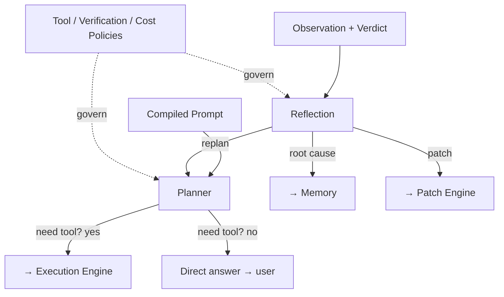
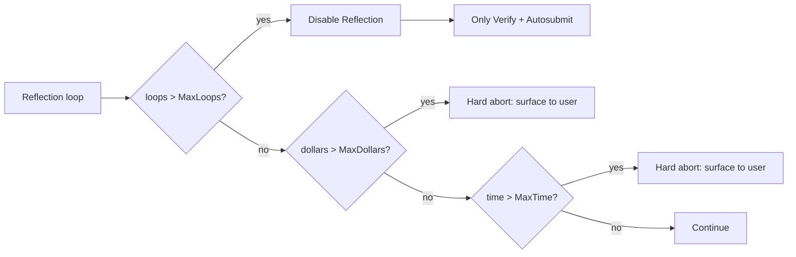

# 07 — Cognitive Core

> **Goal of this document:** design Layer 6 — the "brain" that decides what to
> do. It hosts the **Planner** (decompose, choose tool vs. answer), the
> **Reflection** step (diagnose failure without acting), the **Reasoner** (chain
> of thought), and the **Tool/Verification/Cost policies** that bound its
> behavior — including the **Cost Controller** that auto-degrades runaway loops.

This file owns **Layer 6 (`internal/cognitive`)**. It consumes the compiled
prompt from File 06 and emits tool calls / answers / patch decisions to the
runtime (File 04).

---

## Table of Contents

1. [Components of the Core](#71-components-of-the-core)
2. [Planner](#72-planner)
3. [Reflection](#73-reflection)
4. [Reasoner](#74-reasoner)
5. [Tool Policy & Verification Policy](#75-tool-policy--verification-policy)
6. [Cost Controller](#76-cost-controller)
7. [The Core, consolidated](#77-the-core-consolidated)

---

## 7.1 Components of the Core



The Core is **not** one giant LLM call. It is a set of specialized
prompt-driven sub-roles, each with its own system prompt, each invoked by the
runtime at the right FSM state:

| Component | Invoked at FSM state | Output |
|---|---|---|
| Planner | `PLAN` | tool calls, or a final answer |
| Reflection | `VERIFY` (on failure) | a decision: replan / patch / abort |
| Reasoner | inside Planner/Reflection | chain-of-thought (streamed as `llm.thinking`) |
| Tool Policy | gates Planner's tool choices | allow/deny |
| Verification Policy | gates what "done" means | pass/fail thresholds |
| Cost Controller | governs all | caps, degradation, abort |

---

## 7.2 Planner

### 7.2.1 What it decides
Given the compiled prompt, the Planner answers one question: **does this task
need a tool, or can I answer directly?**

```
Need tool?
  YES → emit tool calls → Executor
  NO  → emit final answer → user
```

### 7.2.2 The Planner call

```go
func (c *Core) Think(ctx context.Context, msgs []Message) (Turn, error) {
    stream, err := c.provider.Stream(ctx, Request{Messages: msgs, Tools: c.toolSchemas()})
    if err != nil {
        if isContextLength(err) { return c.retryTrimmed(ctx, msgs) }
        c.bus.Publish(ctx, ErrorEvent{Layer: "cognitive", Code: "provider_error",
            Msg: err.Error(), Retry: isRetryable(err)})
        return Turn{}, err
    }
    var buf strings.Builder
    for chunk := range stream {
        if chunk.Err != nil { return Turn{}, chunk.Err }
        if chunk.Delta != "" {
            buf.WriteString(chunk.Delta)
            c.bus.Publish(ctx, TokenEvent{Delta: chunk.Delta})
        }
        if chunk.Thinking != "" {
            c.bus.Publish(ctx, ThinkingEvent{Delta: chunk.Thinking})
        }
    }
    turn := c.parser.Parse(buf.String())   // final answer OR tool calls
    c.cost.AddTokens(turn.TokensIn, turn.TokensOut)
    return turn, nil
}

type Turn struct {
    Text      string
    Final     bool
    ToolCalls []ToolCall
    TokensIn  int
    TokensOut int
}
```

### 7.2.3 Tool-call parsing (portable)
We do not rely on the provider's native function-calling. The model is
instructed to emit tool calls as fenced ` ```tool ` blocks containing one JSON
object `{tool, args, reason}` per call. The parser scans for these; text outside
a block is the visible answer. A turn is `Final` iff it contains zero tool-call
blocks. This is provider-agnostic: same engine against OpenAI, Anthropic,
Gemini, or a local llama.cpp server. Providers with native tool calls can opt
in per-provider; the default is the portable path.

---

## 7.3 Reflection

### 7.3.1 The cardinal rule
**Reflection does not call tools. Reflection only thinks.**

When verification fails (File 09), the runtime enters the `VERIFY` failure path
and asks the Core to reflect. Reflection receives the observation, the
verification verdict, and the task history, and produces a **decision** — never
a side effect.

```go
type ReflectionDecision struct {
    Note    string     // root-cause analysis (streamed as reflection.note)
    Replan  bool      // re-enter PLAN with the note appended
    Patch   patch.Op  // if Replan is false and a corrective patch is proposed
    Abort   bool      // give up; surface to user
}
```

### 7.3.2 The reflection call

```go
func (c *Core) Reflect(ctx context.Context, task *session.Task, verdict verify.Verdict, obs Observation) ReflectionDecision {
    if task.Retry >= task.RetryMax {
        c.cost.NotifyReflectionDisabled(task.ID)
        return ReflectionDecision{Abort: true, Note: "retry cap reached; cost-controlled abort"}
    }
    msgs := c.reflectionPrompt(task, verdict, obs)
    out, err := c.reflectProvider.Stream(ctx, Request{Messages: msgs})
    if err != nil { return ReflectionDecision{Abort: true, Note: err.Error()} }

    var buf strings.Builder
    for chunk := range out { buf.WriteString(chunk.Delta) }
    c.bus.Publish(ctx, ReflectionEvent{Note: buf.String()})
    task.Retry++

    dec := c.parseReflection(buf.String())   // replan | patch | abort
    c.cost.IncLoop(task.ID)
    return dec
}
```

### 7.3.3 Why reflection beats blind retry
A blind retry re-emits the same tool call hoping for a different result. Reflection
explicitly asks the model for a **root cause** and a **corrected approach**, and
the runtime feeds that root-cause note back into the next `PLAN` iteration as
context. This is what turns "the model kept trying the same broken patch" into
"the model realized it had the wrong function signature and corrected itself."
The retry cap (sourced from the Cost Controller) bounds the cost of getting it
wrong.

---

## 7.4 Reasoner

The Reasoner is not a separate call; it is the **chain-of-thought** that the
Planner and Reflection emit when the provider exposes reasoning tokens. It is
streamed as `llm.thinking` events and rendered in the TUI as a dimmed
"thinking…" block, distinct from the visible answer. The Reasoner has no
decisions of its own; it is the model's working shown to the user for
transparency (P4), not a control path.

For providers without reasoning tokens, the Reasoner is the model's prose
prefixed by a `<plan>` tag in the system prompt — a structured "here's what I'll
do" before the tool call, which the parser extracts and renders separately.

---

## 7.5 Tool Policy & Verification Policy

### 7.5.1 Tool Policy
Gates the Planner's tool choices *before* the execution engine sees them:

```go
type ToolPolicy struct {
    Allowlist   map[string]bool      // tool names allowed at all
    PerTaskAllow map[string]bool     // per-task overrides
    MaxConcurrent int                // parallel tools per turn (default 1)
}

func (p *ToolPolicy) Allow(call ToolCall, task *session.Task) error {
    if !p.Allowlist[call.Tool] && !p.PerTaskAllow[call.Tool] {
        return fmt.Errorf("tool %q not allowed", call.Tool)
    }
    return nil
}
```

The Planner's tool calls pass through `ToolPolicy.Allow` before the runtime
dispatches them; a denial returns to the model as a tool result explaining why,
so it can choose a different tool.

### 7.5.2 Verification Policy
Defines what "done" means — which verification stages (File 09) must pass and
at what strictness:

```go
type VerificationPolicy struct {
    RequireAST     bool
    RequireFormat  bool
    RequireLint    bool
    RequireTypeCheck bool
    RequireBuild   bool
    RequireTests   bool
    LintLevel      string   // "error" | "warning"
    TestTimeout    time.Duration
}

func DefaultPolicy() VerificationPolicy {
    return VerificationPolicy{RequireAST: true, RequireFormat: true,
        RequireLint: true, RequireTypeCheck: true, RequireBuild: true,
        RequireTests: false, LintLevel: "error", TestTimeout: 30 * time.Second}
}
```

A quick "explain this function" task may use a lighter policy (AST only); a
"refactor and ship" task uses the full policy including tests. The policy is
selected per task and visible in the event trace.

### 7.5.3 `HasMore`
`cognitive.HasMore(task)` returns whether the task has remaining work (more
todos, more loop iterations needed). It is what the runtime uses to decide
`VERIFY → PLAN` (more to do) vs. `VERIFY → DONE` (task complete) at transition
T11/T12 (File 04 §4.2).

---

## 7.6 Cost Controller

### 7.6.1 What it tracks
The brief is explicit — track **loop count, tool count, token, dollar, time**:

```go
package cognitive  // or internal/cost

type Cost struct {
    mu           sync.Mutex
    perTask      map[TaskID]*taskCost
    loops        int
    reflections  int
    tokens       TokenUse
    dollars      float64
    startedAt    time.Time
    config       CostConfig
}

type taskCost struct {
    loops       int
    reflections int
    toolCalls   int
    tokens      TokenUse
    dollars     float64
    deadline    time.Time
}

type CostConfig struct {
    MaxLoops       int           // reflection loops before degradation
    MaxReflections int           // hard cap on reflection calls per task
    MaxDollars     float64       // hard spend cap per task
    MaxTime        time.Duration // wall-clock cap per task
}
```

### 7.6.2 The auto-degradation ladder
When a task runs away (repeated verify-fail → reflection loops), the Cost
Controller degrades *before* it bankrupts the user:



Concretely, per the brief:

```
Reflection × 6  →  Disable Reflection
                        ↓
                Only Verify
                        ↓
                Autosubmit
```

- **After `MaxLoops`** reflection loops: the Core stops invoking Reflection;
  subsequent verify failures go straight to "only verify" mode (apply the model's
  best-effort patch and verify, no reflection reasoning).
- **If that still fails**: the task autosubmits its current best state to the
  user for manual review, rather than looping forever.
- **Hard caps** (`MaxDollars`, `MaxTime`): the task aborts and surfaces, no
  matter what.

```go
func (c *Cost) IncLoop(tid TaskID) {
    tc := c.task(tid)
    tc.loops++
    if tc.loops >= c.config.MaxLoops {
        c.bus.Publish(context.Background(), CostDegradedEvent{Task: tid, Stage: "reflection_disabled"})
    }
}

func (c *Cost) ReflectionAllowed(tid TaskID) bool {
    tc := c.task(tid)
    if tc.loops >= c.config.MaxLoops { return false }   // only-verify mode
    if tc.dollars >= c.config.MaxDollars || time.Now().After(tc.deadline) {
        return false
    }
    return true
}

func (c *Cost) AddTokens(in, out int) {
    c.mu.Lock(); defer c.mu.Unlock()
    c.tokens.In += in; c.tokens.Out += out
    c.dollars += c.pricer.Price(in, out)
    if c.dollars >= c.config.MaxDollars {
        c.bus.Publish(context.Background(), CostAbortEvent{Reason: "spend cap"})
    }
}
```

### 7.6.3 Cost events
The Cost Controller publishes `cost.*` events consumed by the TUI's cost meter
(File 14) and by Infrastructure's metrics (File 13): tokens-per-task,
dollars-per-task, loops, reflections, and the degradation/abort signals.

### 7.6.4 The `RetryMax` linkage
`session.Task.RetryMax` (File 03 §3.2.1) is sourced from
`Cost.MaxReflections` at task start. So the Session Manager's retry counter and
the Cost Controller's reflection cap are the same number, seen from two layers.

---

## 7.7 The Core, consolidated

```go
package cognitive

type Core struct {
    provider        Provider
    reflectProvider Provider   // may be a cheaper model for reflection
    parser          *Parser
    toolPolicy      *ToolPolicy
    verifyPolicy    *VerificationPolicy
    cost            *Cost
    memory          *memory.Store
    bus             *event.Bus
    log             *slog.Logger
}

func (c *Core) Think(ctx context.Context, msgs []Message) (Turn, error)              // §7.2
func (c *Core) Reflect(ctx context.Context, t *session.Task, v verify.Verdict, o Observation) ReflectionDecision  // §7.3
func (c *Core) HasMore(t *session.Task) bool                                          // §7.5.3
func (c *Core) NotePatchRejected(t *session.Task, reason string)
func (c *Core) Cost() *Cost                                                            // for the runtime
```

### 7.7.1 Provider interface (provider-agnostic)

```go
type Provider interface {
    Stream(ctx context.Context, req Request) (<-chan Chunk, error)
    Window() int
}

type Chunk struct {
    Delta    string
    Thinking string
    ToolCall *ToolCall
    Err      error
}
```

This is the seam that makes S9 (add a provider without touching the runtime)
true: one interface, one implementation per provider.

---

## 7.8 What this file fixes, and what it hands off

**Fixed here:**
- the Core as a set of specialized sub-roles (Planner, Reflection, Reasoner)
  invoked at the right FSM states;
- the Planner's tool-vs-answer decision and the portable tool-call parsing;
- Reflection as a **non-acting** root-cause step that feeds the next PLAN
  iteration, with the retry cap;
- the Tool and Verification policies that gate decisions;
- the Cost Controller tracking loops/tools/tokens/dollars/time with the
  auto-degradation ladder (disable reflection → only verify → autosubmit) and
  hard spend/time caps.

**Handed off:**
- The compiled prompt it consumes → **File 06**.
- Tool execution it requests → **File 08**; verification that triggers
  reflection → **File 09**; the patch its decisions request → **File 10**.
- The memory surfaces it reads → **File 11**.
- The cost/metrics events it publishes → rendered by **File 14**, exported by
  **File 13**.

---

*End of File 07 — Cognitive Core.*
