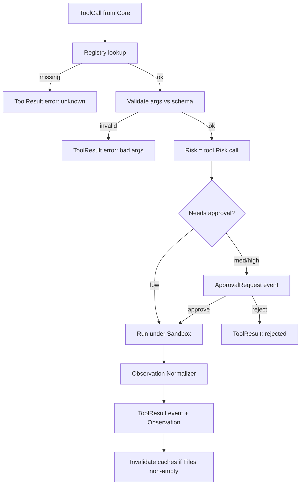
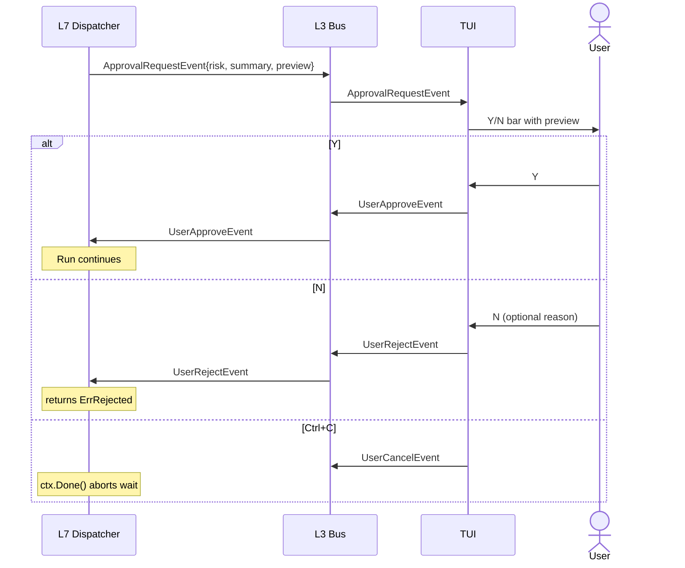

# 08 — Execution Engine

> **Goal of this document:** design Layer 7 — where the AI "touches" the system.
> The **Tool Registry** (static Go tools + MCP runtime tools), the **Sandbox**
> that confines them, the **Dispatcher**, the **Human-in-the-loop** gate, and
> the **Observation Normalizer** that turns raw tool output into a structured,
> redacted, truncated observation.

This file owns **Layer 7 (`internal/exec`)**. It receives tool calls from the
Cognitive Core (File 07) and produces observations for the Verification Engine
(File 09) and Memory (File 11).

---

## Table of Contents

1. [Tool Registry (static + MCP)](#81-tool-registry-static--mcp)
2. [Tool Metadata](#82-tool-metadata)
3. [Dispatcher](#83-dispatcher)
4. [Sandbox & Security](#84-sandbox--security)
5. [Human-in-the-loop](#85-human-in-the-loop)
6. [Observation Normalizer & Truncation](#86-observation-normalizer--truncation)
7. [The Engine, consolidated](#87-the-engine-consolidated)

---

## 8.1 Tool Registry (static + MCP)

### 8.1.1 The decision
The brief says "Tool không nên hardcode" and lists Shell, Filesystem, Git,
Docker, Browser, LSP, MCP, Python, HTTP, SQL. We resolve this as **static Go
registration for the deterministic built-ins, plus an MCP client for runtime
tools** — the option you approved:

- **Static tools** (compile-time, auditable, deterministic): the core set the
  agent always has. These implement the `Tool` interface in Go and register at
  startup.
- **MCP tools** (runtime, loaded from config): external tool servers speaking
  the Model Context Protocol. Discovered at startup from a config of server
  endpoints; their schemas become first-class tools with the same metadata.

This keeps the built-ins deterministic (P3) while allowing arbitrary extension
without recompiling (P4/S8).

### 8.1.2 The `Tool` interface

```go
package exec

type Tool interface {
    Name() string
    Metadata() Metadata             // §8.2
    Schema() jsonschema.Schema
    Risk(call ToolCall) Risk
    Run(ctx context.Context, in ToolInput) (ToolOutput, error)
}
```

### 8.1.3 The built-in static tools

| Tool | Purpose | Risk default | Writes |
|---|---|---|---|
| `Read` | Read a file (with line range) | low | no |
| `Write` | Create/overwrite via the Patch Engine | high | yes (patch) |
| `Patch` | Apply a search/replace or diff patch | high | yes |
| `Bash` | Run a shell command under the sandbox | medium (low if allowlisted) | maybe |
| `Grep` | Content search (ripgrep semantics) | low | no |
| `Glob` | File-pattern search | low | no |
| `Git` | Snapshot/rollback/diff/status | medium | no (snapshot only) |

`Write`/`Patch` delegate to the Patch Engine (File 10) — L7 never hands the
model a way to bypass snapshot/verify/rollback.

### 8.1.4 MCP tools

```go
type MCPClient struct {
    servers map[string]*mcp.ServerConn
}

func (c *MCPClient) Discover(ctx context.Context) ([]Tool, error) {
    var tools []Tool
    for name, srv := range c.servers {
        list, err := srv.ListTools(ctx)
        if err != nil { continue }   // a down server doesn't break the agent
        for _, t := range list {
            tools = append(tools, &MCPTool{server: name, spec: t, client: srv})
        }
    }
    return tools, nil
}

type MCPTool struct {
    server string
    spec   mcp.ToolSpec
    client *mcp.ServerConn
}

func (t *MCPTool) Name() string           { return t.server + "." + t.spec.Name }
func (t *MCPTool) Schema() jsonschema.Schema { return t.spec.Schema }
func (t *MCPTool) Risk(call ToolCall) Risk { return t.spec.Risk }   // declared by the server
func (t *MCPTool) Run(ctx context.Context, in ToolInput) (ToolOutput, error) {
    out, err := t.client.CallTool(ctx, t.spec.Name, in.Args)
    return ToolOutput{Stdout: out.Content, ExitCode: out.ExitCode,
        Summary: out.Summary}, err
}
```

An MCP tool is wrapped to satisfy the same `Tool` interface, so the dispatcher,
sandbox, and HITL gate treat it identically to a static tool. A misbehaving MCP
server is sandboxed and timed out like any tool; a down server is skipped, not
fatal.

### 8.1.5 The registry

```go
type Registry struct {
    tools map[string]Tool
}

func (r *Registry) Register(t Tool) {
    if _, dup := r.tools[t.Name()]; dup { panic("duplicate tool: " + t.Name()) }
    r.tools[t.Name()] = t
}
func (r *Registry) Get(name string) (Tool, bool) { t, ok := r.tools[name]; return t, ok }
func (r *Registry) Schemas() []jsonschema.Schema { /* … */ }
```

At startup: register the static built-ins, then `MCPClient.Discover` and
register each MCP tool. The schemas feed the system prompt's `<tools>` block
(File 06).

---

## 8.2 Tool Metadata

Every tool — static or MCP — carries rich metadata per the brief
(permission/timeout/cost/schemas):

```go
type Metadata struct {
    Permission  Permission   // what FS/network/exec it needs
    Timeout     time.Duration
    Cost        CostHint     // relative cost for the cost controller
    InputSchema  jsonschema.Schema
    OutputSchema jsonschema.Schema
    Category    string       // "fs" | "shell" | "net" | "vcs" | "browser" | "db" | ...
    Description string
}

type Permission struct {
    FS     FSAccess   // "read" | "write" | "none"
    Net    bool
    Exec   bool
    Secret bool       // may see secret-shaped output → must redact
}

type CostHint int
const ( CostCheap CostHint = iota; CostMedium; CostExpensive )
```

Metadata is what lets the sandbox pre-authorize a read-only tool without a
prompt, flag a network tool for high-risk approval, and let the cost controller
weight a Docker tool heavier than a `Read`.

---

## 8.3 Dispatcher

### 8.3.1 The flow



### 8.3.2 The dispatcher

```go
func (e *Engine) Dispatch(ctx context.Context, call ToolCall) (Observation, error) {
    tool, ok := e.registry.Get(call.Tool)
    if !ok { return obsErr(call, fmt.Errorf("unknown tool %q", call.Tool)), nil }
    if err := validateArgs(tool.Schema(), call.Args); err != nil {
        return obsErr(call, err), nil
    }
    if err := e.toolPolicy.Allow(call, call.Task); err != nil {   // File 07
        return obsErr(call, err), nil
    }
    risk := tool.Risk(call)
    if risk >= RiskMedium && !e.config.AutoApprove(risk) {
        if err := e.requestApproval(ctx, call, risk, tool); err != nil {
            return obsErr(call, err), nil
        }
    }
    out, err := tool.Run(ctx, ToolInput{Args: call.Args, CWD: e.sandbox.CWD,
        Approve: e.approveHook(ctx, call)})
    if err != nil { return obsErr(call, err), nil }

    obs := e.normalizer.Normalize(out, tool.Metadata())
    e.bus.Publish(ctx, ToolResultEvent{Task: call.Task, Tool: call.Tool, Obs: obs})
    if len(out.Files) > 0 { e.memory.Project().Invalidate(ctx, out.Files) }
    return obs, nil
}

func (e *Engine) NeedsApproval(call ToolCall) bool {
    t, ok := e.registry.Get(call.Tool); if !ok { return false }
    return t.Risk(call) >= RiskMedium && !e.config.AutoApprove(t.Risk(call))
}
```

### 8.3.3 Routing rules
- One `ToolCall` → one `Dispatch` → one `ToolResult`. Tools within a turn are
  sequential by default (the runtime drives them one at a time); parallel
  execution is opt-in for read-only tools via a `parallel` flag and the worker
  pool (File 02 §2.4).
- The dispatcher never calls the LLM. It returns observations; the runtime
  re-enters the Core with them.

---

## 8.4 Sandbox & Security

### 8.4.1 Threat model
The model is **untrusted**. A hallucinated or adversarial tool call must never
read outside the working dir, write outside it, escape the sandbox, exfiltrate
over the network, or run forever.

### 8.4.2 Path confinement

```go
func (s *Sandbox) Resolve(p string) (string, error) {
    full := p
    if !filepath.IsAbs(p) { full = filepath.Join(s.cwd, p) }
    if real, err := filepath.EvalSymlinks(full); err == nil { full = real }
    rel, err := filepath.Rel(s.root, full)
    if err != nil || strings.HasPrefix(rel, "..") { return "", ErrPathEscapes }
    return full, nil
}
```

Every `Read`/`Write`/`Grep`/`Glob` goes through `Resolve`; escapes are rejected
with `ErrPathEscapes`, surfaced as a normal tool error — never a panic.

### 8.4.3 Command allowlist / denylist (`Bash`)

| Class | Examples | Default | Approval |
|---|---|---|---|
| Safe-read | `ls`, `cat`, `git status`, `go vet` | allow | none |
| Build/test | `go build`, `go test`, `make` | allow | none |
| Mutating-fs | `rm`, `mv`, `git commit` | allow | medium |
| Network | `curl`, `wget`, `npm install` | deny unless `--allow-net` | high |
| Shell-escape | `eval`, `source`, `$(...)`, backticks | deny | — |
| Disk-heavy | `dd`, `mkfs` | deny | — |

Classification parses the command into argv (a real parser, not `strings.Split`),
peels wrappers (`sudo`/`env`/`time`), and re-matches; shell metacharacters
introducing sub-execution require every sub-command individually allowlisted.

### 8.4.4 Network policy
Default: **no network access**. Opt-in `--allow-net host:port` for specific
hosts (e.g. `proxy.golang.org:443`). Enforced by per-process network namespace
on Linux, a Windows firewall rule scoped to the process, or — on platforms
without per-process isolation — by restricting *which commands* may network,
not the destination.

### 8.4.5 Secrets redaction
Before any output is published or stored, a redactor masks common secret shapes
(AWS keys, GitHub tokens, PEM blocks, `api_key=`/`token=`/`secret=`). Redacted
output is what the model sees and what the log stores; raw output stays in
memory for the call's duration only. A tool whose metadata declares
`Secret: true` is always run through the redactor even if no pattern matches.

### 8.4.6 Resource limits

| Resource | Limit | Enforcement |
|---|---|---|
| Wall-clock | 30s default, 600s max (per tool `Metadata.Timeout`) | `context.WithTimeout` |
| CPU | 50% of one core | cgroup v2 / nice / job object |
| Memory | 1 GB | cgroup / job object |
| Output size | 256 KB/stream before truncation (§8.6) | streaming counter |
| Process tree | killed on ctx cancel | process-group kill |

Fail closed: a command hitting a limit is killed and reported, not allowed to
run on.

### 8.4.7 Portable process-group kill

```go
// shell_unix.go
func setProcessGroup(cmd *exec.Cmd) { cmd.SysProcAttr = &syscall.SysProcAttr{Setpgid: true} }
func killGroup(cmd *exec.Cmd) error {
    pgid, _ := syscall.Getpgid(cmd.Process.Pid)
    _ = syscall.Kill(-pgid, syscall.SIGTERM)
    return cmd.Process.Kill()
}
// shell_windows.go
func setProcessGroup(cmd *exec.Cmd) {
    cmd.SysProcAttr = &syscall.SysProcAttr{CreationFlags: syscall.CREATE_NEW_PROCESS_GROUP}
}
func killGroup(cmd *exec.Cmd) error {
    dll := syscall.MustLoadDLL("kernel32.dll")
    p := dll.MustFindProc("GenerateConsoleCtrlEvent")
    _, _, _ = p.Call(syscall.CTRL_BREAK_EVENT, uintptr(cmd.Process.Pid))
    return cmd.Process.Kill()
}
```

The runtime only cancels the context; `sysio` translates that into the correct
group-kill, satisfying the "no orphaned child after exit" guarantee on every
platform.

---

## 8.5 Human-in-the-loop

### 8.5.1 Risk classification

| Risk | Meaning | Default UX |
|---|---|---|
| `low` | read-only, reversible, no side effects | run silently, log only |
| `medium` | local side effects, reversible (build/test/git-commit in repo) | one-key Y/N + preview |
| `high` | irreversible, cross-repo, network, large blast radius | Y/N in red + diff preview; type tool name to confirm |
| `critical` | explicitly denied | block; model told it's denied |

### 8.5.2 The HITL flow



### 8.5.3 UX requirements
- The command/diff is visible *in full* before the Y/N prompt — no "approve to
  see what it does".
- `high` risk renders red and requires typing the tool name (not just `y`),
  preventing muscle-memory approval.
- The bar shows risk class + the model's `reason` one-liner.
- A "remember this session" toggle whitelists the **exact** command string
  (never by pattern, so `rm $X` can't become `rm -rf /`).

### 8.5.4 Rejection loop guard
A model that retries the exact rejected call three times is force-stopped with
`ErrorEvent{code: "tool_rejected_loop"}`. The model is instructed to treat
rejection as feedback and propose an alternative.

---

## 8.6 Observation Normalizer & Truncation

### 8.6.1 Why a normalizer
The brief says: don't return raw output. A tool's raw stdout/stderr/exit code
must become a structured **Observation** — redacted, truncated, summarized —
before it reaches the verify/memory/context layers. Raw output of 50 MB would
blow the context window (File 06) and the event log.

### 8.6.2 The normalization pipeline

```mermaid
flowchart LR
    RAW[Raw ToolOutput] --> RED[Redact secrets]
    RED --> TR[Truncate: head+tail+summarize middle]
    TR --> SUM[Derive 1-line Summary]
    SUM --> OBS[Observation{stdout, stderr, exit, summary, truncated}]
```

### 8.6.3 Truncation

```go
type OutputLimits struct{ StdoutSoft, StdoutHard, StderrSoft, StderrHard, CombinedHard int }

func (e *Engine) truncate(s string, soft, hard int) string {
    if len(s) <= soft { return s }
    if len(s) <= hard {
        headN := soft * 30 / 100; tailN := soft - headN
        return s[:headN] + "\n… (truncated " + itoa(len(s)-soft) + " bytes) …\n" + s[len(s)-tailN:]
    }
    headN := hard * 30 / 100; tailN := hard * 30 / 100
    middle := s[headN : len(s)-tailN]
    summary := e.summarizer.Summarize(context.Background(), middle, 200)
    return s[:headN] + "\n… (truncated; summary: " + summary + ") …\n" + s[len(s)-tailN:]
}
```

| Stream | Soft | Hard |
|---|---|---|
| stdout | 8 KB | 32 KB |
| stderr | 4 KB | 16 KB |
| combined | 12 KB | 48 KB |

Within soft → kept verbatim. Between soft and hard → head+tail with a marker.
Above hard → head+tail + the middle summarized by a **separate small/cheap
model** call focused on errors/warnings/the final result, clearly labeled as a
summary so the model doesn't mistake it for verbatim output.

### 8.6.4 The Observation

```go
type Observation struct {
    Tool      string
    Stdout    string
    Stderr    string
    ExitCode  int
    Summary   string          // 1-line; survives history trimming (File 06 §6.7)
    Truncated bool
    Bytes     int
    Files     []string        // paths mutated
    FromPatch bool            // true when produced by the Patch Engine
}
```

The `Summary` is the single line the context engine keeps when it trims old tool
results (File 06 pass 1): the *fact* that a tool ran survives even when the
*detail* is trimmed.

---

## 8.7 The Engine, consolidated

```go
package exec

type Engine struct {
    registry   *Registry
    sandbox    *Sandbox
    mcp        *MCPClient
    normalizer *Normalizer
    summarizer *Summarizer
    toolPolicy *cognitive.ToolPolicy   // shared with Core (File 07)
    limits     OutputLimits
    config     Config
    bus        *event.Bus
    memory     *memory.Store
    pending    sync.Map                 // approvalID -> chan approvalDecision
    log        *slog.Logger
}

func New(d Deps) *Engine                   // wire + register built-ins + discover MCP
func (e *Engine) Dispatch(ctx, call) (Observation, error)
func (e *Engine) NeedsApproval(call ToolCall) bool
func (e *Engine) ResolveApproval(id string, approved bool)
func (e *Engine) Register(t Tool)
```

### 8.7.1 Adding a tool (the S8 criterion)
A static tool is one file implementing `Tool` + a `Register` call at startup;
an MCP tool is a config entry pointing at an MCP server. Neither touches the
TUI, the runtime, or the bus. That is S8 made concrete.

---

## 8.8 What this file fixes, and what it hands off

**Fixed here:**
- the static + MCP tool registry with the `Tool` interface and rich metadata;
- the dispatcher with schema validation, tool-policy gating, and approval
  wiring;
- the sandbox: path confinement, command allowlist, network default-deny,
  secrets redaction, resource limits, portable process-group kill;
- the HITL flow with risk classes and the high-risk type-to-confirm UX;
- the observation normalizer (redact → truncate → summarize) producing the
  structured `Observation` with a `Summary` that survives trimming.

**Handed off:**
- `Write`/`Patch` delegate to the Patch Engine → **File 10**.
- The `toolPolicy.Allow` gate is owned by the Cognitive Core → **File 07**.
- Verification consumes the Observation → **File 09**.
- Memory invalidation on writes → **File 11**.

---

*End of File 08 — Execution Engine.*
