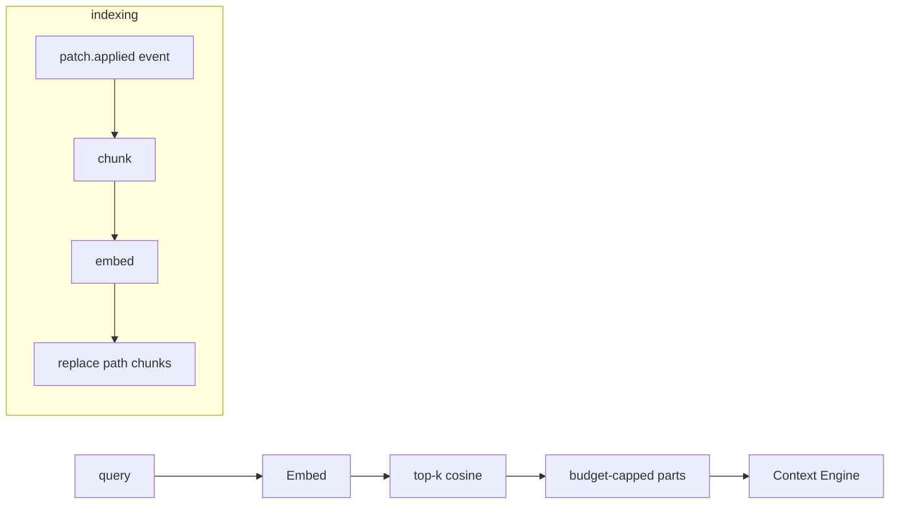

# 11 — Memory System

> **Goal of this document:** give the agent short-term and long-term memory —
> six types, each with a distinct scope, lifetime, and backing — and the rule
> that **memory is never updated directly; it is updated only via events**.

This file owns **Layer 10 (`internal/memory`)**. It serves the surfaces
consumed by the Context Engine (File 06) and the Session Manager (File 03).

---

## Table of Contents

1. [The Six Memory Types](#111-the-six-memory-types)
2. [Update Only Via Events](#112-update-only-via-events)
3. [Working & Conversation Memory](#113-working--conversation-memory)
4. [Execution History & Repository Memory](#114-execution-history--repository-memory)
5. [Knowledge & Preference Memory](#115-knowledge--preference-memory)
6. [Semantic Memory (Vector RAG)](#116-semantic-memory-vector-rag)
7. [Embedding Strategy](#117-embedding-strategy)
8. [The Store, consolidated](#118-the-store-consolidated)

---

## 11.1 The Six Memory Types

The brief divides memory into six kinds, each with a clear purpose:

| Type | Scope | Lifetime | Backing | Holds |
|---|---|---|---|---|
| Working Memory | per-turn, in-process | one turn | RAM | the live conversation being mutated |
| Conversation | per-session | across turns | SQLite | the full message history, resumable |
| Execution History | per-task | across the task | SQLite + git snapshots | tool calls, observations, patches, retries |
| Repository Memory | per-project | across sessions | `AGENTS.md` + tree cache + symbol graph | conventions, structure, symbol relationships |
| Knowledge Memory | per-project, growing | across sessions | vector DB (semantic) | codebase chunks for RAG retrieval |
| Preference Memory | per-user | across projects | SQLite (user profile) | style, tooling, do/don't, model choice |

Each type has a distinct *scope* (turn / session / task / project / user),
*lifetime*, and *backing* — the separation is what lets the Context Engine
compose them (File 06) without coupling and lets each be tested independently.

---

## 11.2 Update Only Via Events

The cardinal rule: **memory is never updated by direct calls from other
layers. It is updated only by event handlers reacting to the bus.** This is the
brief's "Không update trực tiếp. Chỉ update qua Event."

Why:
- **Determinism (P3).** A memory write that happens as a side effect of a direct
  call is invisible; a write that happens as a reaction to a logged event is
  replayable.
- **Single-writer per store.** Each sub-store's handler runs on one goroutine;
  events serialize naturally through the bus.
- **Decoupling.** The Patch Engine doesn't know memory exists; it publishes
  `patch.applied`, and the Repository/Knowledge handlers react.

```go
func (s *Store) listen(bus *event.Bus) {
    ch := bus.Subscribe(
        event.Topic("patch.applied"),
        event.Topic("tool.result"),
        event.Topic("task.completed"),
        event.Topic("assistant.message"),
    )
    go func() {
        for env := range ch {
            switch e := env.Evt.(type) {
            case event.PatchAppliedEvent:
                s.repo.Invalidate(e.Paths)
                s.knowledge.Reindex(e.Paths)
            case event.ToolResultEvent:
                s.execHistory.Append(e)
            case event.AssistantMessageEvent:
                s.conversation.AppendAssistant(e)
            case event.TaskCompletedEvent:
                s.conversation.Persist(e.Task)
            }
        }
    }()
}
```

---

## 11.3 Working & Conversation Memory

### 11.3.1 Working Memory
In-process, per-turn, owned by the runtime goroutine (File 02 I1). The fastest
tier — no I/O — and the source the Context Engine reads during a turn. A turn
forks the conversation so a canceled turn doesn't corrupt the shared list;
the fork merges back only on success.

```go
type WorkingMemory struct{ conv *Conversation }
func (w *WorkingMemory) Fork(text string, atts []AttachmentRef) *Conversation
func (w *WorkingMemory) History() []Part                       // for the Context Engine
```

### 11.3.2 Conversation Memory
Per-session, resumable, SQLite-backed. Close the app, reopen tomorrow, continue
chatting.

```sql
CREATE TABLE sessions (id TEXT PRIMARY KEY, project_id TEXT, title TEXT,
    created_at TEXT, updated_at TEXT, model TEXT);
CREATE TABLE messages (id TEXT PRIMARY KEY, session_id TEXT, seq INTEGER,
    role TEXT, text TEXT, tool_call TEXT, tool_result TEXT, summary TEXT,
    created_at TEXT, UNIQUE(session_id, seq));
```

Using `modernc.org/sqlite` (pure Go, no CGO) so the single-binary cross-compile
story survives. Resume loads messages ordered by `seq` into a fresh
`WorkingMemory`; the next turn appends and persists on `task.completed`.

### 11.3.3 Resume with integrity
On resume, the store verifies the last checkpoint still matches the working
tree (File 03 §3.5.3); if the user edited files between sessions, the task is
flagged "stale" and advises before continuing — it never blindly applies on top
of diverged content.

---

## 11.4 Execution History & Repository Memory

### 11.4.1 Execution History
Per-task record of what the agent did: tool calls, observations, patches,
reflection notes, retries, verify verdicts. This is the audit trail behind the
Session Manager's history/undo (File 03 §3.3) and the input to Reflection
(File 07 §7.3 — "what went wrong last time").

```go
type ExecEntry struct {
    Seq     int
    Kind    string   // "tool" | "patch" | "reflection" | "verify"
    Summary string
    Snapshot SnapshotRef
    At      time.Time
}
```

### 11.4.2 Repository Memory
The agent's understanding of the codebase, surviving across sessions:

- **`AGENTS.md`** — the project manifest (conventions, structure, do/don't),
  free-form Markdown read on session start and injected into the system prompt
  (File 06). Human-editable first.
- **Directory tree cache** — a cached, `.gitignore`/`.yoloignore`-respecting
  walk, invalidated on file writes (via the `patch.applied` event).
- **Symbol graph** — a tree-sitter-derived graph of definitions, call sites,
  and dependents, used by the Context Engine's centrality ranking (File 06
  §6.2.3). Rebuilt incrementally on changes.

```go
type ProjectStore struct {
    root  string
    tree  *nodeTree
    graph *GraphStore
    mu    sync.RWMutex
}
func (p *ProjectStore) Invalidate(paths []string)
func (p *ProjectStore) ReadFiles(ctx context.Context, refs []FileRef) []Part
func (p *ProjectStore) MarkRead(path string)
```

### 11.4.3 `.yoloignore`
A `.gitignore`-syntax file excluding paths from the tree cache, RAG indexing,
and `Grep`/`Glob` by default: `node_modules/`, `vendor/`, `.git/`, build outputs.

---

## 11.5 Knowledge & Preference Memory

### 11.5.1 Knowledge Memory (semantic / vector)
The vector store for RAG — retrieve code by meaning, not by grep. Detailed in
§11.6.

### 11.5.2 Preference Memory
Per-user, cross-project: style ("wrap errors with %w"), tooling ("use
golangci-lint"), do/don't, preferred model. Loaded at session start and merged
into the Context Engine's preference input (File 06 §6.1). Updated when the user
explicitly says "remember that I prefer…" — stored as a key/value pair in the
user's SQLite profile, not inferred silently.

```go
type PreferenceStore struct{ db *sql.DB }
func (p *PreferenceStore) Get(ctx context.Context, key string) (string, error)
func (p *PreferenceStore) Set(ctx context.Context, key, value string) error
func (p *PreferenceStore) All(ctx context.Context) (map[string]string, error)
```

Preference Memory is the one store the user can edit directly (it's *their*
data); agent-originated updates are still event-driven, routed through an
explicit "user asked to remember" event.

---

## 11.6 Semantic Memory (Vector RAG)

### 11.6.1 Vector DB decision

| Option | Go story | Verdict |
|---|---|---|
| LanceDB | Go SDK, embedded | strong upgrade path |
| ChromaDB | REST, needs a server | rejected (breaks single-binary) |
| sqlite-vec | SQLite extension | natural upgrade (reuses the SQLite DB) |
| **Pure-Go + SQLite** | trivial, no deps | **MVP** |

> **MVP: pure-Go in-memory vector store with SQLite persistence** (vectors as
> BLOBs). **Upgrade path: sqlite-vec or LanceDB** when the codebase exceeds
> ~50k chunks. A server dependency (ChromaDB) is rejected for the same reason
> Rust/Python were rejected in File 01 — it breaks single-binary delivery.

### 11.6.2 The store

```go
type SemanticStore struct {
    db     *sql.DB
    embed  Embedder
    chunks []chunkVec
    mu     sync.RWMutex
}

type chunkVec struct {
    id     int64
    path   string
    kind   string   // "function" | "class" | "block"
    name   string
    text   string
    vector []float32
}

func (s *SemanticStore) Retrieve(ctx context.Context, query string, budget int, c Counter) []Part {
    q, err := s.embed.Embed(ctx, []string{query})
    if err != nil || len(q) == 0 { return nil }
    s.mu.RLock(); defer s.mu.RUnlock()
    hits := topK(cosineAll(q[0], s.chunks), kForBudget(budget, c))
    out := make([]Part, 0, len(hits))
    for _, h := range hits {
        cv := s.chunks[h.i]
        out = append(out, Part{Kind: PartRAG, Text: cv.text,
            Attr: map[string]string{"path": cv.path, "name": cv.name, "kind": cv.kind}})
        if c.Count(join(out)) >= budget { break }
    }
    return out
}
```

### 11.6.3 Event-driven indexing
The background `memory.index` goroutine listens for `patch.applied` and
reindexes only the changed paths (atomic replace of that path's chunks).
First session on a new project triggers a full index (shown as a progress bar
in the status pane); subsequent sessions are warm.

### 11.6.4 The RAG flow



---

## 11.7 Embedding Strategy

### 11.7.1 Chunking decision: per-function with overlap
Chunks split at function/method boundaries (tree-sitter `function_definition`
nodes), including the preceding docstring/signature as context. Files with no
functions fall back to fixed 40-line windows with 8-line overlap.

| Strategy | Boundary | Recall |
|---|---|---|
| Fixed window | every N lines | poor (splits functions) |
| **Per-function** | function/method node | **best** (complete semantic unit) |
| Per-class | class node | poor for Go (a file is often one package) |
| Per-file | whole file | low precision |

### 11.7.2 The chunker

```go
func ChunkFile(path string, content []byte, lang *sitter.Language) []Chunk {
    tree, _ := sitterParse(lang, content); defer tree.Close()
    var chunks []Chunk
    walk(tree.RootNode(), func(n *sitter.Node) {
        if n.Type() == "function_definition" || n.Type() == "method_definition" {
            start := n.StartByte()
            if prev := n.PrevSibling(); prev != nil && prev.Type() == "comment" {
                start = prev.StartByte()
            }
            chunks = append(chunks, Chunk{Path: path, Kind: "function",
                Name: funcName(n, content), Text: string(content[start:n.EndByte()]),
                Loc: [2]int{int(n.StartPoint().Row)+1, int(n.EndPoint().Row)+1}})
        }
    })
    if len(chunks) == 0 { chunks = fixedWindow(path, content, 40, 8) }
    return chunks
}
```

### 11.7.3 Size caps
Soft 1500 chars (~350 tokens); split at the next statement boundary. Hard 4000
chars; a larger function becomes multi-chunks sharing the signature header so
each is independently retrievable.

### 11.7.4 The embedding model
An `Embedder` interface over an embedding API (OpenAI `text-embedding-3-small`,
Voyage, or a local model via Ollama). Configurable; default hosted small model,
with `--local-embed` for the offline/air-gapped audience (File 01 §1.3.3) so no
code leaves the machine.

### 11.7.5 Reindexing & staleness
A path's chunks are replaced atomically on reindex (old vectors deleted, new
inserted in one transaction — a retrieval sees old or new, never a mix). A
staleness marker records mtime at index time; a path newer than its marker is
flagged "stale" and prioritized for reindex. Incremental: only changed files
are re-embedded.

### 11.7.6 Privacy
For the air-gapped/server audience, `--local-embed` routes the embedder to an
Ollama endpoint or in-process model — no code leaves the machine. The hosted
default is opt-in, not assumed.

---

## 11.8 The Store, consolidated

```go
package memory

type Store struct {
    working   *WorkingMemory
    conversation *ConversationStore
    exec      *ExecHistoryStore
    repo      *ProjectStore
    knowledge *SemanticStore
    pref      *PreferenceStore
}

func Open(deps Deps) (*Store, error) {
    sess := openSQLite(deps.SessionsDB)
    return &Store{
        working:      &WorkingMemory{},
        conversation: &ConversationStore{db: sess},
        exec:         &ExecHistoryStore{db: sess},
        repo:         OpenProject(deps.ProjectRoot),
        knowledge:    NewSemantic(sess, deps.Embedder),
        pref:         &PreferenceStore{db: openSQLite(deps.UserDB)},
    }, nil
}

func (s *Store) Working() *WorkingMemory         // §11.3.1
func (s *Store) Conversation() *ConversationStore
func (s *Store) ExecHistory() *ExecHistoryStore
func (s *Store) Project() *ProjectStore           // §11.4.2
func (s *Store) Semantic() *SemanticStore         // §11.6
func (s *Store) Preferences() *PreferenceStore    // §11.5.2
func (s *Store) Close() error
```

### 11.8.1 The event listener
The `listen` goroutine in §11.2 is started at `Open` and is the **only** writer
to the sub-stores (besides the user-editable Preference store). Every other
layer that "updates memory" is really publishing an event this listener reacts
to.

---

## 11.9 What this file fixes, and what it hands off

**Fixed here:**
- the six-type memory model with explicit scope/lifetime/backing;
- the cardinal rule that memory updates only via event handlers (single-writer
  per store, replayable, decoupled);
- working + conversation memory (pure-Go SQLite, resume with integrity);
- execution history + repository memory (manifest, tree cache, symbol graph,
  `.yoloignore`);
- knowledge memory as a pure-Go vector store with SQLite persistence (chosen
  over LanceDB/Chroma for single-binary) + event-driven incremental indexing;
- preference memory as the one user-editable store;
- per-function chunking with overlap, size caps, offline-capable embedder.

**Handed off:**
- The surfaces (`Working().History`, `Semantic().Retrieve`,
  `Project().ReadFiles`, `Project().Invalidate`, `Preferences().All`) are
  consumed by Files 06 and 08; their signatures are frozen here.
- The Session Manager (File 03) uses the conversation/exec-history stores for
  resume and undo.
- The embedder mirrors the LLM provider interface (File 07); both are
  registered in the bootstrap (File 15).

---

*End of File 11 — Memory System.*
