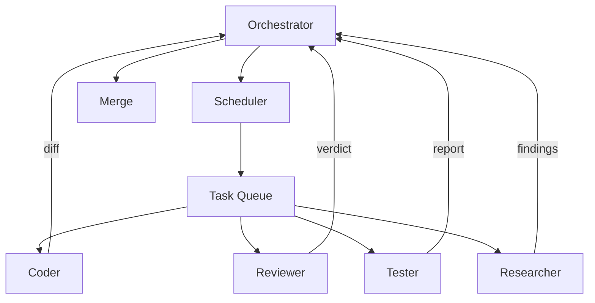
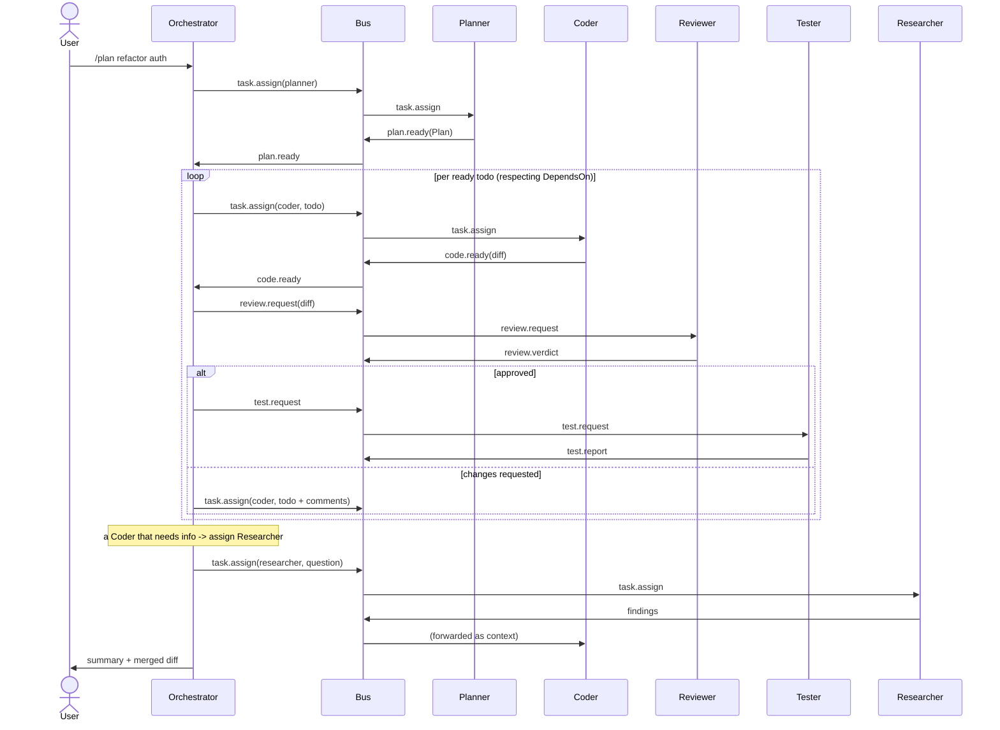

# 12 — Coordination Layer

> **Goal of this document:** design Layer 11 — the multi-agent system that
> tackles complex tasks. A **Planner** decomposes, a **Scheduler** orders the
> resulting todos through a **Task Queue**, and specialist agents
> (Coder/Reviewer/Tester/**Researcher**) execute them under an orchestrator
> that **merges** the results.

This file extends the single-agent runtime (File 04) to a multi-agent system.
It reuses the event bus (File 05), the Cognitive Core (File 07) per agent, and
the tools/patch/verify/memory layers without changes.

---

## Table of Contents

1. [Why Multi-Agent?](#121-why-multi-agent)
2. [Agent Roles](#122-agent-roles)
3. [Communication Protocol](#123-communication-protocol)
4. [Orchestrator](#124-orchestrator)
5. [Scheduler & Task Queue](#125-scheduler--task-queue)
6. [Merge](#126-merge)
7. [The Orchestrator, consolidated](#127-the-orchestrator-consolidated)

---

## 12.1 Why Multi-Agent?

### 12.1.1 The single-agent ceiling
A single agent handles most interactive tasks well but hits a ceiling on
complex, multi-step tasks ("refactor auth, update callers, add tests, make CI
pass"). A single agent attempting this has **one context window** that fills
with the whole task, **one role** that must switch between planning/writing/
reviewing/testing, **one perspective** biased toward its own code, and **no
internal checks** so a step-2 mistake propagates to step 7.

### 12.1.2 The thesis
Complex tasks are better solved by **specialized agents with narrow context,
distinct roles, and an explicit coordination protocol**. Each runs its own
loop with its own (smaller) context, is prompted for one role, hands work to
others via messages (not shared state), and is checked by an agent whose only
job is to find flaws.

### 12.1.3 When to use it
Multi-agent is **not the default**. The MVP is single-agent; coordination is
enabled for tasks the user marks complex or the orchestrator auto-classifies as
needing decomposition. A quick question stays single-agent — paying the
coordination tax for "explain this function" would be absurd.

| Trigger | Mode |
|---|---|
| Short question, single file | single-agent |
| "Fix this bug in file X" | single-agent |
| "Refactor module Y, update callers, add tests" | multi-agent (auto) |
| `/plan <complex task>` | multi-agent (explicit) |
| `/agent coder <task>` | single named agent (ad-hoc) |

Auto-detection is a ruleset (verb count, "and" chains, file-count estimates),
conservative: default to single-agent when unsure, because the coordination tax
is real.

---

## 12.2 Agent Roles



### 12.2.1 Role contracts

| Role | Goal | Allowed tools | Output to orchestrator |
|---|---|---|---|
| **Planner** | Decompose the task into an ordered TODO list with acceptance criteria | Read, Grep, Glob (read-only) | a `Plan` (list of `Todo`) |
| **Coder** | Implement one TODO | Read, Write, Patch, Bash (build) | a diff + self-report |
| **Reviewer** | Audit the Coder's diff against the TODO and conventions | Read, Grep, Glob (read-only) | approve / changes-requested + comments |
| **Tester** | Run tests and report | Bash (test), Read | pass/fail + failing output |
| **Researcher** | Investigate the codebase/external docs to answer questions the Coder/Planner hit | Read, Grep, Glob, Browser/HTTP (read-only) | findings / summary |

The **Researcher** is the role added beyond the original four: when a Coder hits
"which auth library does this project use?" or "what's the API contract for
service X?", rather than burning the Coder's context on investigation, the
orchestrator delegates to a Researcher whose entire job is read-only
investigation, then returns a concise finding. This keeps the Coder's context
focused on implementation.

Key constraints enforced at the **tool-registry level** (File 08), not just by
prompting:
- Planner and Reviewer are **read-only** — they have no write tools.
- Coder is the only role that can modify files, via the Patch Engine.
- Tester is confined to test/build commands by the sandbox allowlist.

### 12.2.2 The Plan and Todo

```go
type Plan struct {
    ID        string
    Goal      string
    Todos     []Todo
    CreatedAt time.Time
}

type Todo struct {
    ID         string
    Title      string
    Acceptance string
    DependsOn  []string    // DAG: other Todo IDs that must finish first
    Status     TodoStatus  // pending | in_progress | blocked | done | failed
    Assignee   string      // "coder" | "researcher" | …
    Artifacts  []string    // paths produced/modified
    ReworkCycles int
}
```

`DependsOn` encodes the DAG so independent todos run concurrently (§12.5) and
dependent ones serialize.

---

## 12.3 Communication Protocol

### 12.3.1 Agents do not share memory
The cardinal rule: **agents communicate only via events on the bus, never via
shared in-process state.** Each agent has its own `WorkingMemory` and
conversation; the orchestrator reads across agents via events, not direct
struct access. This makes the system safe to parallelize and observable — every
inter-agent message is a logged, replayable event.

### 12.3.2 Inter-agent events
See File 05 §5.4.7 for the catalog: `coord.task.assign`, `coord.plan.ready`,
`coord.code.ready`, `coord.review.verdict`, `coord.test.report`.

### 12.3.3 A turn of inter-agent traffic



### 12.3.4 Backpressure & fairness
Each agent is a subscriber with a bounded channel (File 05 §5.6). A slow Coder
throttles the pipeline naturally. The orchestrator never queues more than one
todo per agent, keeping each agent's context on the current todo rather than a
backlog.

---

## 12.4 Orchestrator

The orchestrator is itself an agent — an LLM-driven loop with a distinct role:
**decompose, delegate, track, merge**. It does not implement code.

| Responsibility | How |
|---|---|
| Decide mode | auto-classify the user message (§12.1.3) |
| Hold the Plan | owns the `Plan`, tracks todo statuses |
| Schedule todos | respects `DependsOn`; runs independent todos concurrently |
| Route artifacts | forwards Coder's diff to Reviewer, verdict back |
| Delegate investigation | assigns Researcher when a Coder/Planner asks a question |
| Handle verdicts | on "changes requested", re-assigns Coder with comments |
| Detect loops | caps re-review/re-implement cycles (default 3) |
| Merge | produces the final summary and combined diff |
| Honor cancellation | a user Ctrl+C cancels the whole plan and all agents |

```go
func (o *Orchestrator) Run(ctx context.Context, goal string) error {
    planID := newID()
    o.spawn(ctx, "planner", TaskAssignEvent{PlanID: planID, Brief: goal})
    for {
        select {
        case <-ctx.Done():
            return o.cancelAll(ctx)
        case env := <-o.agentEvents:
            switch e := env.Evt.(type) {
            case PlanReadyEvent:
                o.plan = &e.Plan; o.dispatchReady(ctx)
            case CodeReadyEvent:
                o.requestReview(ctx, e)
            case ReviewVerdictEvent:
                if e.Approved { o.requestTest(ctx, e) } else { o.reassignCoder(ctx, e) }
            case TestReportEvent:
                if e.Passed { o.markDone(e.TodoID); o.dispatchReady(ctx) } else { o.reassignWithTestFail(ctx, e) }
            case FindingsEvent:
                o.forwardFindings(ctx, e)
            }
            if o.plan != nil && o.plan.AllDone() { return o.mergeAndReport(ctx) }
        }
    }
}
```

### 12.4.1 The review–rework cap
A todo the Reviewer rejects returns to the Coder with comments, capped:

```go
const MaxReworkCycles = 3

func (o *Orchestrator) reassignCoder(ctx context.Context, v ReviewVerdictEvent) {
    t := o.plan.Todo(v.TodoID)
    t.ReworkCycles++
    if t.ReworkCycles > MaxReworkCycles {
        t.Status = TodoFailed
        o.log.Warn("rework cap exceeded", "todo", t.ID)
        return
    }
    o.spawn(ctx, "coder", TaskAssignEvent{PlanID: o.plan.ID, TodoID: t.ID,
        Brief: t.Title + "\n\nReviewer comments:\n" + strings.Join(v.Comments, "\n")})
}
```

When the cap is hit, the todo is `failed` and surfaced in the final summary —
no silent infinite retry.

### 12.4.2 Cancellation across agents
A user Ctrl+C publishes `UserCancelEvent` for the plan's turn. `cancelAll`
cancels every agent's context; each agent's loop notices `ctx.Done()`, exits,
and rolls back any in-flight patch (File 04 §4.5.5). The plan is marked
`cancelled` and the partial state reported. Agents are just tasks with roles —
they reuse the single-agent cancellation path.

---

## 12.5 Scheduler & Task Queue

### 12.5.1 Concurrent todos
Todos with no unmet `DependsOn` dispatch in parallel, each to its own Coder:

```go
func (o *Orchestrator) dispatchReady(ctx context.Context) {
    for i := range o.plan.Todos {
        t := &o.plan.Todos[i]
        if t.Status != TodoPending || !o.depsMet(t) { continue }
        if _, busy := o.inflight[t.ID]; busy { continue }
        t.Status = TodoInProgress
        o.sem.Acquire(ctx, 1)                       // bounded concurrency
        o.spawn(ctx, "coder", TaskAssignEvent{PlanID: o.plan.ID, TodoID: t.ID, Brief: t.Title})
        o.inflight[t.ID] = 1
    }
}

func (o *Orchestrator) depsMet(t *Todo) bool {
    for _, dep := range t.DependsOn {
        if o.plan.StatusOf(dep) != TodoDone { return false }
    }
    return true
}
```

Concurrency is bounded by a semaphore (default `runtime.NumCPU()`) so a 50-todo
plan doesn't spawn 50 agent conversations and saturate the API rate limit.

### 12.5.2 The task queue
The Scheduler (File 04 §4.4) is lifted to `active map[TaskID]*taskHandle` with
priority (`user > planner > coder > reviewer > tester > researcher`), so a user
interrupt always pre-empts a queued agent turn. The runtime goroutine remains
the sole FSM mutator; per-agent goroutines publish events the runtime drains
before mutating state (preserving File 02's I1 invariant).

### 12.5.3 Researcher delegation
When a Coder or Planner publishes a `QuestionEvent` (a new topic), the
orchestrator assigns a Researcher rather than letting the inquirer block on
investigation. The Researcher's findings are forwarded as context to the
inquirer's next turn. This is the mechanism that keeps implementer contexts
small.

---

## 12.6 Merge

When all todos are `done` (or `failed`), the orchestrator produces a report:

- a **summary** per todo,
- the **combined diff** across all Coder changes — computed from the git
  snapshots taken by the Patch Engine (File 10 §10.5), so it reflects exactly
  what landed on disk,
- a **status table** (done/failed per todo),
- for failed todos, the last review/test output so the user can decide next
  steps.

The combined diff reuses the Patch Engine's git snapshots, so merge has no
separate persistence mechanism — it aggregates existing checkpoints.

---

## 12.7 The Orchestrator, consolidated

The single-agent `Core` (File 04 §4.6) is the building block; the orchestrator
is a thin layer over it. Migration from MVP to multi-agent:

1. `Scheduler.active` → `map[TaskID]*taskHandle` (File 04 §4.4.2).
2. `Deps` gains an optional `Orchestrator`.
3. The runtime routes `UserSubmitEvent` to `startTurn` (single) or
   `orchestrator.Run` (multi, by the classifier).

```go
package coord

type Orchestrator struct {
    core       *runtime.Core
    bus        *event.Bus
    plan       *Plan
    agents     map[string]*agentHandle
    inflight   map[string]int
    sem        *semaphore.Weighted
    config     Config
    agentEvents <-chan event.Envelope
    log        *slog.Logger
}

func (o *Orchestrator) spawn(ctx context.Context, role string, task TaskAssignEvent) {
    h := o.core.NewAgentTurn(ctx, role, task)   // a turn with a role-scoped tool set
    go h.Drive()                                 // each agent runs its own FSM loop
}
```

### 12.7.1 Role-scoped tool sets
`NewAgentTurn(role, …)` builds a per-agent `exec.Engine` with only the tools the
role may use (§12.2.1), enforced at construction — a Planner literally cannot
call `Patch` because the tool isn't in its registry. One `Tool` interface (File
08) makes this a one-liner per role.

---

## 12.8 What this file fixes, and what it hands off

**Fixed here:**
- the rationale for multi-agent and explicit triggers;
- the five specialist roles (Planner/Coder/Reviewer/Tester/**Researcher**) with
  constrained tool sets enforced at the registry level;
- the inter-agent event protocol and the "agents don't share memory" rule;
- the orchestrator loop, DAG-based concurrent scheduling, the rework cap,
  Researcher delegation, and merge;
- the cancellation path reusing the single-agent primitive unchanged.

**Handed off:**
- The mode classifier is a small ruleset today, pluggable later (File 15).
- The combined diff reuses Patch Engine snapshots (File 10 §10.5).
- The TUI plan board rendering is specified in File 14.

---

*End of File 12 — Coordination Layer.*
