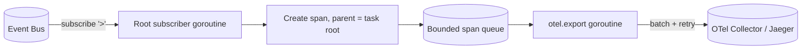
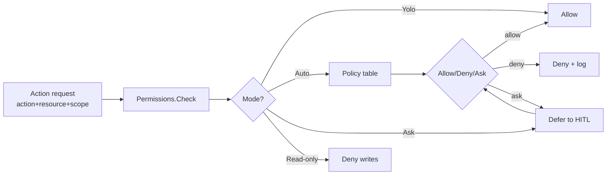

# 13 — Infrastructure

> **Goal of this document:** design Layer 12 — the cross-cutting
> **observability and safety infrastructure** that wraps the agent without
> touching its logic. It projects the event bus (File 05) into
> **OpenTelemetry** traces/metrics, structured **`log/slog`** logs, and opt-in
> **Sentry** error reports; it owns **secrets redaction**, the **permissions**
> model, the **rate limiter**, and the **cost ledger** that the Cognitive Core
> (File 07) reads from.

This file is a *pure observer* of the agent. It subscribes to the root topic
(`>`) on the event bus and turns events into spans, metrics, and log lines. It
**never modifies agent state** — that rule, stated in File 05 §5.5.2 and File 02
§2.4.1, is what makes "what is the agent doing?" answerable in your existing
Grafana/Jaeger/Sentry stack rather than a bespoke panel.

---

## Table of Contents

1. [Scope & Principles](#131-scope--principles)
2. [Package Layout](#132-package-layout)
3. [Telemetry — OpenTelemetry Integration](#133-telemetry--opentelemetry-integration)
4. [Metrics](#134-metrics)
5. [Structured Logging](#135-structured-logging)
6. [Sentry Integration](#136-sentry-integration)
7. [Secrets Redaction](#137-secrets-redaction)
8. [Permissions Model](#138-permissions-model)
9. [Rate Limiting](#139-rate-limiting)
10. [Cost Ledger](#1310-cost-ledger)
11. [The Infrastructure, consolidated](#1311-the-infrastructure-consolidated)

---

## 13.1 Scope & Principles

### 13.1.1 What lives here

Infrastructure owns six concerns that every layer needs but no layer wants to
own:

| Concern | Owner type | Why it can't live in a layer |
|---|---|---|
| Telemetry (traces) | `infra.Telemetry` | Spans must wrap *every* event, across all layers |
| Metrics | `infra.Metrics` | Counters are global; a layer can't see others' events |
| Logs | `infra.Logger` | One structured logger, one format, one sink |
| Secrets | `infra.Secrets` | Redaction must wrap *all* output before any layer sees it |
| Permissions | `infra.Permissions` | The allow/deny decision is policy, not logic |
| Rate limit / Cost | `infra.RateLimiter` / `infra.Cost` | Global budgets shared across layers and agents |

### 13.1.2 The observer contract

Infrastructure obeys three rules, enforced by code review and a lint check
(`infra` may not import any `internal/<layer>` package except `event`):

1. **Read-only.** It may read event payloads and call external SDKs. It may
   *not* call back into the runtime, publish agent-driving events, or mutate
   task/session/memory state. The one exception is `cost.*` events emitted by
   the Cost Ledger (§13.10), which *are* agent-driving — but the ledger is a
   budget authority, not a passive sink, and is the documented exception.
2. **Off the hot path.** Span creation, metric increment, and log emission are
   microseconds, but export is not. All export (OTel batch, Sentry flush) runs
   on background goroutines (`otel.export`, `sentry.flush`) so the runtime's
   single goroutine never waits on a network call.
3. **Fail-open, fail-silent.** If the OTel collector is unreachable, spans are
   dropped, not retried indefinitely; if Sentry is misconfigured, errors fall
   back to `slog`. Observability must never break the agent (P1) and never
   stall it (P3).

### 13.1.3 Principles to guarantees

| Principle | How this layer honors it |
|---|---|
| P1 Speed | Export is asynchronous; hot path does only in-memory span/metric/log calls |
| P2 Safety | Secrets redaction gates all output; permissions gate all actions; cost caps abort |
| P3 Determinism | Telemetry is a side-effect; the same inputs produce the same agent behavior with or without it |
| P4 Transparency | Every event becomes a span, a metric, and a log line — the agent is fully auditable externally |
| P5 Bounded Cost | The Cost Ledger is the single source of spend truth; rate limiter caps external calls |

---

## 13.2 Package Layout

```
internal/infra/
  telemetry.go      // OpenTelemetry tracer, span-per-event projector
  metrics.go         // counters & histograms, OTel metrics SDK
  logger.go          // slog wrapper, event → structured line
  sentry.go          // opt-in Sentry hub, error → breadcrumb/event
  secrets.go         // redactor, pattern registry
  permissions.go     // Permission checker, policy table
  ratelimit.go       // token-bucket limiter, per-provider/per-tool
  cost.go            // Cost ledger, pricer, degradation events
  export.go          // otel.export & sentry.flush goroutines
  config.go          // Config struct, defaults, env wiring
  infra.go           // Infra aggregate, Start/Stop lifecycle
```

### 13.2.1 The aggregate

```go
package infra

import (
    "context"
    "log/slog"
    "go.opentelemetry.io/otel"
    "go.opentelemetry.io/otel/metric"
    "go.opentelemetry.io/otel/trace"
)

// Infra bundles every cross-cutting concern and owns its lifecycle.
// Layers receive the slices they need (e.g. Cognitive gets Cost),
// never the whole aggregate, so they can't reach across concerns.
type Infra struct {
    Tel       *Telemetry
    Metrics   *Metrics
    Log       *slog.Logger
    Sentry    *SentryHub     // nil when opt-out
    Secrets   *Secrets
    Perms     *Permissions
    Limiter   *RateLimiter
    Cost      *Cost
    cfg       Config
    stop      []func(context.Context) error  // shutdown hooks, LIFO
}

// Start wires SDKs, registers the root subscriber, and launches the
// export goroutines. It returns once the root subscriber is draining.
func Start(ctx context.Context, bus Subscribable, cfg Config) (*Infra, error)

// Stop flushes exporters in reverse order with a deadline, then frees resources.
// It is idempotent.
func (i *Infra) Stop(ctx context.Context) error

// Subscribable is the slice of the event bus Infra needs.
type Subscribable interface {
    Subscribe(topic string, buf int) (<-chan Envelope, UnsubID)
}
```

`Start` is called once from `main`, before the runtime. `Stop` is called on
shutdown signal or after the session's `DONE`+drain. Between them, Infra runs
one root subscriber goroutine and two export goroutines; everything else is
called synchronously from the runtime's single goroutine (span/metric/log
construction is allocation-bound, not I/O-bound).

---

## 13.3 Telemetry — OpenTelemetry Integration

### 13.3.1 The span-per-event model

Every event published to the bus becomes exactly **one span**. The span's name
is the event topic; its parent is the **task root span** for the task that
owns the event (identified by the `task_id` field every event carries); its
attributes are the event's fields.



The root subscriber is the **only** place spans are created. Layers never call
`tracer.Start` themselves — they just publish events, and projection does the
rest. This keeps the trace tree complete and consistent without per-layer
discipline.

### 13.3.2 The Telemetry type

```go
package infra

import (
    "context"
    "sync"
    "go.opentelemetry.io/otel"
    "go.opentelemetry.io/otel/attribute"
    "go.opentelemetry.io/otel/codes"
    "go.opentelemetry.io/otel/exporters/otlp/otlptrace/otlptracehttp"
    "go.opentelemetry.io/otel/sdk/resource"
    sdktrace "go.opentelemetry.io/otel/sdk/trace"
    "go.opentelemetry.io/otel/trace"
)

type Telemetry struct {
    tracer  trace.Tracer
    exp     sdktrace.SpanExporter
    sp      sdktrace.SpanProcessor
    roots   sync.Map  // taskID -> trace.Span (task root span)
    log     *slog.Logger
}

func newTelemetry(ctx context.Context, cfg Config, log *slog.Logger) (*Telemetry, error) {
    exp, err := otlptracehttp.New(ctx,
        otlptracehttp.WithEndpoint(cfg.OTel.Endpoint),
        otlptracehttp.WithInsecure(cfg.OTel.Insecure),
    )
    if err != nil {
        return nil, err
    }
    res, _ := resource.New(ctx,
        resource.WithAttributes(
            attribute.String("service.name", "yolo-code"),
            attribute.String("service.version", cfg.Version),
            attribute.String("host.id", cfg.HostID),
        ),
    )
    sp := sdktrace.NewBatchSpanProcessor(exp,
        sdktrace.WithMaxQueueSize(cfg.OTel.QueueSize),
        sdktrace.WithBatchTimeout(cfg.OTel.BatchTimeout),
        sdktrace.WithMaxExportBatchSize(cfg.OTel.BatchSize),
    )
    tp := sdktrace.NewTracerProvider(
        sdktrace.WithSpanProcessor(sp),
        sdktrace.WithResource(res),
        sdktrace.WithSampler(sdktrace.TraceIDRatioBased(cfg.OTel.SampleRate)),
    )
    otel.SetTracerProvider(tp)
    return &Telemetry{
        tracer: tp.Tracer("yolo-code"),
        exp:    exp,
        sp:     sp,
        log:    log,
    }, nil
}

// StartRoot opens the task root span. Called once per task by L2
// (the runtime) when it transitions into PLAN — NOT by infra. Infra
// only records the span so subsequent event spans can be parented to it.
func (t *Telemetry) StartRoot(ctx context.Context, taskID string) (context.Context, trace.Span) {
    ctx, span := t.tracer.Start(ctx, "task",
        trace.WithAttributes(attribute.String("task.id", taskID)),
    )
    t.roots.Store(taskID, span)
    return ctx, span
}

// EndRoot closes the task root span. Called by L2 when the task leaves
// the EXECUTE/VERIFY/PATCH cycle (DONE, CANCELLED, or ERROR).
func (t *Telemetry) EndRoot(taskID string, err error) {
    if v, ok := t.roots.LoadAndDelete(taskID); ok {
        span := v.(trace.Span)
        if err != nil {
            span.SetStatus(codes.Error, err.Error())
            span.RecordError(err)
        }
        span.End()
    }
}

// Project turns one event into one span, parented to its task's root.
// Called from the root subscriber goroutine. Never blocks on export.
func (t *Telemetry) Project(ctx context.Context, env Envelope) {
    parent, ok := t.roots.Load(env.TaskID)
    var opts []trace.SpanStartOption
    if ok {
        opts = append(opts, trace.WithLinks(trace.LinkFromSpan(parent.(trace.Span))))
    }
    _, span := t.tracer.Start(ctx, env.Topic, opts...)
    for k, v := range env.Fields {
        span.SetAttributes(attribute.Any(k, v))
    }
    if env.Err != "" {
        span.SetStatus(codes.Error, env.Err)
    }
    span.End()  // ends immediately; the SDK queues it for batch export
}
```

### 13.3.3 Span attributes by topic

To keep traces queryable, event fields map to stable attribute keys:

| Topic group | Key attributes |
|---|---|
| `task.*` | `task.id`, `task.kind`, `task.parent` |
| `state.change` | `state.from`, `state.to` |
| `llm.*` | `llm.model`, `llm.tokens_in`, `llm.tokens_out`, `llm.latency_ms` |
| `tool.call` / `tool.result` | `tool.name`, `tool.exit_code`, `tool.duration_ms` |
| `patch.applied` | `patch.files`, `patch.insertions`, `patch.deletions` |
| `verification.*` | `verify.stage`, `verify.verdict` |
| `cost.*` | `cost.dollars`, `cost.loops`, `cost.degradation` |
| `error` | `error.type`, `error.recoverable` |

Unknown fields are attached as-is with their JSON key. The versioning rule
(File 05 §5.4.10) applies: additive fields are fine, removed/renamed ones are
breaking.

### 13.3.4 Sampling

Default `SampleRate` is `1.0` in dev, `0.1` in CI, configurable in prod. The
sampler is `TraceIDRatioBased` so a sampled-out task has *no* spans, not a
partial tree — partial trees mislead. The Cost Ledger and Metrics (§13.4) are
**not** sampled; budgets and counters must be exact.

### 13.3.5 The `otel.export` goroutine

The SDK's `BatchSpanProcessor` runs its own background goroutine; we do not
write a custom exporter loop. What `otel.export` (named in File 02 §2.4.1's
thread table) refers to is the **drain** performed at shutdown:

```go
package infra

func (t *Telemetry) shutdown(ctx context.Context) error {
    // Force-flush the batch processor so in-flight spans are exported.
    if err := t.sp.ForceFlush(ctx); err != nil {
        t.log.Warn("otel span flush failed", "err", err)  // fail-silent
    }
    return t.exp.Shutdown(ctx)
}
```

If `ForceFlush` times out, spans still in the queue are dropped — fail-silent
per §13.1.2. The agent has already completed; traces are best-effort.

---

## 13.4 Metrics

### 13.4.1 What we count

Metrics are the **unsampled** truth. Where traces answer "what happened on
this task," metrics answer "how is the system doing over time."

| Metric | Type | Labels | Source event |
|---|---|---|---|
| `events.total` | counter | `topic` | every event |
| `task.duration_ms` | histogram | `kind`, `outcome` | `task.done`/`task.cancelled` |
| `llm.tokens.total` | counter | `model`, `direction` | `llm.token` |
| `llm.latency_ms` | histogram | `model` | `llm.token` (end) |
| `tool.calls.total` | counter | `tool`, `outcome` | `tool.result` |
| `tool.duration_ms` | histogram | `tool` | `tool.result` |
| `verify.verdicts.total` | counter | `stage`, `verdict` | `verification.*` |
| `patch.files.total` | counter | (none) | `patch.applied` |
| `cost.dollars.total` | counter | `task_kind` | `cost.*` |
| `cost.loops.total` | counter | `task_id` | `cost.loop` |
| `agent.concurrency` | up-down | `role` | `coord.*` |
| `bus.lag` | histogram | `subscriber` | periodic bus probe |

### 13.4.2 The Metrics type

```go
package infra

import (
    "context"
    "go.opentelemetry.io/otel/metric"
    sdkmetric "go.opentelemetry.io/otel/sdk/metric"
)

type Metrics struct {
    meter          metric.Meter
    exp            sdkmetric.Exporter
    eventsTotal    metric.Int64Counter
    taskDuration   metric.Int64Histogram
    llmTokens      metric.Int64Counter
    toolCalls      metric.Int64Counter
    verifyVerdicts metric.Int64Counter
    costDollars    metric.Float64Counter
    costLoops      metric.Int64Counter
    concurrency    metric.Int64UpDownCounter
}

func newMetrics(ctx context.Context, cfg Config) (*Metrics, error) {
    exp, err := sdkmetric.NewPeriodicExporter(...)  // OTLP HTTP
    if err != nil { return nil, err }
    reader := sdkmetric.NewPeriodicReader(exp,
        sdkmetric.WithInterval(cfg.OTel.MetricInterval))
    mp := sdkmetric.NewMeterProvider(sdkmetric.WithReader(reader))
    otel.SetMeterProvider(mp)

    m := mp.Meter("yolo-code")
    out := &Metrics{meter: m, exp: exp}
    out.eventsTotal, _    = m.Int64Counter("events.total")
    out.taskDuration, _   = m.Int64Histogram("task.duration_ms")
    out.llmTokens, _      = m.Int64Counter("llm.tokens.total")
    out.toolCalls, _      = m.Int64Counter("tool.calls.total")
    out.verifyVerdicts, _ = m.Int64Counter("verify.verdicts.total")
    out.costDollars, _    = m.Float64Counter("cost.dollars.total")
    out.costLoops, _      = m.Int64Counter("cost.loops.total")
    out.concurrency, _    = m.Int64UpDownCounter("agent.concurrency")
    return out, nil
}

// Record projects one event into the relevant counters/histograms.
// Called from the root subscriber goroutine alongside Telemetry.Project.
func (m *Metrics) Record(env Envelope) {
    attrs := labelAttrs(env.Fields)
    m.eventsTotal.Add(context.Background(), 1,
        metric.WithAttributes(label("topic", env.Topic)))
    switch env.Topic {
    case "llm.token":
        if in, ok := env.Int("tokens_in"); ok {
            m.llmTokens.Add(context.Background(), int64(in),
                metric.WithAttributes(label("direction","in")))
        }
        if out, ok := env.Int("tokens_out"); ok {
            m.llmTokens.Add(context.Background(), int64(out),
                metric.WithAttributes(label("direction","out")))
        }
    case "tool.result":
        m.toolCalls.Add(context.Background(), 1,
            metric.WithAttributes(
                label("tool", env.Str("tool")),
                label("outcome", env.Str("outcome")),
            ))
        if ms, ok := env.Int("duration_ms"); ok {
            m.taskDuration.Record(context.Background(), int64(ms),
                metric.WithAttributes(label("kind","tool")))
        }
    case "cost.loop":
        m.costLoops.Add(context.Background(), 1,
            metric.WithAttributes(label("task_id", env.TaskID)))
    case "cost.spend":
        if d, ok := env.Float("dollars"); ok {
            m.costDollars.Add(context.Background(), d,
                metric.WithAttributes(label("task_kind", env.Str("task_kind"))))
        }
    // ...remaining cases mirror §13.4.1
    }
}
```

### 13.4.3 Cardinality discipline

Labels with unbounded values (task IDs, file paths, tool argument strings) are
**never** metric labels — they would explode the cardinality of the OTel
backend. `task_id` appears on `cost.loops.total` only because active task count
is bounded by the session's concurrency cap (File 03 §3.4, default 8). File
paths go into trace attributes (sampled) and logs (filtered), never metrics.

### 13.4.4 Health probe

A `bus.lag` histogram is fed by a 1 Hz probe that measures each subscriber's
channel depth. Sustained high lag on the TUI subscriber is the early-warning
signal that rendering can't keep up — surfaced as a metric, so it can page
before the user notices stutter.

---

## 13.5 Structured Logging

### 13.5.1 One logger, one format

The whole agent uses a single `*slog.Logger` constructed here. Layers receive
it (or a child with added attributes) and never construct their own. This
guarantees a consistent format and a single sink.

```go
package infra

import (
    "io"
    "log/slog"
    "os"
)

func newLogger(cfg Config) *slog.Logger {
    var w io.Writer = os.Stderr
    var handler slog.Handler
    opts := &slog.HandlerOptions{
        Level:     cfg.Log.Level,
        AddSource: true,
    }
    switch cfg.Log.Format {
    case "json":
        handler = slog.NewJSONHandler(w, opts)
    default: // "text" — human-readable, the TUI-friendly default
        handler = slog.NewTextHandler(w, opts)
    }
    return slog.New(handler).With(
        slog.String("host.id", cfg.HostID),
        slog.String("version", cfg.Version),
    )
}
```

### 13.5.2 Event → log line projection

The root subscriber writes one log line per event at `DEBUG`, with the event's
fields as structured attributes. Higher-severity lines are emitted by the
layer that owns the event (e.g. L2 logs `state.change` to `ERROR` at `INFO`,
`error` at `ERROR`), not by Infra — Infra only does the uniform `DEBUG`
projection so a tail of the log is a complete transcript.

```go
package infra

func (i *Infra) projectLog(env Envelope) {
    attrs := make([]any, 0, len(env.Fields)+2)
    attrs = append(attrs, "topic", env.Topic, "task", env.TaskID)
    for k, v := range env.Fields {
        attrs = append(attrs, k, v)
    }
    // Redact any field flagged secret-bearing before it hits the log.
    attrs = i.Secrets.RedactAttrs(attrs)
    i.Log.Debug("event", attrs...)
}
```

### 13.5.3 Severity by topic

| Topic | Layer-set severity | Infra projection |
|---|---|---|
| `state.change` | `INFO` | `DEBUG` (uniform) |
| `tool.call` / `tool.result` | `INFO` | `DEBUG` |
| `llm.thinking` | `DEBUG` | `DEBUG` |
| `verification.failed` | `WARN` | `DEBUG` |
| `reflection.note` | `DEBUG` | `DEBUG` |
| `error` | `ERROR` (+ Sentry, §13.6) | `DEBUG` |
| `cost.abort` | `ERROR` (+ Sentry) | `DEBUG` |

The layer-set severity and the Infra `DEBUG` projection are two different
lines — the layer line is for humans reading the log, the Infra line is the
machine-readable transcript. They carry the same `task` so they correlate.

### 13.5.4 Redaction at the log boundary

Every log line passes through `Secrets.RedactAttrs` before write. This is the
*second* redaction boundary — the first is in the Execution Engine (File 08
§8.4.5) before output is published. Two boundaries because logs outlive the
in-memory raw output: defense in depth, so a `slog` misconfiguration or a
future `fmt.Println` can't leak a secret.

---

## 13.6 Sentry Integration

### 13.6.1 Opt-in, fail-silent

Sentry is **opt-in** via `Config.Sentry.DSN`. Without a DSN, `SentryHub` is
`nil` and every method is a no-op (guarded by a nil check at the call site).
With a DSN, the Sentry Go SDK is initialized and the root subscriber forwards
`error` and `cost.abort` events as Sentry events.

```go
package infra

import (
    "context"
    "time"
    "github.com/getsentry/sentry-go"
)

type SentryHub struct {
    hub  *sentry.Hub
    log  *slog.Logger
    cfg  Config
}

func newSentry(cfg Config, log *slog.Logger) *SentryHub {
    if cfg.Sentry.DSN == "" {
        return nil  // opt-out
    }
    if err := sentry.Init(sentry.ClientOptions{
        DSN:              cfg.Sentry.DSN,
        Environment:      cfg.Sentry.Environment,
        Release:          cfg.Version,
        AttachStacktrace: true,
        SampleRate:        cfg.Sentry.SampleRate,
        BeforeSend: func(e *sentry.Event, hint *sentry.EventHint) *sentry.Event {
            // Strip any field flagged secret-bearing from the event's context.
            e.Contexts = redactContexts(e.Contexts)
            return e
        },
    }); err != nil {
        log.Warn("sentry init failed, continuing without it", "err", err)
        return nil  // fail-silent
    }
    return &SentryHub{hub: sentry.NewHub(sentry.CurrentHub().Client()), log: log}
}

// Report forwards an error-class event to Sentry. Non-blocking.
func (s *SentryHub) Report(env Envelope) {
    if s == nil { return }
    s.hub.CaptureEvent(&sentry.Event{
        Level:   sentry.LevelError,
        Message: env.Err,
        Tags:    sentryTags(env),
        Extra:   redactMap(env.Fields),
    })
}

// Flush blocks up to the deadline draining the Sentry queue. Called at Stop.
func (s *SentryHub) Flush(ctx context.Context) error {
    if s == nil { return nil }
    d, ok := ctx.Deadline()
    if !ok { d = time.Now().Add(2 * time.Second) }
    sentry.Flush(time.Until(d))
    return nil
}
```

### 13.6.2 What is sent, what is not

| Sent to Sentry | Not sent |
|---|---|
| `error` events (recoverable tagged `info`, fatal `error`) | Normal tool calls, token streams |
| `cost.abort` (spend cap hit — a budget incident) | Reflection notes |
| Panics recovered by the runtime's deferred recover | User prompts (PII) |
| First occurrence of a verification failure per task | Repeated identical failures (deduped by fingerprint) |

Breadcrumbs (sentry's term for the lighter-weight event trail) are fed by the
`DEBUG` log projection at a capped rate — the last 100 events before an error
become breadcrumbs, which is exactly the context an on-call engineer needs.

### 13.6.3 PII and secret scrubbing

Sentry events pass through `BeforeSend`, which redacts contexts using the same
`Secrets` registry (§13.7). User prompts are never attached — the agent's
`error` events carry structured failure reasons, not the conversation text.
This is the third redaction boundary (after Execution output and the log line).

---

## 13.7 Secrets Redaction

### 13.7.1 The registry

```go
package infra

import (
    "regexp"
    "strings"
    "sync"
)

type SecretPattern struct {
    Name    string
    Pattern *regexp.Regexp
    Replace string  // replacement, e.g. "[REDACTED:aws_key]"
}

type Secrets struct {
    patterns []SecretPattern
    mu       sync.RWMutex
}

func newSecrets() *Secrets {
    return &Secrets{patterns: defaultSecretPatterns()}
}

func defaultSecretPatterns() []SecretPattern {
    return []SecretPattern{
        {Name: "aws_access_key_id", Pattern: regexp.MustCompile(`AKIA[0-9A-Z]{16}`), Replace: "[REDACTED:aws_key]"},
        {Name: "aws_secret_key",   Pattern: regexp.MustCompile(`(?i)aws_secret_access_key\s*=\s*['"]?[A-Za-z0-9/+=]{40}`), Replace: "[REDACTED:aws_secret]"},
        {Name: "github_pat",       Pattern: regexp.MustCompile(`gh[pousr]_[A-Za-z0-9]{36}`), Replace: "[REDACTED:github_pat]"},
        {Name: "github_token",     Pattern: regexp.MustCompile(`(?i)github_token\s*=\s*['"]?[A-Za-z0-9]{40}`), Replace: "[REDACTED:github_token]"},
        {Name: "pem_block",        Pattern: regexp.MustCompile(`-----BEGIN [A-Z ]*PRIVATE KEY-----[\s\S]*?-----END [A-Z ]*PRIVATE KEY-----`), Replace: "[REDACTED:pem]"},
        {Name: "generic_kv",       Pattern: regexp.MustCompile(`(?i)\b(api[_-]?key|token|secret|password|passwd|pwd)\s*[=:]\s*['"]?[^\s'"&]{8,}`), Replace: "[REDACTED:kv]"},
        {Name: "jwt",              Pattern: regexp.MustCompile(`eyJ[A-Za-z0-9_-]{10,}\.[A-Za-z0-9_-]{10,}\.[A-Za-z0-9_-]{10,}`), Replace: "[REDACTED:jwt]"},
    }
}

// Register adds a custom pattern at runtime (e.g. from repo-local config).
func (s *Secrets) Register(p SecretPattern) {
    s.mu.Lock(); defer s.mu.Unlock()
    s.patterns = append(s.patterns, p)
}
```

### 13.7.2 The redaction API

```go
// Redact masks all secret shapes in a string. Used by L8 (Execution)
// before publishing tool output, and by the log projector.
func (s *Secrets) Redact(in string) string {
    s.mu.RLock(); defer s.mu.RUnlock()
    out := in
    for _, p := range s.patterns {
        out = p.Pattern.ReplaceAllString(out, p.Replace)
    }
    return out
}

// RedactAttrs redacts values in a slog attribute slice in place,
// returning a new slice (values may be replaced with the redaction token).
func (s *Secrets) RedactAttrs(attrs []any) []any {
    out := make([]any, len(attrs))
    for i, a := range attrs {
        if str, ok := a.(string); ok {
            out[i] = s.Redact(str)
        } else {
            out[i] = a
        }
    }
    return out
}

// RedactMap returns a copy of m with string values redacted.
func (s *Secrets) RedactMap(m map[string]any) map[string]any {
    out := make(map[string]any, len(m))
    for k, v := range m {
        if str, ok := v.(string); ok {
            out[k] = s.Redact(str)
        } else {
            out[k] = v
        }
    }
    return out
}

// WouldLeak reports whether in contains any secret shape — used as a
// gate before publishing tool output that wasn't already redacted.
func (s *Secrets) WouldLeak(in string) bool {
    s.mu.RLock(); defer s.mu.RUnlock()
    for _, p := range s.patterns {
        if p.Pattern.MatchString(in) { return true }
    }
    return false
}
```

### 13.7.3 The three boundaries

Redaction is applied at three points so a failure at any one does not leak:

1. **Execution output** (File 08 §8.4.5) — `Redact` runs before tool output is
   published or stored in memory. Tools with `Secret: true` metadata are
   always redacted even if no pattern matches.
2. **Log line** (§13.5.4) — `RedactAttrs` runs before the `slog` write.
3. **Sentry event** (§13.6.3) — `BeforeSend` redacts contexts.

This matches the principle in File 02: raw output stays in memory for the
call's duration only; everything persistent or external is redacted.

---

## 13.8 Permissions Model

### 13.8.1 The decision

Permissions answer one question: **may this action run?** The answer is a
policy lookup keyed by `(action, resource, scope)`, resolved before the action
is dispatched. This is the layer the user pre-authorizes against when they
choose a permission mode; the runtime's WAIT_TOOL/HITL flow (File 08 §8.5) is
the *runtime* enforcement of the same policy.



### 13.8.2 The Permissions type

```go
package infra

import "strings"

type PermMode string

const (
    PermYolo      PermMode = "yolo"       // allow everything (P1 max)
    PermAuto      PermMode = "auto"       // policy-driven (default)
    PermAsk       PermMode = "ask"        // HITL on every action
    PermReadOnly  PermMode = "read-only"  // deny all writes/network
)

type Action string

const (
    ActFileRead    Action = "file.read"
    ActFileWrite   Action = "file.write"
    ActFileDelete  Action = "file.delete"
    ActCmdExec     Action = "cmd.exec"
    ActNetRequest  Action = "net.request"
    ActMCPTool     Action = "mcp.tool"
)

type Verdict string

const (
    VerAllow Verdict = "allow"
    VerDeny  Verdict = "deny"
    VerAsk   Verdict = "ask"
)

type Permissions struct {
    mode   PermMode
    policy []policyRule  // ordered; first match wins
}

type policyRule struct {
    actions  []Action
    pattern  string  // glob on resource, e.g. "/tmp/**", "git status*"
    verdict  Verdict
    reason   string
}

// Check decides whether an action may proceed under the current mode.
func (p *Permissions) Check(a Action, resource string) (Verdict, string) {
    switch p.mode {
    case PermYolo:
        return VerAllow, "yolo mode"
    case PermReadOnly:
        if isWrite(a) || a == ActNetRequest {
            return VerDeny, "read-only mode"
        }
        return VerAllow, "read-only mode"
    case PermAsk:
        return VerAsk, "ask mode"
    default: // PermAuto
        for _, r := range p.policy {
            if matches(r.actions, a) && globMatch(r.pattern, resource) {
                return r.verdict, r.reason
            }
        }
        return VerAsk, "no explicit policy — default to ask"
    }
}

func isWrite(a Action) bool {
    return a == ActFileWrite || a == ActFileDelete || a == ActCmdExec
}
```

### 13.8.3 Default auto-mode policy

| Action | Resource pattern | Verdict | Reason |
|---|---|---|---|
| `file.read` | any | allow | reading is safe |
| `file.write` | repo `/**` | allow | inside workspace |
| `file.write` | outside repo | deny | path confinement (File 08 §8.4.1) |
| `cmd.exec` | read-only cmds (`ls`,`cat`,`git status`,...) | allow | allowlist |
| `cmd.exec` | mutating cmds (`git commit`,`rm`,...) | ask | side effects |
| `cmd.exec` | unknown cmd | ask | conservative |
| `net.request` | any | deny | default-deny network |

The policy is loaded from `Config.Permissions.Rules` (repo-local
`.yolo/permissions.toml` overrides global). A denied action is logged at
`WARN` and reported to the runtime as a `tool.result` with `outcome=denied`,
so the agent learns the boundary instead of crashing.

### 13.8.4 Elevation

A denied action can be elevated by explicit user approval in the TUI's HITL
prompt (File 08 §8.5). Approval is **scoped**: "allow this once," "allow for
this session," or "allow for this rule (persist to policy)." The persisted form
appends a rule with `verdict=allow`, so subsequent identical requests hit the
policy fast path — no more prompts. Elevation never silently switches the
global mode; it widens the policy.

---

## 13.9 Rate Limiting

### 13.9.1 Two limits, one limiter

The rate limiter caps two things: **LLM provider requests** (per-provider, to
respect API quotas and avoid 429s) and **tool calls** (per-tool, to prevent a
looping agent from hammering a slow tool). Both use the same token-bucket
implementation, keyed by a bucket key.

```go
package infra

import (
    "context"
    "sync"
    "time"
)

type bucket struct {
    tokens   float64
    last     time.Time
    rate     float64  // tokens/sec
    burst    float64
}

type RateLimiter struct {
    mu      sync.Mutex
    buckets map[string]*bucket
    cfg     RateLimitConfig
}

func newRateLimiter(cfg RateLimitConfig) *RateLimiter {
    return &RateLimiter{
        buckets: make(map[string]*bucket),
        cfg:     cfg,
    }
}

// Allow consumes one token from the bucket keyed by key, blocking up to
// the context deadline if the bucket is empty. Returns the wait duration
// (0 if immediate) and a boolean for whether the call proceeded.
func (r *RateLimiter) Allow(ctx context.Context, key string) (time.Duration, bool) {
    r.mu.Lock()
    b, ok := r.buckets[key]
    if !ok {
        b = &bucket{tokens: r.cfg.Burst, last: time.Now(), rate: r.cfg.Rate, burst: r.cfg.Burst}
        r.buckets[key] = b
    }
    r.mu.Unlock()

    for {
        r.mu.Lock()
        now := time.Now()
        elapsed := now.Sub(b.last).Seconds()
        b.tokens += elapsed * b.rate
        if b.tokens > b.burst { b.tokens = b.burst }
        b.last = now
        if b.tokens >= 1 {
            b.tokens -= 1
            r.mu.Unlock()
            return 0, true
        }
        deficit := 1 - b.tokens
        wait := time.Duration(deficit/b.rate*float64(time.Second))
        r.mu.Unlock()

        select {
        case <-time.After(wait):
        case <-ctx.Done():
            return 0, false
        }
    }
}
```

### 13.9.2 Bucket keys & defaults

| Bucket key | Rate | Burst | Why |
|---|---|---|---|
| `llm:<provider>` | 2 req/s | 10 | stay under typical provider quotas |
| `llm:<provider>:<model>` | (optional override) | — | expensive models throttled harder |
| `tool:<name>` | per-tool `Metadata.RateLimit` | per-tool | slow tools self-limit |
| `mcp:<server>` | 1 req/s | 5 | be a polite MCP client |

The Cognitive Core (File 07 §7.4) calls `Allow(ctx, "llm:"+provider)` before
each provider request; the Tool Dispatcher (File 08 §8.3) calls
`Allow(ctx, "tool:"+name)` before each tool call. A denied/timeout call returns
a `rate_limited` error that the Cognitive Core treats as a backoff signal,
not a tool failure — it does not consume a loop iteration.

### 13.9.3 Coordination with the Cost Controller

The rate limiter (this layer) and the Cost Controller (File 07 §7.6) are
**complementary**, not redundant:

| Concern | Rate limiter | Cost Controller |
|---|---|---|
| Time window | short (seconds) | long (task lifetime) |
| Resource | requests/sec | dollars, loops, tokens, wall-clock |
| Reaction | backoff (wait) | degrade (disable reflection → only verify → abort) |
| Failure mode | transient (retry) | permanent (escalate) |

A task can be rate-limited a hundred times without ever threatening the cost
budget; conversely, a single expensive request can blow the dollar cap without
touching any rate limit. Both run; the agent honors whichever trips first.

---

## 13.10 Cost Ledger

### 13.10.1 One ledger, two readers

The Cost ledger lives here because it is **global** — a multi-agent task
shares one budget across all agents (File 12 §12.5.3). But the Cognitive Core
(File 07 §7.6) is the *consumer* of the budget: it asks "may I reflect?" and
reports tokens spent. So the ledger exposes a read API the Core calls, and a
write API the Core uses to record spend, while the **degradation decision**
stays in the Core (it owns the reflection/verification/abort ladder).

This split is deliberate: the *accounting* (counting tokens and dollars) is
infrastructure — pure, side-effect-free arithmetic; the *policy* (what to do
when the budget is low) is cognition — it depends on task state and reasoning
mode. File 07 owns the policy; this file owns the ledger.

### 13.10.2 The Cost type

```go
package infra

import (
    "context"
    "sync"
    "time"
)

type CostConfig struct {
    MaxDollars      float64       // per task
    MaxLoops        int           // per task (reflection cap)
    MaxTokens       int           // per task (sum in+out)
    Deadline        time.Duration // per task wall-clock
}

type taskCost struct {
    dollars   float64
    loops     int
    tokensIn  int
    tokensOut int
    deadline  time.Time
    started   time.Time
}

type Cost struct {
    mu    sync.Mutex
    cfg   CostConfig
    tasks map[string]*taskCost
    pricer Pricer
    bus   EventPublisher  // to emit cost.* events
}

type Pricer interface {
    Price(model string, tokensIn, tokensOut int) float64
}

// NewTask registers a task with the budget. Called by L2 at task start.
func (c *Cost) NewTask(taskID string) {
    c.mu.Lock(); defer c.mu.Unlock()
    c.tasks[taskID] = &taskCost{
        deadline: time.Now().Add(c.cfg.Deadline),
        started:  time.Now(),
    }
}

// AddTokens records spend. Called by the Cognitive Core after each turn.
func (c *Cost) AddTokens(taskID, model string, in, out int) {
    c.mu.Lock(); defer c.mu.Unlock()
    tc, ok := c.tasks[taskID]
    if !ok { return }
    tc.tokensIn += in; tc.tokensOut += out
    tc.dollars += c.pricer.Price(model, in, out)
    c.bus.Publish(context.Background(), CostSpendEvent{
        TaskID: taskID, Dollars: tc.dollars, Delta: c.pricer.Price(model, in, out),
    })
    if tc.dollars >= c.cfg.MaxDollars {
        c.bus.Publish(context.Background(), CostAbortEvent{TaskID: taskID, Reason: "spend cap"})
    }
}

// IncLoop records a reasoning iteration. Called by the Cognitive Core per loop.
func (c *Cost) IncLoop(taskID string) {
    c.mu.Lock(); defer c.mu.Unlock()
    if tc, ok := c.tasks[taskID]; ok {
        tc.loops++
        c.bus.Publish(context.Background(), CostLoopEvent{TaskID: taskID, Loops: tc.loops})
    }
}

// Snapshot returns the current spend for a task. Read by the Core's
// ReflectionAllowed / VerifyOnly / etc. (File 07 §7.6.2).
func (c *Cost) Snapshot(taskID string) (dollars float64, loops, tokens int, deadline time.Time, ok bool) {
    c.mu.Lock(); defer c.mu.Unlock()
    tc, ok := c.tasks[taskID]
    if !ok { return }
    return tc.dollars, tc.loops, tc.tokensIn + tc.tokensOut, tc.deadline, true
}

// EndTask removes a task's ledger entry at task completion.
func (c *Cost) EndTask(taskID string) {
    c.mu.Lock(); defer c.mu.Unlock()
    delete(c.tasks, taskID)
}
```

### 13.10.3 The `cost.*` events

The ledger publishes four event types, consumed by the TUI (File 14, cost
meter) and by Metrics (§13.4):

| Event | Topic | When | Fields |
|---|---|---|---|
| `CostSpendEvent` | `cost.spend` | after each turn | `task_id`, `dollars`, `delta` |
| `CostLoopEvent` | `cost.loop` | each reasoning iteration | `task_id`, `loops` |
| `CostAbortEvent` | `cost.abort` | a budget cap is hit | `task_id`, `reason` |
| `CostDegradedEvent` | `cost.degraded` | the Core steps down the ladder | `task_id`, `level` |

`CostDegradedEvent` is published by the Cognitive Core (File 07 §7.6.3), not
the ledger — the ledger counts, the Core decides to degrade. The ledger
publishes the first three; the Core publishes the fourth, but the ledger's
`bus.Publish` is the same channel.

### 13.10.4 The pricer

```go
type staticPricer struct {
    perMil map[string][2]float64  // model -> {in$/1M, out$/1M}
}

func (p staticPricer) Price(model string, in, out int) float64 {
    rates, ok := p.perMil[model]
    if !ok { rates = p.perMil["default"] }
    return float64(in)/1e6*rates[0] + float64(out)/1e6*rates[1]
}
```

Rates are loaded from `Config.Cost.Pricing` (a TOML/JSON table), refreshable at
runtime so a provider price change doesn't require a release. Unknown models
fall back to a conservative `default` rate so spend is always over-estimated,
never under — P5 (bounded cost) prefers false alarms to silent overruns.

---

## 13.11 The Infrastructure, consolidated

The root subscriber ties everything together: one event in, four projections
out (span, metric, log, sentry), all off the export path.

```go
package infra

import "context"

func (i *Infra) runRootSubscriber(ctx context.Context, evts <-chan Envelope) {
    for {
        select {
        case <-ctx.Done():
            return
        case env, ok := <-evts:
            if !ok { return }
            // 1. Span (in-memory; export is async in the SDK's batch processor)
            i.Tel.Project(ctx, env)
            // 2. Metric (in-memory counter increment; export periodic)
            i.Metrics.Record(env)
            // 3. Structured log line (redacted)
            i.projectLog(env)
            // 4. Sentry (opt-in, only for error-class events)
            if env.Topic == "error" || env.Topic == "cost.abort" {
                i.Sentry.Report(env)
            }
        }
    }
}

// Start wires SDKs, subscribes to the root topic, and launches goroutines.
func Start(ctx context.Context, bus Subscribable, cfg Config) (*Infra, error) {
    log := newLogger(cfg)
    tel, err := newTelemetry(ctx, cfg, log)
    if err != nil { return nil, err }
    met, err := newMetrics(ctx, cfg)
    if err != nil { return nil, err }
    sentry := newSentry(cfg, log)
    i := &Infra{
        Tel: tel, Metrics: met, Log: log, Sentry: sentry,
        Secrets: newSecrets(),
        Perms:   newPermissions(cfg.Permissions),
        Limiter: newRateLimiter(cfg.RateLimit),
        Cost:    newCost(cfg.Cost, staticPricerFromConfig(cfg), bus),
        cfg:     cfg,
    }
    // Root subscriber — the single projection point.
    evts, _ := bus.Subscribe(">", 256)
    go i.runRootSubscriber(ctx, evts)

    i.stop = []func(context.Context) error{
        i.Sentry.Flush,        // flush errors first (most valuable, smallest)
        i.Metrics.shutdown,
        i.Telemetry.shutdown,  // spans last (largest batch)
    }
    return i, nil
}

func (i *Infra) Stop(ctx context.Context) error {
    var firstErr error
    for j := len(i.stop) - 1; j >= 0; j-- {  // LIFO
        if err := i.stop[j](ctx); err != nil && firstErr == nil {
            firstErr = err
        }
    }
    return firstErr  // report but don't cascade; shutdown is best-effort
}
```

### 13.11.1 Configuration

```go
type Config struct {
    Version     string
    HostID      string
    OTel        OTelConfig
    Log         LogConfig
    Sentry      SentryConfig
    Permissions PermissionsConfig
    RateLimit   RateLimitConfig
    Cost        CostConfig
}

type OTelConfig struct {
    Endpoint        string  // "localhost:4318"
    Insecure        bool
    SampleRate      float64
    QueueSize       int
    BatchSize       int
    BatchTimeout    time.Duration
    MetricInterval  time.Duration
}

type LogConfig struct {
    Format string  // "text" | "json"
    Level  slog.Level
}
```

All of it is wired from environment (`YOLO_OTEL_ENDPOINT`, `YOLO_SENTRY_DSN`,
`YOLO_LOG_LEVEL`, ...) and repo-local config (`.yolo/config.toml`), with
sensible dev defaults: OTel off, `text` logs at `INFO`, no Sentry,
`auto` permissions, the default rate limits, and a generous cost budget.

---

### What this file fixes, and what it hands off

**Fixes:**
- The observability gap: every event is now a span, a metric, and a log line,
  exported to your existing OTel/Sentry stack — no bespoke panel needed.
- Secrets leakage: three redaction boundaries (execution output, log, Sentry)
  mean a failure at any one does not leak.
- Unbounded spend: the Cost Ledger is the single source of dollar/loop/token
  truth, with the Core owning the degradation ladder that consumes it.
- Permission ambiguity: one policy table, one decision point, scoped elevation.
- Provider 429s: per-provider and per-tool token buckets keep the agent polite.

**Hands off:**
- **To L6 (Cognitive Core, File 07):** the `Cost` ledger's `Snapshot` /
  `AddTokens` / `IncLoop` API; the Core owns the degradation policy that reads
  it. Also `RateLimiter.Allow` for pre-flight provider/tool gating.
- **To L7 (Execution Engine, File 08):** the `Secrets.Redact` API for the
  output redaction boundary (§8.4.5), and `Permissions.Check` for the
  pre-dispatch decision that the HITL flow (§8.5) elevates.
- **To L2 (Runtime, File 04):** `Tel.StartRoot` / `EndRoot` to bracket each
  task's trace, and `Cost.NewTask` / `EndTask` to bracket its budget.
- **To TUI (File 14):** the `cost.*` events (cost meter), `bus.lag` metric
  (health), and the structured log stream (transcript view). The TUI only
  *reads* these — it never calls Infra directly.
- **To the operator:** `Config` and `.yolo/config.toml` for everything
  above; environment variables for secrets-bearing keys (never the config file).

*End of File 13 — Infrastructure.*
