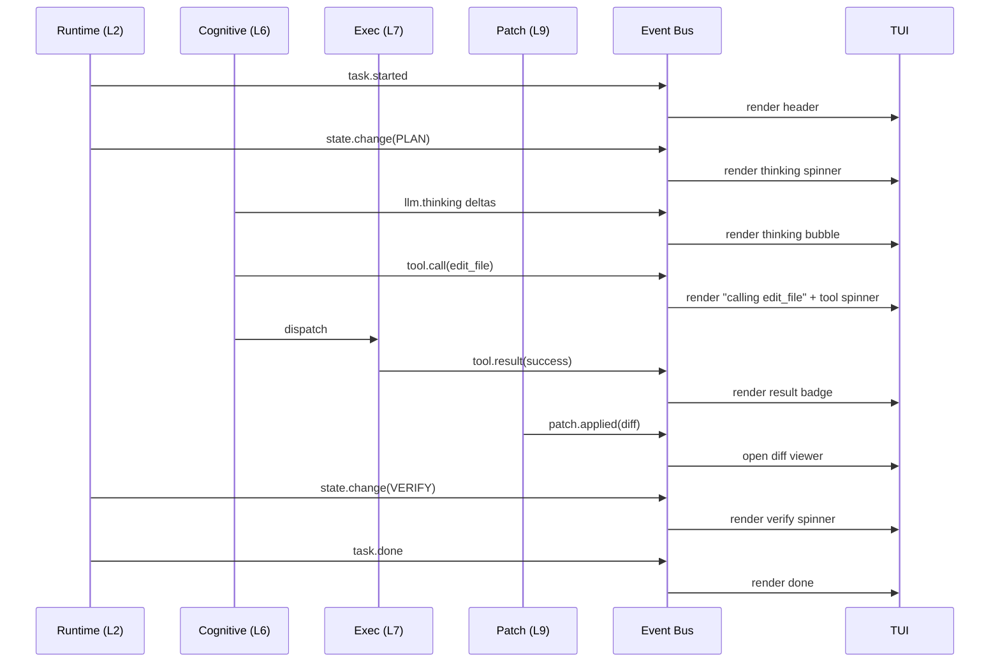

# 14 — TUI Architecture

> **Goal of this document:** design the terminal UI as a **subscribe-only
> renderer** with no logic of its own. It subscribes to the rendering topics
> on the event bus (File 05), projects event state onto the screen with
> `bubbletea`+`lipgloss`+`bubbles`, and publishes `user.*` events back when
> the user types, approves, cancels, pauses, or quits.

This file is the **render sink** named in File 05 §5.5.3. The rule stated there
governs everything below: *the TUI holds no state machine of its own — it
renders what the bus says.* Cancellation, pause, state changes, tool calls,
approvals, diffs, and errors are all derived from events, never from the TUI
inspecting the runtime.

---

## Table of Contents

1. [The Subscribe-Only Contract](#141-the-subscribe-only-contract)
2. [The Elm Architecture & the Never-Block Rule](#142-the-elm-architecture--the-never-block-rule)
3. [The `busWatcher` Bridge](#143-the-buswatcher-bridge)
4. [The Model (Render State)](#144-the-model-render-state)
5. [Event → Render Mapping](#145-event--render-mapping)
6. [The Canonical Flow](#146-the-canonical-flow)
7. [Components](#147-components)
8. [Input Handling](#148-input-handling)
9. [Backpressure & Responsiveness](#149-backpressure--responsiveness)
10. [Headless Mode](#1410-headless-mode)
11. [The TUI, consolidated](#1411-the-tui-consolidated)

---

## 14.1 The Subscribe-Only Contract

### 14.1.1 What "no logic" means

The TUI is a pure projection. Concretely, the `internal/tui` package:

| Allowed | Forbidden |
|---|---|
| Subscribe to rendering topics on the bus | Import any `internal/<layer>` package |
| Publish `user.*` events (input) | Call any runtime method |
| Hold *render state* (what to draw) | Hold *agent state* (task progress, FSM) |
| Render based on accumulated events | Derive outcomes by inspecting the runtime |
| Reformat/truncate for display | Apply patches, run tools, or mutate memory |

A lint check (File 15 CI) enforces the import rule: `internal/tui` may import
only `internal/event`, `bubbletea`, `lipgloss`, `bubbles`, and stdlib. This is
the architectural seam that lets the same agent run headless (File 14.10) or
behind a future web UI without changing a line of runtime code.

### 14.1.2 Why it must be this way

If the TUI computed anything — "is this task done?", "should I show a
spinner?", "can this tool be approved?" — it would become a second source of
truth alongside the bus. Two sources drift: the runtime cancels a task but the
TUI's local flag still says "running," and the user sees a lie. The event bus
is the *only* source of truth (File 05 §5.1, File 02 §2.4.1). The TUI's job is
to *paint* that truth, nothing more.

This is also what makes the agent replayable and observable (P3, P4): the
complete event log reconstructs exactly what the TUI showed, so a bug report
"is a transcript and a screenshot in one."

### 14.1.3 Principles to guarantees

| Principle | How this layer honors it |
|---|---|
| P1 Speed | Rendering is microseconds; `Update` never blocks, so input stays snappy mid-stream |
| P2 Safety | Approvals/cancels go through the bus as events, so the runtime validates them uniformly |
| P3 Determinism | The screen is a pure function of the event sequence — replay reproduces it |
| P4 Transparency | What you see is what the bus said; nothing is hidden in TUI-local state |

---

## 14.2 The Elm Architecture & the Never-Block Rule

### 14.2.1 The bubbletea model

bubbletea implements the Elm architecture: `Model` (state), `Update(msg)
(Model, Cmd)` (transition), `View() string` (render). We use it as-is, with one
extra rule layered on top (File 02 §2.4.2):

> **Never do work in `Update`; always dispatch it as a `tea.Cmd` returning a
> `tea.Msg`.**

`Update` must return in microseconds. It only folds a message into the model
and possibly returns a command. All I/O — reading the next event from the bus,
writing to the screen, waiting on stdin — happens in commands that run off the
render thread and report back as messages.

### 14.2.2 The message set

```go
package tui

import tea "github.com/charmbracelet/bubbletea"

// busMsg wraps an event-bus envelope. Produced by the busWatcher command.
type busMsg struct{ env Envelope }

// inputMsg carries a keystroke or pasted line. Produced by the stdin command.
type inputMsg struct{ key string; text string }

// tickMsg drives periodic re-render (spinners, cost meter). Produced by a timer command.
type tickMsg struct{}

// quitMsg signals the program should exit. Produced after user.quit is acknowledged.
type quitMsg struct{}
```

Every message is either an envelope off the bus (`busMsg`), a keystroke
(`inputMsg`), a clock tick (`tickMsg`), or shutdown (`quitMsg`). `Update` does
no I/O; it only decides which of these it received and folds it into the model.

### 14.2.3 The `Update` contract

```go
func (m Model) Update(msg tea.Msg) (tea.Model, tea.Cmd) {
    switch msg := msg.(type) {
    case busMsg:
        return m.fold(msg.env)        // fold event into render state; no I/O
    case inputMsg:
        return m.handleInput(msg)     // publish user.* via a command; no I/O here
    case tickMsg:
        return m.tick()               // advance spinners; return next tick command
    case tea.QuitMsg, quitMsg:
        return m, tea.Quit
    }
    return m, nil
}
```

`fold`, `handleInput`, and `tick` are pure functions of `(model, msg) → (model,
cmd)`. They never touch the filesystem, the network, or the runtime. The only
"side effect" they produce is a `tea.Cmd` that the bubbletea runtime executes
off-thread.

---

## 14.3 The `busWatcher` Bridge

### 14.3.1 One long-lived command

The TUI's only bridge to the bus is a single long-lived command, `busWatcher`
(File 02 §2.4.2). It owns the subscription channel and pumps envelopes into
`busMsg`s for the lifetime of the program.

```go
package tui

import (
    "context"
    tea "github.com/charmbracelet/bubbletea"
)

// busWatcher is a tea.Cmd that blocks on the event-bus channel and emits
// one busMsg per envelope. It re-launches itself after each message, so it
// stays alive for the whole session. It never runs on the render thread.
func busWatcher(sub <-chan Envelope, cancel <-chan struct{}) tea.Cmd {
    return func() tea.Msg {
        select {
        case env, ok := <-sub:
            if !ok { return quitMsg{} }  // bus closed → exit
            return busMsg{env: env}
        case <-cancel:
            return quitMsg{}
        }
    }
}
```

Because this command blocks on a channel read off-thread, the render thread is
free to repaint and read stdin while we wait for the next event. When the next
event arrives, `Update` receives a `busMsg`, folds it, and re-launches
`busWatcher` for the next one.

### 14.3.2 Subscription topics

The TUI subscribes to exactly the rendering topics (File 05 §5.4.9 registry).
It does **not** subscribe to `>` (root) — that's Infrastructure's job (File 13).
Subscribing to fewer topics keeps the TUI's channel light and its model small.

```go
func subscribe(bus Subscribable) <-chan Envelope {
    // bubbletea's Cmd model gives us one channel; we merge the rendering
    // topics into a single fan-in channel so the watcher reads one stream.
    return bus.SubscribeMulti([]string{
        "task.*", "state.change", "context.built",
        "llm.token", "llm.thinking", "assistant.message",
        "tool.call", "observation.received", "tool.result",
        "approval.request", "verification.failed", "reflection.note",
        "patch.applied", "memory.update",
        "coord.plan.ready", "coord.task.assign", "coord.code.ready",
        "coord.review.verdict", "coord.test.report",
        "cost.spend", "cost.loop", "cost.abort", "cost.degraded",
        "error",
    }, 64)
}
```

The buffer is 64 (File 05 §5.6 default). Rendering an event is microseconds, so
64 absorbs bursts; sustained lag is a bug surfaced by Infra's `bus.lag` metric
(File 13 §13.4.4), not by dropped events.

---

## 14.4 The Model (Render State)

### 14.4.1 What the model holds

The model is **render state** — enough to paint the screen, and nothing more.

```go
package tui

type Model struct {
    width, height int
    focus         pane  // chat | input | diff | board

    // task header
    taskID     string
    taskKind   string
    state      string  // current FSM state label, from state.change

    // chat transcript (append-only)
    messages   []messageView  // user, assistant, thinking, tool, observation

    // streaming
    streaming  bool
    thinking   string  // accumulated llm.thinking text for the current turn
    spinner    spinnerState

    // active tool (for the spinner line)
    activeTool string
    toolStart  int64  // unix ms, for elapsed display

    // pending approval, if any
    approval   *approvalView

    // diff viewer (set by patch.applied / verification.failed)
    diff       *diffView

    // cost meter
    cost       costView

    // multi-agent board (only when coord.* events arrive)
    board      *boardView

    // banner (last error)
    banner     string

    // input
    input      textinput.Model

    // bus bridge
    sub        <-chan Envelope
    cancel     chan struct{}
    publisher  EventPublisher  // for user.* events
}
```

Every field is derived from events. `state` is a string copied from the last
`state.change` event — the TUI does not model the FSM, it just labels it.
`thinking` accumulates `llm.thinking` deltas until the next
`assistant.message` flushes it into `messages`. Nothing here is computed from
runtime internals.

### 14.4.2 `fold` — the pure projection

```go
func (m Model) fold(env Envelope) (tea.Model, tea.Cmd) {
    switch env.Topic {
    case "task.started":
        m.taskID = env.Str("task_id")
        m.taskKind = env.Str("kind")
    case "state.change":
        m.state = env.Str("to")
        m.spinner = spinnerFor(m.state)  // EXECUTE/VERIFY spin, PLAN/LOAD don't
    case "llm.thinking":
        m.streaming = true
        m.thinking += env.Str("delta")
    case "assistant.message":
        m.streaming = false
        m.messages = append(m.messages, messageView{
            role: "assistant", text: env.Str("text"),
        })
        m.thinking = ""
    case "tool.call":
        m.activeTool = env.Str("tool")
        m.toolStart = env.Int64("ts")
        m.messages = append(m.messages, messageView{
            role: "tool", text: "calling " + env.Str("tool"),
        })
    case "tool.result":
        m.activeTool = ""
        m.messages = append(m.messages, messageView{
            role: "tool", text: summarize(env.Str("output")), outcome: env.Str("outcome"),
        })
    case "patch.applied":
        m.diff = &diffView{files: env.StrList("files"), hunks: env.Str("diff")}
        m.focus = diff
    case "approval.request":
        m.approval = &approvalView{id: env.Str("id"), prompt: env.Str("prompt")}
        m.focus = input
    case "cost.spend":
        m.cost.dollars = env.Float("dollars")
    case "cost.loop":
        m.cost.loops = env.Int("loops")
    case "cost.degraded":
        m.cost.level = env.Str("level")
    case "error":
        m.banner = env.Str("message")
    case "coord.plan.ready":
        m.board = &boardView{planID: env.Str("plan_id"), todos: todoViews(env)}
    // ...remaining topics mirror §14.5
    }
    return m, busWatcher(m.sub, m.cancel)  // re-launch the watcher
}
```

Two things to note: `fold` returns the re-launched `busWatcher` command (so the
bridge keeps pumping), and it never calls back into the runtime. The
`summarize`/`todoViews` helpers are pure formatting functions.

---

## 14.5 Event → Render Mapping

This is the heart of the file: every rendering topic and what it draws.

| Event topic | TUI effect | Component |
|---|---|---|
| `task.started` / `task.done` | Set/clear task header (`taskID`, `kind`) | Header |
| `state.change` | Update status line (`to` state), pick spinner | Status bar |
| `context.built` | Flash "context: N items, B tokens" for ~1s | Status bar |
| `llm.thinking` | Append delta to live thinking bubble; spinner on | Chat |
| `llm.token` | Append delta to live assistant bubble; spinner on | Chat |
| `assistant.message` | Finalize assistant bubble; flush thinking | Chat |
| `tool.call` | Add "calling <tool>" line; start tool spinner | Chat + status |
| `observation.received` | Show truncated observation preview | Chat |
| `tool.result` | Replace "calling" line with summarized result + outcome badge | Chat |
| `approval.request` | Focus input; show Y/N prompt with the request text | Input |
| `verification.failed` | Open diff viewer on the failing file; stage badge | Diff viewer |
| `reflection.note` | Dimmed inline note in the chat | Chat |
| `patch.applied` | Open diff viewer with the applied hunks; insert/delete counts | Diff viewer |
| `memory.update` | Status line flash: "memory: +N <store>" | Status bar |
| `coord.plan.ready` | Open the multi-agent board with todos | Board |
| `coord.task.assign` | Mark todo assigned to agent role | Board |
| `coord.code.ready` | Mark todo coded; show self-report | Board |
| `coord.review.verdict` | Mark todo approved/needs-rework; show comments | Board |
| `coord.test.report` | Mark todo tested; pass/fail badge | Board |
| `cost.spend` | Update dollar figure in cost meter | Cost meter |
| `cost.loop` | Update loop count in cost meter | Cost meter |
| `cost.degraded` | Show degradation level ("reflection off"/"verify only") | Cost meter |
| `cost.abort` | Banner: "spend cap hit — task aborted"; red | Banner |
| `error` | Banner with message + recoverable badge; auto-dismiss after 8s | Banner |
| `user.*` (echo) | Echo own input into chat immediately (optimistic) | Chat |

### 14.5.1 Spinner selection by state

| FSM state (from `state.change`) | Spinner | Why |
|---|---|---|
| `PLAN` | pulsing dot | planning, not yet doing |
| `EXECUTE` | spinner | a tool is running or an LLM is streaming |
| `WAIT_TOOL` | spinner (tool-colored) | blocked on tool completion |
| `VERIFY` | bouncing bar | checks running |
| `PATCH` | sweeping bar | applying changes |
| `WAIT_USER` | still (no spin) | waiting on the human |
| `PAUSED` | paused glyph | user paused |
| `ERROR` | none (banner) | something broke |
| `DONE` | none | finished |

The TUI does not know the FSM exists — it just maps the `to` string it
received to a spinner. Adding a state to File 04 requires adding one row here;
no other TUI change.

---

## 14.6 The Canonical Flow

The brief's example flow, traced event-by-event through the mapping above.
This is what a single "fix the bug in auth.go" task looks like on screen.



### 14.6.1 Step by step, what the user sees

1. **Planner Started** — `task.started` → header appears (`task #7 · bugfix`).
   `state.change(PLAN)` → status bar reads `PLAN`, a pulsing dot spins.
2. **Render Thinking** — `llm.thinking` deltas stream into a dimmed thinking
   bubble. The spinner stays on. No tool line yet.
3. **Tool Started** — `tool.call(edit_file)` → a "calling edit_file" line
   appears; the spinner switches to the tool color; the status bar reads
   `EXECUTE`.
4. **Render Spinner** — while the tool runs, the spinner animates and an
   elapsed-time counter ticks (from `tickMsg`). The render thread is idle
   between events, so keystrokes remain responsive.
5. **Patch Applied** — `patch.applied` → the diff viewer opens, focused,
   showing the hunks with insert/delete counts. The chat keeps the result
   badge above it.
6. **Diff Viewer** — the user scrolls the diff with `j`/`k`; if
   `verification.failed` arrives, the failing stage is highlighted and the
   viewer stays open until the user dismisses or the next `patch.applied`
   replaces it.
7. **Done** — `task.done` → the header clears the spinner, the status bar
   reads `DONE`, the diff viewer remains dismissable. The user is back at the
   input prompt for the next task.

At no point does the TUI ask "is the tool done?" — it just draws what
`tool.result` told it. At no point does it decide "can I show the diff?" — it
shows the diff when `patch.applied` arrives, unconditionally.

---

## 14.7 Components

### 14.7.1 The layout

```
┌──────────────────────────────────────────────────────────────┐
│ task #7 · bugfix                              PLAN ◌          │ ← header + status
├────────────────────────────────────────────────────┬─────────┤
│ user: fix the bug in auth.go                       │         │
│ (thinking) …I'll locate the nil check…             │  cost   │
│ assistant: I'll edit auth.go to guard the nil.     │  $0.42  │
│ calling edit_file                    ⣾ 3.2s       │  loops 2│
│ ✓ edit_file — 1 file, +3 −1                        │  refl on│
│ ▌diff viewer: auth.go                              │         │
│   @@ -42,7 +42,9 @@                                │  board  │
│   -   if u != nil {                                │  (hide  │
│   +   if u != nil && u.ID != "" {                  │   when  │
│ …                                                  │   single)│
├────────────────────────────────────────────────────┴─────────┤
│ > _                                                          │ ← input
└──────────────────────────────────────────────────────────────┘
```

### 14.7.2 Chat pane

Append-only list of `messageView`s. Roles: `user` (right-aligned, accent),
`assistant` (left, default), `thinking` (dimmed, italic, collapses on the next
`assistant.message`), `tool` (monospace, with an outcome badge
✓/✗/denied/rate-limited). Long outputs are truncated with a "show more" afford
ance that expands into a scrollable sub-view — truncation is display-only; the
full observation lives in the event log and memory.

### 14.7.3 Diff viewer

Opened by `patch.applied` or `verification.failed`. Renders the unified diff
with `lipgloss` syntax highlighting (green `-`, red `+`, cyan hunk headers).
The viewer is a `bubbles/viewport` so large diffs scroll. It does not edit —
edits come only from `patch.applied` events. Closing it returns focus to chat.

### 14.7.4 Status bar

One line: `task #N · kind | STATE | context: B tokens | memory: M`. Updated by
`task.*`, `state.change`, `context.built`, `memory.update`. Cheap and constant
in size; it is the at-a-glance answer to "what is the agent doing right now?"

### 14.7.5 Cost meter

Right rail, fed by `cost.*` events (File 13 §13.10.3). Shows dollars, loops,
and the degradation level. When `cost.degraded` fires, the level label changes
color (reflection off → amber, verify only → orange, abort → red). The TUI does
not compute dollars — it displays the figure the ledger published.

### 14.7.6 Multi-agent board

Hidden in single-agent mode. Appears on the first `coord.plan.ready` (File 12).
A column per todo, with the assigned agent role and a status badge
(assigned/coded/reviewed/tested/done). Updated by the `coord.*` events. This is
the one place the TUI renders *aggregation* rather than a single event stream —
but the aggregation is over published events, not runtime inspection.

### 14.7.7 Input

A `bubbles/textinput` for free text and a small keymap for commands:
`Enter`→submit, `Esc`→cancel active task, `Ctrl+P`→pause, `Ctrl+R`→resume,
`y/n`→approve/reject when an `approval.request` is pending. Every one of these
publishes a `user.*` event (§14.8); none calls the runtime directly.

---

## 14.8 Input Handling

### 14.8.1 Input is publish-only

The TUI captures keystrokes and translates them into `user.*` events published
to the bus. The runtime (L2) subscribes to `user.*` (File 05 §5.4.6) and reacts
— starting tasks, canceling, approving, pausing, resuming, or quitting. The
TUI never confirms its own input; it optimistically echoes and lets the bus
close the loop.

```go
func (m Model) handleInput(in inputMsg) (tea.Model, tea.Cmd) {
    // Keystroke commands while an approval is pending.
    if m.approval != nil {
        switch in.key {
        case "y":
            return m, publish(m.publisher, UserApproveEvent{Task: m.taskID, ApprovalID: m.approval.id})
        case "n":
            return m, publish(m.publisher, UserRejectEvent{Task: m.taskID, ApprovalID: m.approval.id})
        }
    }
    // Global keymap.
    switch in.key {
    case "esc":
        return m, publish(m.publisher, UserCancelEvent{Task: m.taskID})
    case "ctrl+p":
        return m, publish(m.publisher, UserPauseEvent{Task: m.taskID})
    case "ctrl+r":
        return m, publish(m.publisher, UserResumeEvent{Task: m.taskID})
    case "ctrl+c":
        return m, publish(m.publisher, UserQuitEvent{})
    }
    // Free text → submit on Enter.
    if in.key == "enter" && m.input.Value() != "" {
        text := m.input.Value()
        m.input.Reset()
        m.messages = append(m.messages, messageView{role: "user", text: text}) // optimistic echo
        return m, publish(m.publisher, UserSubmitEvent{Text: text})
    }
    // Otherwise, route to the text input widget.
    var cmd tea.Cmd
    m.input, cmd = m.input.Update(tea.KeyMsg{Type: tea.KeyType(in.key)})
    return m, cmd
}
```

`publish` returns a `tea.Cmd` that calls `publisher.Publish` off-thread, so
even a slow bus doesn't stall `Update`.

### 14.8.2 The user event set

These are the only events the TUI ever publishes (File 05 §5.4.6):

| Keystroke / action | Event | Runtime reaction |
|---|---|---|
| Enter in input | `user.submit` | L2 starts a new task |
| Esc | `user.cancel` | L2 cancels the active task |
| `y` (approval pending) | `user.approve` | L2 resumes from WAIT_TOOL |
| `n` (approval pending) | `user.reject` | L2 aborts the tool path |
| Ctrl+P | `user.pause` | L2 → PAUSED |
| Ctrl+R | `user.resume` | L2 → resumes from PAUSED |
| Ctrl+C (twice) | `user.quit` | L2 drains and stops |

The TUI does not validate these — it can't, because it has no logic. If the
user presses Esc with no active task, the runtime's `user.cancel` handler is a
no-op and nothing changes on screen. That's correct: the bus is the arbiter.

### 14.8.3 Optimistic echo

User text is echoed into the chat immediately on Enter, before the bus
acknowledges it. This keeps the UI feeling instant (P1). If the runtime rejects
the submit (e.g. another task is already running), an `error` event arrives
and the banner explains — the optimistic line stays, with a small "rejected"
marker. The TUI never retracts what it already drew; it annotates.

---

## 14.9 Backpressure & Responsiveness

### 14.9.1 The bounded channel

The TUI's subscription channel is buffered to 64 (File 05 §5.6). When the TUI
falls behind, `Publish` blocks on the channel until the TUI drains. This is
deliberate: a slow TUI must not drop events (P3), and backpressure surfaces a
render bug loudly rather than silently losing state.

### 14.9.2 Why it rarely bites

Rendering an event is microseconds: fold into the model, append a string,
return. The 64-buffer absorbs bursts (a fast tool loop firing many
`tool.result`s). Sustained lag would mean the render thread is genuinely stuck
— but `Update` never blocks, so this only happens if `View` is pathologically
slow (a multi-megabyte diff). The diff viewer uses a `viewport` that only
renders the visible window, so even huge diffs are O(viewport) not O(diff).

### 14.9.3 Coalescing high-frequency streams

`llm.thinking` and `llm.token` can fire hundreds of times per second on a fast
stream. Rather than repaint per token, `fold` accumulates deltas into a single
live bubble and a `tickMsg` (60 Hz) triggers the repaint. So 200 tokens/sec
become 60 repaints/sec — the human eye can't see more, and the render thread
stays idle between ticks. The accumulated text is always correct; only the
repaint is throttled.

### 14.9.4 The health signal

Infra's `bus.lag` metric (File 13 §13.4.4) measures the TUI channel depth. A
sustained non-zero lag pages before the user notices stutter — observable
observability of the observer.

---

## 14.10 Headless Mode

### 14.10.1 Same events, no TUI

Because the TUI is a pure subscriber, the agent runs identically without it.
A `headless` runner replaces `internal/tui` with a thin program that:

- reads `user.submit` lines from stdin (one task per line, or a JSON plan),
- subscribes to the same rendering topics,
- prints a compact event transcript to stdout (one line per event),
- exits on `task.done` (single-shot) or `user.quit` (interactive).

```go
package headless

func Run(ctx context.Context, bus Subscribable, in io.Reader, out io.Writer) {
    sub := subscribe(bus)  // same topic list as the TUI
    for env := range sub {
        fmt.Fprintln(out, formatEvent(env))  // one line, machine-parseable
        if env.Topic == "task.done" && singleShot { return }
    }
}
```

No `bubbletea`, no rendering, no spinner — but the *same* event contract, so a
script piping into headless drives the same runtime the TUI does. This is what
makes CI integration (File 15) trivial: the test harness is a headless run
with assertions over the transcript.

### 14.10.2 What the TUI and headless share

| Concern | TUI | Headless |
|---|---|---|
| Event subscription | same topics | same topics |
| Input → `user.*` | keystrokes | stdin lines |
| Output | screen render | transcript lines |
| Logic | none | none |

The shared column is the point: input and output are the only differences. The
runtime, the bus, the layers, and Infra are byte-for-byte identical between
modes. This is the seam File 01 §success-criteria S8 ("add a tool without
touching the TUI") rests on, generalized to "swap the whole UI without
touching the agent."

---

## 14.11 The TUI, consolidated

The program wires the bridge, the model, and the loop in one place.

```go
package tui

import (
    "context"
    tea "github.com/charmbracelet/bubbletea"
    "github.com/charmbracelet/bubbles/textinput"
)

func Run(ctx context.Context, bus Subscribable, pub EventPublisher) error {
    sub := subscribe(bus)
    cancel := make(chan struct{})
    defer close(cancel)

    m := Model{
        focus:     chat,
        input:     textinput.New(),
        sub:       sub,
        cancel:    cancel,
        publisher: pub,
    }
    m.input.Prompt = "> "
    m.input.Focus()

    p := tea.NewProgram(m, tea.WithAltScreen())
    // Launch the first busWatcher; Update re-launches it after each event.
    _, err := p.Run()  // blocks until tea.Quit
    return err
}

// initial command: start the watcher. tea sends Init's returned Cmd first.
func (m Model) Init() tea.Cmd {
    return busWatcher(m.sub, m.cancel)
}

// View is pure: a string from the model. No I/O, no events.
func (m Model) View() string {
    return lipgloss.JoinVertical(0,
        renderHeader(m),
        lipgloss.JoinHorizontal(0, renderChat(m), renderRail(m)),
        renderInput(m),
        renderBanner(m),
    )
}
```

`Run` is the entire entry point. `Init` launches the watcher; `Update` (§14.2.3)
folds messages and re-launches it; `View` paints. There is no second thread, no
polling, no runtime calls. The program ends when the watcher returns
`quitMsg` (bus closed or `user.quit` acknowledged).

---

### What this file fixes, and what it hands off

**Fixes:**
- The second-source-of-truth bug: by being subscribe-only, the TUI can never
  disagree with the bus about what the agent is doing.
- The blocking-render bug: `Update` never does I/O, so input stays responsive
  even while a long tool runs or a large diff renders.
- The "only interactive" trap: headless mode reuses the exact event contract,
  so CI, scripts, and a future web UI drive the same runtime.
- High-frequency repaint cost: token/thinking streams coalesce to 60 Hz, so a
  fast stream doesn't peg the render thread.

**Hands off:**
- **To L3 (Event Bus, File 05):** the topic list in §14.3.2 and the bounded-64
  subscriber contract. The TUI is one of the three observer subscribers
  (File 05 §5.5.3); the bus owns backpressure.
- **To L2 (Runtime, File 04):** the `user.*` event set in §14.8.2. The runtime
  is the sole reactor to user input; the TUI only publishes.
- **To L12 (Infrastructure, File 13):** the `cost.*` events that drive the cost
  meter, and the `bus.lag` metric that health-checks the TUI. The TUI reads
  these; it never calls Infra.
- **To L11 (Coordination, File 12):** the `coord.*` events that populate the
  multi-agent board. The board is rendered only when those events arrive.
- **To the user:** the keymap in §14.7.7 and the layout in §14.7.1. Theming
  (colors, key bindings) is a `lipgloss` style table, swappable without
  touching any other file.

*End of File 14 — TUI Architecture.*
