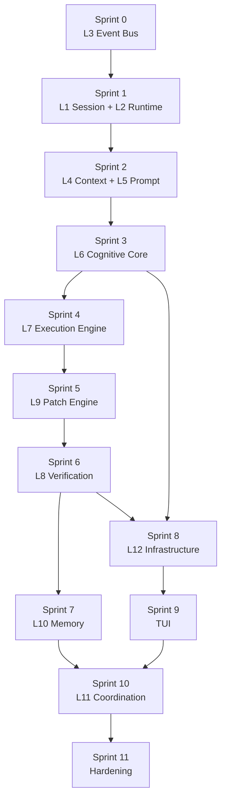
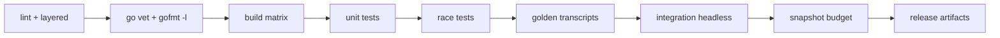

# 15 — Implementation Roadmap

> **Goal of this document:** turn the 12-layer architecture (Files 02–14) into
> an **ordered build plan**: eleven sprints, each owning one or two layers,
> with explicit dependency edges, ticket-level tasks, exit criteria tied to the
> S1–S10 success criteria (File 01 §9), and a CI pipeline that enforces the
> architectural invariants (layer dependencies, race-safety, replay
> determinism) on every push.

This file is the bridge from design to execution. The ordering is fixed by the
dependency rule (File 02 §2.2: a layer depends only on lower layers + the
event bus, never on the TUI) — so sprints build bottom-up, and each sprint's
exit is a demonstrable, testable behavior, not a checklist of files.

---

## Table of Contents

1. [Build Principles](#151-build-principles)
2. [Dependency Graph & Sprint Order](#152-dependency-graph--sprint-order)
3. [Sprint 0 — Foundation (L3)](#153-sprint-0--foundation-l3)
4. [Sprint 1 — Runtime Spine (L1, L2)](#154-sprint-1--runtime-spine-l1-l2)
5. [Sprint 2 — Context & Prompt (L4, L5)](#155-sprint-2--context--prompt-l4-l5)
6. [Sprint 3 — Cognitive Core (L6)](#156-sprint-3--cognitive-core-l6)
7. [Sprint 4 — Execution Engine (L7)](#157-sprint-4--execution-engine-l7)
8. [Sprint 5 — Patch Engine (L9)](#158-sprint-5--patch-engine-l9)
9. [Sprint 6 — Verification Engine (L8)](#159-sprint-6--verification-engine-l8)
10. [Sprint 7 — Memory System (L10)](#1510-sprint-7--memory-system-l10)
11. [Sprint 8 — Infrastructure (L12)](#1511-sprint-8--infrastructure-l12)
12. [Sprint 9 — TUI (subscribe-only)](#1512-sprint-9--tui-subscribe-only)
13. [Sprint 10 — Coordination Layer (L11)](#1513-sprint-10--coordination-layer-l11)
14. [Sprint 11 — Hardening & Distribution](#1514-sprint-11--hardening--distribution)
15. [CI Pipeline](#1515-ci-pipeline)
16. [Risk Register](#1516-risk-register)

---

## 15.1 Build Principles

### 15.1.1 Bottom-up, demoable

Every sprint ends with a runnable `yolo` binary that demonstrates one new
capability. We never accumulate untested layers. The cheapest demo is the
**headless runner** (File 14 §14.10): a script pipes a prompt to `yolo
--headless`, asserts over the event transcript, and exits. The TUI comes last
(Sprint 9) precisely because it adds nothing the headless path can't test.

### 15.1.2 The single-goroutine discipline

The runtime's FSM runs on one goroutine (File 02 §2.4.1). Sprints that add
concurrency (the bus's subscriber goroutines, the tool workers, the OTel
exporter) must justify each new goroutine against File 02's inventory table
and the race-safety rules (File 02 §2.4.4). `go test -race` is mandatory from
Sprint 0.

### 15.1.3 Replay-first testing

The agent's determinism guarantee (S5: identical input + model → identical
event trace) is tested by **golden transcripts**: a recorded event log is the
expected output; a run reproduces it byte-for-byte (modulo model nondeterminism,
which we mock with a deterministic stub provider). This is cheaper and stronger
than behavioral tests, because it covers the whole pipeline in one assertion.

### 15.1.4 Architectural invariants enforced in CI

| Invariant | Source | CI check |
|---|---|---|
| Layer depends only on lower layers + event bus | File 02 §2.2 | `layered` linter (§15.15) |
| `internal/tui` imports no layer except `event` | File 14 §14.1.1 | import allowlist |
| `internal/infra` is read-only (no agent-driving events except `cost.*`) | File 13 §13.1.2 | review + grep gate |
| Single FSM goroutine owns state | File 02 §2.4.4 | `go test -race` |
| Events durable before visible | File 05 §5.3 | fsync-ordering test |
| Patch rolled back on verification failure | File 10 §10.6 | checkpoint-rollback test |

---

## 15.2 Dependency Graph & Sprint Order



Sprint 8 (Infrastructure) forks off after Sprint 3 (it needs the Cognitive
Core's cost events to exercise the cost ledger) and rejoins before the TUI.
Sprint 10 (Coordination) needs both Memory (Sprint 7) and the TUI (Sprint 9).
Sprint 6 → Sprint 8 edge lets the verification pipeline feed Infra's metrics.
Critical path: S0 → S1 → S2 → S3 → S4 → S5 → S6 → S7 → S10 → S11.

| Sprint | Layers | Duration | Unlocks |
|---|---|---|---|
| 0 | L3 | 1 wk | everything (the bus) |
| 1 | L1, L2 | 2 wk | end-to-end single-turn loop (stubbed) |
| 2 | L4, L5 | 1.5 wk | real context into a real prompt |
| 3 | L6 | 2 wk | planning, reflection, tool decisions |
| 4 | L7 | 2 wk | safe tool execution, HITL |
| 5 | L9 | 1.5 wk | applying changes |
| 6 | L8 | 1 wk | blocking bad patches |
| 7 | L10 | 1.5 wk | persistent memory |
| 8 | L12 | 1.5 wk | full observability + safety infra |
| 9 | TUI | 2 wk | the interactive product |
| 10 | L11 | 2 wk | multi-agent complex tasks |
| 11 | – | 1.5 wk | release |

Total ≈ 19.5 person-weeks on the critical path; parallelizable to ≈ 12
calendar weeks with two engineers (Sprints 5+6 and 7+8 can overlap, and 8 can
start while 4 runs).

---

## 15.3 Sprint 0 — Foundation (L3)

**Layer built:** `internal/event` (File 05).
**Goal:** a durable, FIFO, at-least-once event bus that the whole agent will
hang off of.

### 15.3.1 Tickets

| ID | Title | Deps | Exit |
|---|---|---|---|
| L3-001 | Go module + `cmd/yolo` skeleton + `internal/` package dirs | – | `go build ./...` passes; `yolo` runs a no-op |
| L3-002 | `Bus`, `Envelope`, event `Topic` routing | L3-001 | publish/subscribe fan-out test passes |
| L3-003 | Per-subscriber FIFO + bounded channels (buf 64) + backpressure | L3-002 | slow-subscriber test blocks publisher, not drops |
| L3-004 | Append-only durability log with fsync-before-fanout (File 05 §5.3) | L3-003 | crash-recovery test replays durable events |
| L3-005 | Idempotent subscribers (dedup by `(sub, event_id)`) | L3-003 | redelivery produces no double-effect |
| L3-006 | Versioned event structs (`"v":1`) + registry of 16 topic groups | L3-002 | round-trip JSON test |
| L3-007 | CI scaffold: `golangci-lint`, `go test -race`, golden-transcript harness | L3-001 | a red test fails CI, a green one passes |

### 15.3.2 Sprint exit

`yolo --headless` publishes a synthetic event stream and prints a transcript;
killing it mid-stream and restarting replays the durable tail. **S5** (byte-
identical trace) is exercisable for the bus alone. No agent logic exists yet —
the bus is the product of this sprint.

---

## 15.4 Sprint 1 — Runtime Spine (L1, L2)

**Layers built:** `internal/session` (File 03), `internal/runtime` (File 04).
**Goal:** an end-to-end single-turn task with a **stubbed** cognitive core and
**headless** output.

### 15.4.1 Tickets

| ID | Title | Deps | Exit |
|---|---|---|---|
| L1-001 | `Session`/`Task` types, task lifecycle, history stack | L3-* | create→run→done persists to session file |
| L1-002 | Checkpoints + undo stack + resume | L1-001 | resume restores full state from disk |
| L1-003 | Cancel vs pause semantics (terminal vs resumable) | L1-001 | cancel is final; pause→resume continues |
| L2-001 | FSM: 12 states, 20-transition table (File 04 §4.3) | L1-001 | transition-table unit test covers all edges |
| L2-002 | Drive loop on the single runtime goroutine | L2-001 | `-race` clean under concurrent tool stubs |
| L2-003 | `state.change` publication on every transition | L2-001 | transcript shows ordered transitions |
| L2-004 | Cancellation propagation via `context.Context` | L2-002 | cancel kills spawned stubs, returns to terminal state |
| L2-005 | Stubbed `cognitive.Core` returning a canned plan/message | L2-001 | a prompt → a canned assistant message → DONE |
| L2-006 | Headless runner (File 14 §14.10) printing the transcript | L2-003 | `echo "hi" \| yolo --headless` prints events |

### 15.4.2 Sprint exit

A user types a prompt into the headless runner; the stubbed core "responds";
the FSM walks `INIT→LOAD_SESSION→LOAD_CONTEXT→PLAN→EXECUTE→DONE`; the
transcript is byte-identical across runs (**S5**). Cancel (Ctrl+C-equivalent)
returns the FSM to a terminal state. No real LLM, no tools, no patches —
the spine is the product.

---

## 15.5 Sprint 2 — Context & Prompt (L4, L5)

**Layers built:** `internal/context` (File 06, builder half), `internal/prompt`
(File 06, compiler half).
**Goal:** real repository context flows into a real prompt that fits a budget.

### 15.5.1 Tickets

| ID | Title | Deps | Exit |
|---|---|---|---|
| L4-001 | 7 context inputs wired (prompt, files, memory, history, env, tools, session) | L1-*, L2-* | builder assembles a ContextBundle |
| L4-002 | Relevance scoring (recency/proximity/semantic/centrality/explicit) | L4-001 | scored bundle ranks a known-relevant file #1 |
| L4-003 | Compression passes (drop > summarize > fold) | L4-002 | over-budget bundle compresses under budget |
| L5-001 | Prompt compiler: dedup → summarize → budget → order | L4-003 | compiled prompt ≤ token budget |
| L5-002 | XML+Markdown wire format with stable section tags | L5-001 | parser round-trips the compiled prompt |
| L5-003 | Context-bundling test corpus (small real repo) | L4-001 | golden prompt fixtures pass |

### 15.5.2 Sprint exit

The stubbed core now receives a compiled prompt containing real file contents
from a fixture repo, ordered and budgeted. **S6** (live "what is it doing
now") becomes testable: `context.built` event carries the bundle summary. No
real LLM call yet — the stub inspects the prompt and asserts it saw the
expected files.

---

## 15.6 Sprint 3 — Cognitive Core (L6)

**Layer built:** `internal/cognitive` (File 07).
**Goal:** a real LLM provider drives planning, reflection, and tool
selection, under a working cost controller.

### 15.6.1 Tickets

| ID | Title | Deps | Exit |
|---|---|---|---|
| L6-001 | Provider-agnostic interface + SSE streaming client | L5-* | mock provider streams token deltas as events |
| L6-002 | Planner: parse a plan (todos) from a model response | L6-001 | plan has ≥1 todo with file+intent |
| L6-003 | Reflection (non-acting): critique the last turn | L6-002 | reflection emits `reflection.note`, mutates nothing |
| L6-004 | Reasoner: turn plan + reflection into a tool call | L6-003 | emits a `tool.call` event (tool stub consumes) |
| L6-005 | Tool Policy + Verification Policy (admit/deny gates) | L6-004 | unsafe tool call is denied at policy |
| L6-006 | Cost Controller: ledger + degradation ladder (File 07 §7.6) | L6-001 | loop cap disables reflection; spend cap aborts |
| L6-007 | Deterministic stub provider for golden tests | L6-001 | same input → same token sequence → **S5** holds |

### 15.6.2 Sprint exit

A prompt like "list the files in this repo" produces a real `tool.call` for a
(stubbed) `list_files` tool, observes its result, and emits an
`assistant.message`. **S10** (runaway loop auto-degraded) is testable: a loop
hitting the reflection cap steps down to verify-only and eventually aborts.
The cost ledger is wired but its spend truth still comes from the stub's
tokens.

---

## 15.7 Sprint 4 — Execution Engine (L7)

**Layer built:** `internal/exec` (File 08).
**Goal:** real tools run safely, under HITL, with secrets redacted.

### 15.7.1 Tickets

| ID | Title | Deps | Exit |
|---|---|---|---|
| L7-001 | Tool Registry: static Go registration + metadata (perm/timeout/cost/schema) | L6-004 | register a tool by name; lookup returns metadata |
| L7-002 | MCP client for runtime tools (File 08 §8.2.2) | L7-001 | an MCP server tool is callable |
| L7-003 | Dispatcher: spawn worker goroutine per call, enforce timeout | L7-001 | timeout kills the worker; result published |
| L7-004 | Sandbox: path confinement (repo-only), command allowlist | L7-001 | `rm -rf /` is denied; write outside repo is denied |
| L7-005 | Network default-deny + per-tool network opt-in | L7-004 | a tool without `Network: true` cannot connect |
| L7-006 | HITL flow: `approval.request` → wait → approve/reject | L2-004, L7-003 | mutating tool blocks until approved |
| L7-007 | Observation normalizer: redact → truncate → summarize | L7-003 | secret-shaped output is redacted before publish |
| L7-008 | Portable process-group kill (Win/macOS/Linux) | L7-003 | cancel kills the whole tree, not just the parent |

### 15.7.2 Sprint exit

The agent can `read_file`, `list_files`, and run allowlisted shell commands
safely. **S3** (destructive action impossible without confirmation) holds: a
denied or unapproved destructive action never executes. **S8** (add a tool
without touching the TUI) holds: a new tool is one `Register` call. Secrets
in tool output are masked in the transcript.

---

## 15.8 Sprint 5 — Patch Engine (L9)

**Layer built:** `internal/patch` (File 10).
**Goal:** the agent edits files, safely, with rollback.

### 15.8.1 Tickets

| ID | Title | Deps | Exit |
|---|---|---|---|
| L9-001 | Hybrid format parser: SEARCH/REPLACE blocks (primary) | L7-001 | a clean patch applies to a fixture file |
| L9-002 | Unified-diff input fallback parser | L9-001 | a `git diff`-style patch also applies |
| L9-003 | Conflict detection (anchor miss → fail, don't guess) | L9-001 | stale SEARCH anchor fails, not corrupts |
| L9-004 | AST validation (parse after apply; reject syntax-breaking) | L9-001 | a patch breaking syntax is rejected |
| L9-005 | Git checkpoint before apply + rollback on failure/cancel | L9-001 | failed patch leaves the tree clean |
| L9-006 | `patch.applied` event with files/insertions/deletions | L9-001 | transcript shows the diff summary |

### 15.8.2 Sprint exit

The agent makes a real edit to a fixture repo: writes a SEARCH/REPLACE patch,
it applies, a snapshot is taken, and a `patch.applied` event fires. Forcing a
rollback restores the tree. **S4** (any patch rollback-able) holds. A patch
with a stale anchor fails cleanly rather than corrupting the file.

---

## 15.9 Sprint 6 — Verification Engine (L8)

**Layer built:** `internal/verify` (File 09).
**Goal:** bad patches are blocked before the task is marked done.

### 15.9.1 Tickets

| ID | Title | Deps | Exit |
|---|---|---|---|
| L8-001 | Pipeline stages: AST→Format→Lint→TypeCheck→Build→Tests→PolicyCheck | L9-006 | each stage runs and emits a verdict |
| L8-002 | Verdict model: pass / warn / fail with structured reasons | L8-001 | a failing test produces `verification.failed` |
| L8-003 | FSM wiring: PATCH→VERIFY; fail rolls back (File 04 §4.5) | L8-002, L9-005 | failed verify triggers patch rollback |
| L8-004 | Stage skip rules (no Go file → skip TypeCheck) | L8-001 | a Markdown-only patch skips Build/Tests |
| L8-005 | Caching of unchanged-file verification | L8-001 | re-verify of an unchanged file is O(1) |

### 15.9.2 Sprint exit

An agent edit that breaks a test is detected, the FSM transitions
`PATCH→VERIFY→(fail)→rollback`, and the task is not marked done. The
transcript shows which stage failed and why. This is the safety net under all
subsequent editing work.

---

## 15.10 Sprint 7 — Memory System (L10)

**Layer built:** `internal/memory` (File 11).
**Goal:** the agent remembers across sessions and recalls relevant context.

### 15.10.1 Tickets

| ID | Title | Deps | Exit |
|---|---|---|---|
| L10-001 | 6 memory sub-stores (Working/Conversation/Exec/Repo/Knowledge/Preference) | L3-* | each store reads/writes its type |
| L10-002 | Update-only-via-events rule (no direct writes from layers) | L10-001 | a non-event write fails lint/gate |
| L10-003 | Pure-Go vector store (embedding + cosine) | L10-001 | nearest-k query returns seeded docs in order |
| L10-004 | Per-function chunking + reindex on `patch.applied` | L10-003 | an edited function's chunks refresh |
| L10-005 | Persistence (session file) + cross-session recall | L10-001 | a fact stored in session A is recalled in B |
| L10-006 | Memory feeds back into L4 context builder | L10-003, L4-002 | a recalled memory surfaces in the prompt |

### 15.10.2 Sprint exit

The agent recalls a preference ("I prefer table-driven tests") stored in a
prior session and applies it to new code. A `memory.update` event fires on
every learning, visible in the transcript. The vector store is pure Go (no
external DB), satisfying the single-binary constraint.

---

## 15.11 Sprint 8 — Infrastructure (L12)

**Layer built:** `internal/infra` (File 13).
**Goal:** the agent is observable in standard tooling and bound by global safety/cost controls.

### 15.11.1 Tickets

| ID | Title | Deps | Exit |
|---|---|---|---|
| L12-001 | OpenTelemetry traces: span-per-event projector + `otel.export` drain | L3-006 | a run produces a Jaeger trace tree |
| L12-002 | Metrics: counters/histograms from §13.4.1 (unsampled) | L3-006 | a Prometheus scrape returns the counters |
| L12-003 | Structured `log/slog` logger + event→line projection | L3-006 | one DEBUG line per event, redacted |
| L12-004 | Sentry opt-in hub + `error`/`cost.abort` forwarding | L3-006 | a forced error appears in Sentry (test project) |
| L12-005 | Secrets redaction registry + 3 boundaries (exec/log/sentry) | L7-007 | a secret in tool output is masked in all three sinks |
| L12-006 | Permissions model: modes + policy table + scoped elevation | L7-006 | a denied action is blocked; elevation persists a rule |
| L12-007 | Rate limiter: per-provider/per-tool token buckets | L6-001, L7-003 | a fast loop is throttled, not 429'd |
| L12-008 | Cost ledger (full): pricer, `cost.*` events, snapshot API | L6-006 | spend cap aborts; metrics reflect dollars |
| L12-009 | `Infra.Start`/`Stop` lifecycle + LIFO shutdown | L12-001..008 | clean shutdown flushes in ≤ deadline |

### 15.11.2 Sprint exit

A run exports a full trace to Jaeger, counters to Prometheus, errors to
Sentry (opt-in), and a redacted transcript to the log — all from the same
event stream, with zero agent-logic changes. **S5** still holds with
telemetry on (telemetry is a side-effect, not behavior). The cost ledger is
the single spend truth the Cognitive Core reads.

---

## 15.12 Sprint 9 — TUI (subscribe-only)

**Layer built:** `internal/tui` (File 14).
**Goal:** the interactive product — chat, diff viewer, status, cost meter, board.

### 15.12.1 Tickets

| ID | Title | Deps | Exit |
|---|---|---|---|
| TUI-001 | `bubbletea` program + `busWatcher` bridge + Model | L3-006 | events render to the screen |
| TUI-002 | Chat pane: user/assistant/thinking/tool bubbles | TUI-001 | a streamed message renders incrementally |
| TUI-003 | Status bar (task/state/context/memory) | TUI-001 | state.change updates the bar |
| TUI-004 | Diff viewer (viewport) on `patch.applied`/`verification.failed` | TUI-001, L9-006 | a diff scrolls, syntax-highlighted |
| TUI-005 | Cost meter rail from `cost.*` events | TUI-001, L12-008 | dollars/loops/degradation level shown |
| TUI-006 | Input + keymap → `user.*` events (submit/cancel/approve/pause/resume/quit) | TUI-001, L2-004 | keystrokes drive the runtime via the bus |
| TUI-007 | High-freq coalescing (token/thinking → 60 Hz) | TUI-002 | a fast stream doesn't peg the render thread |
| TUI-008 | Import-allowlist lint (no layer except `event`) | TUI-001 | a forbidden import fails CI |
| TUI-009 | Multi-agent board on `coord.*` (skeleton, fills in Sprint 10) | TUI-001 | board renders when a `coord.plan.ready` arrives |

### 15.12.2 Sprint exit

The interactive agent is usable: a user types a prompt, watches thinking
stream, sees a tool run, reviews the applied diff, and the task completes —
all rendered purely from events. **S1** (< 200 ms cold start to first paint),
**S2** (< 50 ms token→screen), and **S6** (< 1 keypress to "what is it
doing") are measured and green. The TUI imports no layer except `event` —
verified by CI.

---

## 15.13 Sprint 10 — Coordination Layer (L11)

**Layer built:** `internal/coord` (File 12).
**Goal:** complex tasks decompose across specialist agents and merge cleanly.

### 15.13.1 Tickets

| ID | Title | Deps | Exit |
|---|---|---|---|
| L11-001 | Planner → Plan + Todos; auto-vs-single classification | L6-002 | "refactor X, add tests, fix CI" → ≥3 todos |
| L11-002 | Scheduler + Task Queue + DAG ordering | L11-001 | todos run in dependency order |
| L11-003 | Agent roles: Coder/Reviewer/Tester/Researcher with scoped tools | L7-001 | each role's tool set is enforced |
| L11-004 | Orchestrator: spawn agents, collect outputs, rework cap | L11-002, L6-006 | a rework loop hits the cap and escalates |
| L11-005 | Merge: combine diffs, resolve overlaps, re-verify | L9-005, L8-003 | merged patch passes verification |
| L11-006 | Shared cost budget across agents (one ledger per task) | L11-004, L12-008 | one agent's spend counts against the whole |
| L11-007 | Board wiring: `coord.*` events populate the TUI board | L11-004, TUI-009 | the board shows live todo status |
| L11-008 | Single-agent fallback (coordination tax avoided for simple tasks) | L11-001 | "explain this function" stays single-agent |

### 15.13.2 Sprint exit

A complex task ("refactor auth, update callers, add tests") decomposes into a
plan, the Coder writes, the Reviewer critiques, the Tester verifies, the
Orchestrator merges, and the merged patch passes verification. A rework loop
hits the cap and escalates rather than looping forever. A trivial task stays
single-agent. **S10** holds across agents (shared budget).

---

## 15.14 Sprint 11 — Hardening & Distribution

**Goal:** a single binary, four platforms, all S1–S10 green, shipped.

### 15.14.1 Tickets

| ID | Title | Deps | Exit |
|---|---|---|---|
| H-001 | Cross-compile matrix: Win/macOS/Linux × amd64/arm64 | all | 4 binaries, no CGO, no runtime deps |
| H-002 | Cold-start profiling → < 200 ms first paint (**S1**) | TUI-001 | pprof trace shows no slow init |
| H-003 | Token-stream latency → < 50 ms chunk→screen (**S2**) | TUI-007 | instrumented measurement under load |
| H-004 | Golden-transcript suite across all fixtures (**S5**) | L6-007 | 100% trace match with the deterministic stub |
| H-005 | Fuzz the patch parser (fuzz corpus of malformed patches) | L9-003 | no panic on any generated input |
| H-006 | Sandbox escape review (path/network/allowlist) | L7-004, L12-006 | red-team checklist passes |
| H-007 | User docs: install, config, keymap, headless mode | all | a new user completes a task from docs alone |
| H-008 | Release packaging (checksums, signed where possible) | H-001 | `gh release create` artifacts verified |

### 15.14.2 Sprint exit

`yolo` ships as one binary per platform, cold-starts under 200 ms, streams
under 50 ms, replays byte-identically, and degrades under runaway cost. All
S1–S10 success criteria are measured green in a release-gate run. This is the
definition of done for the 1.0.

---

## 15.15 CI Pipeline

### 15.15.1 Stages (every push & PR)



| Stage | Command | Gate | Fail means |
|---|---|---|---|
| Lint | `golangci-lint run` | zero findings | style/quality regression |
| Layered | custom `layered` linter | no upward imports | architecture violation |
| TUI allowlist | import-graph check | `tui` imports only `event`+stdlib+`bubbletea/lipgloss/bubbles` | second-source-of-truth risk |
| Format | `go vet ./... && gofmt -l` | clean | formatting drift |
| Build | `go build ./...` × 4 platforms | all green | won't compile somewhere |
| Unit | `go test ./...` | all pass | a layer regressed |
| Race | `go test -race ./...` | all pass | a data race (breaks S-determinism) |
| Golden | `go test -run Golden ./...` | transcripts match | nondeterminism (S5) |
| Integration | `go test -tags=integration ./...` (headless fixtures) | pass | end-to-end break |
| Snapshot | `go test -run Snapshot ./...` | within budgets | perf regression (S1/S2) |
| Release | on tag, `goreleaser` | artifacts | release blocked |

### 15.15.2 The `layered` linter

A small Go program (or `depguard` config) encodes the allowed-dependency
matrix from File 02 §2.2. It fails the build if any package imports a layer
above it or imports the TUI. The matrix:

| Package | May import |
|---|---|
| `internal/session` (L1) | `event`, `infra` (Cost only via interface) |
| `internal/runtime` (L2) | `session`, `event`, `infra`, `exec`, `verify`, `patch` (interfaces) |
| `internal/event` (L3) | stdlib only |
| `internal/context` (L4) | `event`, `memory` |
| `internal/prompt` (L5) | `event`, `context` |
| `internal/cognitive` (L6) | `event`, `context`, `prompt`, `exec`, `memory`, `infra` |
| `internal/exec` (L7) | `event`, `patch`, `infra` |
| `internal/verify` (L8) | `event`, `patch` |
| `internal/patch` (L9) | `event` |
| `internal/memory` (L10) | `event` |
| `internal/coord` (L11) | `event`, `cognitive`, `exec`, `verify`, `patch`, `memory`, `infra` |
| `internal/infra` (L12) | `event` (and SDKs) — no layer packages |
| `internal/tui` (–) | `event` (and `bubbletea`/`lipgloss`/`bubbles`) — no layer packages |

Two columns are the hard rules: `infra` and `tui` import **no** layer package
(except `event`). Everything else is strictly bottom-up.

### 15.15.3 The golden-transcript harness

```go
//go:build golden

func TestReplayDeterminism(t *testing.T) {
    fixtures := loadFixtures("testdata/golden/*.yml") // prompt + stub seed + expected trace
    for _, f := range fixtures {
        f := f
        t.Run(f.Name, func(t *testing.T) {
            got := runHeadless(t, f.Prompt, f.Seed)  // deterministic stub provider
            if diff := cmp.Diff(f.ExpectedTrace, got); diff != "" {
                t.Fatalf("trace drift (-want +got):\n%s", diff)
            }
        })
    }
}
```

A failing golden test is a determinism regression (S5) — the most important
gate in the pipeline, because it catches side effects, ordering bugs, and
accidental nondeterminism in one assertion. Fixtures are committed; a change
that legitimately alters the trace updates the fixture in the same PR, with
the diff reviewed as the "behavioral change."

### 15.15.4 Branch protection

`main` requires: green CI on all stages, at least one review, and a passing
release-gate dry run. Direct pushes to `main` are disabled; everything lands
via PR. The `layered` and golden gates are **blocking** — a red on either
cannot be overridden.

---

## 15.16 Risk Register

| # | Risk | Likelihood | Impact | Mitigation |
|---|---|---|---|---|
| R1 | Model nondeterminism breaks golden tests | high | high | deterministic stub provider for all golden fixtures; real-model tests are smoke-only |
| R2 | Sandbox escape on a new platform | medium | severe | per-platform red-team (H-006); default-deny posture; allowlist review per release |
| R3 | Vector store memory bloat in long sessions | medium | medium | per-function chunking (L10-004); reindex only on `patch.applied`; size cap |
| R4 | MCP server misbehaves / hangs | medium | medium | per-call timeout (L7-003); process-group kill (L7-008); circuit-breaker after N fails |
| R5 | Cost cap too tight in practice | low | medium | configurable budget (L12-008); degradation ladder before hard abort; telemetry to tune |
| R6 | OTel collector unreachable stalls agent | low | high | export is async + fail-silent (File 13 §13.1.2); bus never blocks on telemetry |
| R7 | TUI backpressure stalls runtime | low | medium | bounded-64 + coalescing (File 14 §14.9); `bus.lag` metric pages early |
| R8 | Patch conflict on concurrent multi-agent edits | medium | medium | merge layer (L11-005) serializes + re-verifies; conflict → rework, not corruption |

Each risk has an owner and a sprint where the mitigation lands; the register
is reviewed at the end of every sprint and updated in this file.

---

### What this file fixes, and what it hands off

**Fixes:**
- The "where do we start?" question: eleven sprints, bottom-up, each with a
  demoable exit — no design-to-code gap.
- The architecture-erosion risk: the `layered` linter and TUI allowlist are
  blocking CI gates, so a future change can't quietly violate the dependency
  rule or sneak logic into the TUI.
- The determinism-erosion risk: the golden-transcript harness makes S5 a
  test, not an aspiration — any drift fails CI loudly.
- The release-readiness question: Sprint 11's release gate is the explicit
  definition of done, tied to S1–S10.

**Hands off:**
- **To the engineer:** the ticket IDs (L3-001 … H-008) are the work items;
  each maps to a design-file section (the file:section is the spec). Pick a
  sprint, work the tickets in order, satisfy the exit, merge.
- **To the reviewer:** the CI gates (§15.15) are the acceptance criteria; a
  green run is necessary, and the `layered` + golden gates are the
  non-negotiable ones.
- **To release management:** the risk register (§15.16) and the S1–S10
  release gate (Sprint 11) define ship-readiness; a risk un-mitigated or a
  criterion red blocks the release.

*End of File 15 — Implementation Roadmap.*
